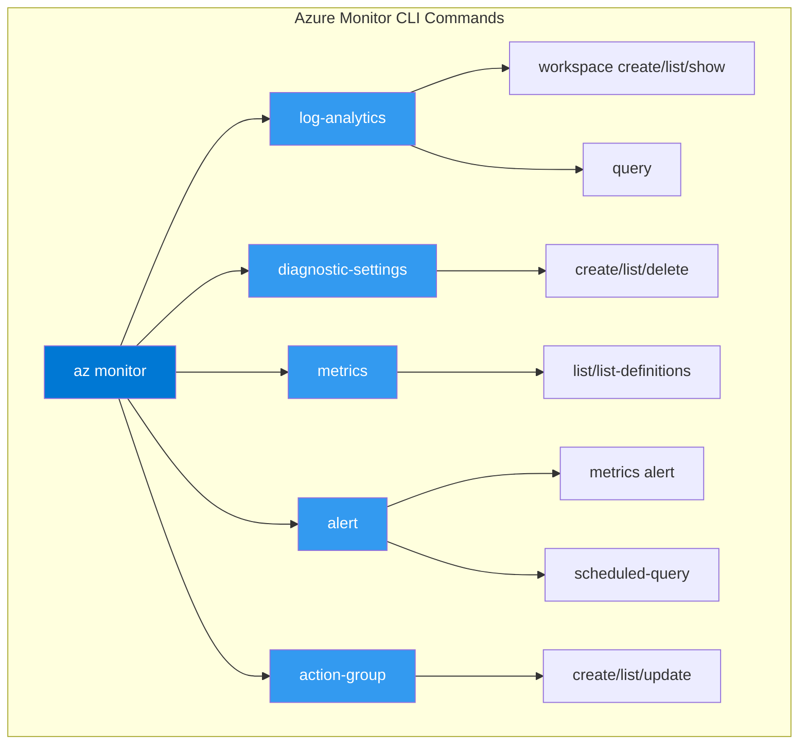

---
content_sources:
  diagrams:
    - id: azure-monitor-cli-cheatsheet
      type: flowchart
      source: self-generated
      justification: "Command-tree diagram organizing the az monitor CLI command groups (log-analytics, diagnostic-settings, metrics, alert, action-group) into a two-level structure so readers can quickly locate the command family for a given task. Synthesized from the Azure Monitor fundamentals, alerts, Log Analytics workspace, and data collection rule overviews in the based_on Microsoft Learn articles; not derived from any single Microsoft Learn diagram."
      based_on:
        - https://learn.microsoft.com/en-us/azure/azure-monitor/fundamentals/overview
        - https://learn.microsoft.com/en-us/azure/azure-monitor/alerts/alerts-overview
        - https://learn.microsoft.com/en-us/azure/azure-monitor/logs/log-analytics-workspace-overview
        - https://learn.microsoft.com/en-us/azure/azure-monitor/data-collection/data-collection-rule-overview
---

# Azure Monitor CLI Cheatsheet

Quick reference for common `az monitor` commands. All examples use long flags for clarity and script compatibility.

<!-- diagram-id: azure-monitor-cli-cheatsheet -->

```mermaid
flowchart TD
    subgraph "Azure Monitor CLI Commands"
        A[az monitor] --> B[log-analytics]
        A --> C[diagnostic-settings]
        A --> D[metrics]
        A --> E[alert]
        A --> F[action-group]
        
        B --> B1[workspace create/list/show]
        B --> B2[query]
        C --> C1[create/list/delete]
        D --> D1[list/list-definitions]
        E --> E1[metrics alert]
        E --> E2[scheduled-query]
        F --> F1[create/list/update]
    end

    style A fill:#0078d4,color:#fff
    style B fill:#339af0,color:#fff
    style C fill:#339af0,color:#fff
    style D fill:#339af0,color:#fff
    style E fill:#339af0,color:#fff
    style F fill:#339af0,color:#fff
```

## Log Analytics Workspaces

### Create a Workspace
```bash
az monitor log-analytics workspace create \
    --resource-group <resource-group-name> \
    --workspace-name <workspace-name> \
    --location <location> \
    --sku PerGB2018 \
    --retention-time 30
```

| Command | Purpose |
| --- | --- |
| `az monitor log-analytics workspace create` | Create a Log Analytics workspace. |
| `--resource-group` | Resource group that contains the resource. |
| `--workspace-name` | Name of the Log Analytics workspace. |
| `--location` | Azure region for the resource. |
| `--sku` | SKU tier of the resource. |
| `--retention-time` | Data retention period in days. |

### List Workspaces
```bash
az monitor log-analytics workspace list \
    --resource-group <resource-group-name>
```

| Command | Purpose |
| --- | --- |
| `az monitor log-analytics workspace list` | List Log Analytics workspaces. |
| `--resource-group` | Resource group that contains the resource. |

### Show Workspace Details
```bash
az monitor log-analytics workspace show \
    --resource-group <resource-group-name> \
    --workspace-name <workspace-name>
```

| Command | Purpose |
| --- | --- |
| `az monitor log-analytics workspace show` | Show a Log Analytics workspace. |
| `--resource-group` | Resource group that contains the resource. |
| `--workspace-name` | Name of the Log Analytics workspace. |

## Diagnostic Settings

### Create Diagnostic Setting
```bash
az monitor diagnostic-settings create \
    --name <setting-name> \
    --resource <resource-id> \
    --workspace <workspace-id> \
    --logs '[{"category": "AppServiceHTTPLogs", "enabled": true}]' \
    --metrics '[{"category": "AllMetrics", "enabled": true}]'
```

| Command | Purpose |
| --- | --- |
| `az monitor diagnostic-settings create` | Create a diagnostic setting. |
| `--name` | Name of the resource. |
| `--resource` | Target resource ID or name for the operation. |
| `--workspace` | Log Analytics workspace name or resource ID that receives the logs. |
| `--logs` | Log categories or settings to collect. |
| `--metrics` | Metric categories to collect. |

### List Diagnostic Settings
```bash
az monitor diagnostic-settings list \
    --resource <resource-id>
```

| Command | Purpose |
| --- | --- |
| `az monitor diagnostic-settings list` | List diagnostic settings for a resource. |
| `--resource` | Target resource ID or name for the operation. |

## Alert Rules

### Create Metric Alert Rule
```bash
az monitor metrics alert create \
    --name <alert-name> \
    --resource-group <resource-group-name> \
    --scopes <resource-id> \
    --condition "avg Percentage CPU > 90" \
    --window-size 5m \
    --evaluation-frequency 1m \
    --description "High CPU alert"
```

| Command | Purpose |
| --- | --- |
| `az monitor metrics alert create` | Create a metric alert rule. |
| `--name` | Name of the resource. |
| `--resource-group` | Resource group that contains the resource. |
| `--scopes` | Target resource scopes for the alert rule. |
| `--condition` | Condition expression that triggers the alert. |
| `--window-size` | Time window over which the condition is evaluated. |
| `--evaluation-frequency` | How often the alert rule is evaluated. |
| `--description` | Human-readable description of the resource. |

### Create Scheduled Query Alert
```bash
az monitor scheduled-query create \
    --name "<alert-name>" \
    --resource-group "$RG" \
    --scopes "$WORKSPACE_ID" \
    --condition "count 'ErrorQuery' > 10" \
    --condition-query "ErrorQuery=AppServiceHTTPLogs | where ScStatus >= 500 | summarize AggregatedValue = count() by bin(TimeGenerated, 5m)" \
    --evaluation-frequency "5m" \
    --window-size "5m" \
    --severity 2 \
    --skip-query-validation true \
    --description "Trigger when App Service HTTP 5xx responses exceed the alert threshold." \
    --output json
```

| Command | Purpose |
| --- | --- |
| `az monitor scheduled-query create` | Create a scheduled query (log) alert rule. |
| `--name` | Name of the resource. |
| `--resource-group` | Resource group that contains the resource. |
| `--scopes` | Target resource scopes for the alert rule. |
| `--condition` | Condition expression that triggers the alert. |
| `--condition-query` | Named query referenced by the alert condition. |
| `--evaluation-frequency` | How often the alert rule is evaluated. |
| `--window-size` | Time window over which the condition is evaluated. |
| `--severity` | Severity level of the alert. |
| `--skip-query-validation` | Skips server-side validation of the query. |
| `--description` | Human-readable description of the resource. |
| `--output` | Output format for the result. |

## Metrics and Logs

### List Metric Definitions
```bash
az monitor metrics list-definitions \
    --resource <resource-id>
```

| Command | Purpose |
| --- | --- |
| `az monitor metrics list-definitions` | List available metric definitions for a resource. |
| `--resource` | Target resource ID or name for the operation. |

### Query Metrics
```bash
az monitor metrics list \
    --resource <resource-id> \
    --metric "Percentage CPU" \
    --interval 1m
```

| Command | Purpose |
| --- | --- |
| `az monitor metrics list` | List metric values for a resource. |
| `--resource` | Target resource ID or name for the operation. |
| `--metric` | Metric name to query. |
| `--interval` | Sampling or evaluation interval. |

### Query Logs (Ad-hoc)
```bash
az monitor log-analytics query \
    --workspace <workspace-id> \
    --analytics-query "AzureActivity | take 10"
```

| Command | Purpose |
| --- | --- |
| `az monitor log-analytics query` | Run a KQL query against a Log Analytics workspace. |
| `--workspace` | Log Analytics workspace ID for the query. |
| `--analytics-query` | Kusto (KQL) query to execute. |

## Action Groups

### Create Action Group
```bash
az monitor action-group create \
    --name <group-name> \
    --resource-group <resource-group-name> \
    --short-name "OpsAlert" \
    --action email admin admin@example.com
```

| Command | Purpose |
| --- | --- |
| `az monitor action-group create` | Create an action group for alert notifications. |
| `--name` | Name of the resource. |
| `--resource-group` | Resource group that contains the resource. |
| `--short-name` | Short name used in alert notifications. |
| `--action` | Receiver or action added to the action group. |

### List Action Groups
```bash
az monitor action-group list \
    --resource-group <resource-group-name>
```

| Command | Purpose |
| --- | --- |
| `az monitor action-group list` | List action groups. |
| `--resource-group` | Resource group that contains the resource. |

## See Also

- [KQL Quick Reference](kql-quick-reference.md)
- [Platform Limits](platform-limits.md)
- [Operations: Alert Rule Management](../operations/alert-rule-management.md)

## Sources

- [az monitor reference](https://learn.microsoft.com/cli/azure/monitor)
- [az monitor log-analytics](https://learn.microsoft.com/cli/azure/monitor/log-analytics)
- [az monitor diagnostic-settings](https://learn.microsoft.com/cli/azure/monitor/diagnostic-settings)
- [az monitor metrics alert](https://learn.microsoft.com/cli/azure/monitor/metrics/alert)
- [az monitor action-group](https://learn.microsoft.com/cli/azure/monitor/action-group)
