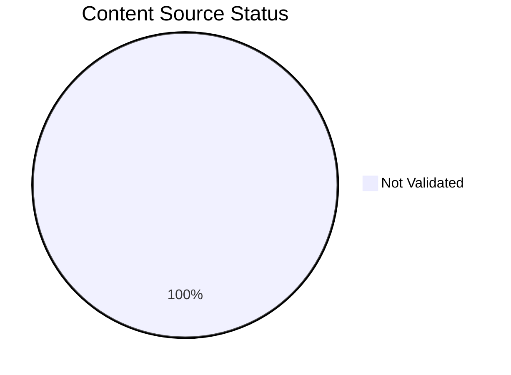

# Content Source Validation Status

This page tracks the source validation status of documentation content in this repository. All content should be traceable to official Microsoft Learn documentation or clearly marked as self-generated where allowed.

## Summary

*Generated: 2026-04-10*

| Content Type | Total | MSLearn Sourced | Self-Generated | No Source |
|---|---:|---:|---:|---:|
| Mermaid Diagrams | 101 | 0 | 0 | 101 |
| Text Sections | — | — | — | — |

!!! warning "Validation Required"
    All 101 mermaid diagrams require source validation.



## Validation Categories

### Source Types

| Type | Description | Allowed? |
|---|---|---|
| `mslearn` | Content directly from Microsoft Learn | Yes |
| `mslearn-adapted` | Content adapted from Microsoft Learn | Yes, with source URL |
| `self-generated` | Original content created for this guide | Requires justification |
| `community` | Community source content | Not for core content |
| `unknown` | Source not documented | Must be validated |

### Diagram Validation Status

| File Group | Diagrams | Source Type | MSLearn URL | Status |
|---|---:|---|---|---|
| All mermaid diagrams | 101 | unknown | — | Not validated |

## How to Validate Content

### Step 1: Add Source Metadata to Frontmatter

Add `content_sources` to the document frontmatter.

### Step 2: Mark Diagram Blocks with IDs

Add an HTML comment before each mermaid block to identify it.

### Step 3: Run Validation Script

```bash
python3 scripts/validate_content_sources.py
```

### Step 4: Update This Page

```bash
python3 scripts/generate_content_validation_status.py
```

## Validation Rules

!!! danger "Mandatory Rules"
    1. Platform diagrams must have MSLearn sources.
    2. Self-generated diagrams must include justification.
    3. Content without a documented source must be validated before publication.

## See Also

- [Reference Index](index.md)

## Sources

- https://learn.microsoft.com/en-us/azure/azure-monitor/
- https://learn.microsoft.com/en-us/azure/
