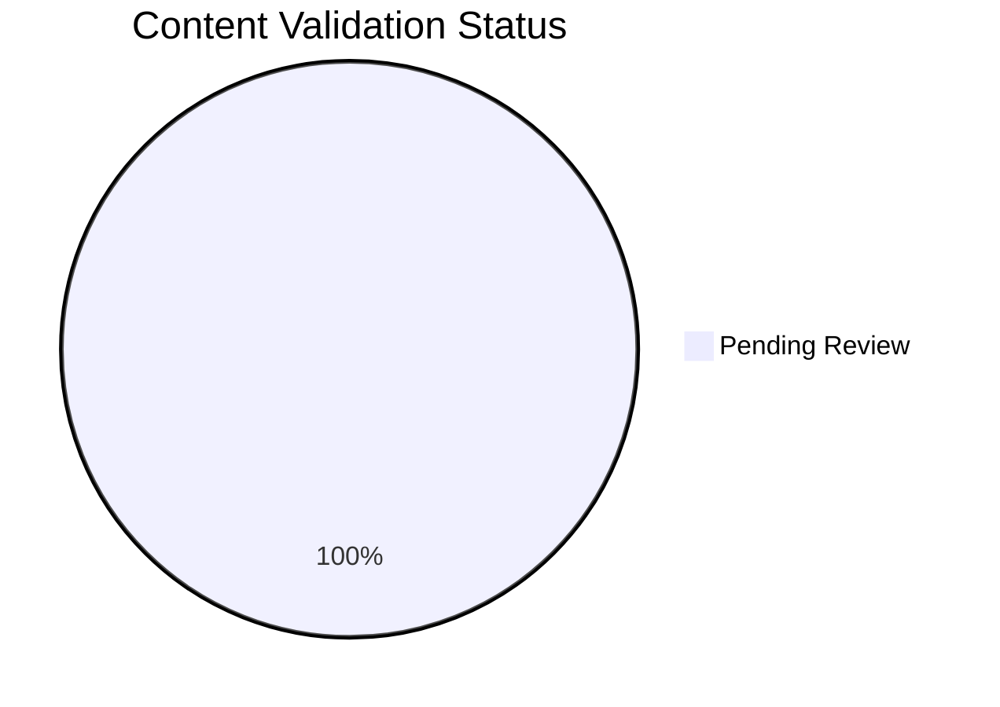

---
content_sources:
  diagrams:
    - id: reference-content-validation-status
      type: pie
      source: self-generated
      justification: Content validation status chart generated from repository frontmatter metadata.
      based_on:
        - docs/
content_validation:
  status: pending_review
  last_reviewed: null
  reviewer: agent
  core_claims: []
---

# Content Validation Status

This page tracks non-tutorial document validation metadata. `pending_review` means the document is registered in the workflow but its individual claims still need source review.

## Summary

*Generated from repository frontmatter metadata.*

| Status | Count |
|---|---:|
| Total non-tutorial documents | 89 |
| Verified | 0 |
| Pending review | 89 |
| Unverified | 0 |
| Missing metadata | 0 |
| Core claims listed | 0 |
| Core claims verified | 0 |

<!-- diagram-id: reference-content-validation-status -->

```mermaid
pie title Content Validation Status
    "Pending Review" : 89
```

## Document Matrix

| Document | Status | Core Claims | Verified Claims |
|---|---|---:|---:|
| [best-practices/alert-strategy.md](../best-practices/alert-strategy.md) | `pending_review` | 0 | 0 |
| [best-practices/cost-optimization.md](../best-practices/cost-optimization.md) | `pending_review` | 0 | 0 |
| [best-practices/data-retention.md](../best-practices/data-retention.md) | `pending_review` | 0 | 0 |
| [best-practices/index.md](../best-practices/index.md) | `pending_review` | 0 | 0 |
| [best-practices/multi-cloud-hybrid.md](../best-practices/multi-cloud-hybrid.md) | `pending_review` | 0 | 0 |
| [best-practices/security-and-access.md](../best-practices/security-and-access.md) | `pending_review` | 0 | 0 |
| [best-practices/tagging-and-organization.md](../best-practices/tagging-and-organization.md) | `pending_review` | 0 | 0 |
| [best-practices/workspace-design.md](../best-practices/workspace-design.md) | `pending_review` | 0 | 0 |
| [contributing/index.md](../contributing/index.md) | `pending_review` | 0 | 0 |
| [index.md](../index.md) | `pending_review` | 0 | 0 |
| [operations/alert-rule-management.md](../operations/alert-rule-management.md) | `pending_review` | 0 | 0 |
| [operations/cost-control.md](../operations/cost-control.md) | `pending_review` | 0 | 0 |
| [operations/data-collection-rules-ops.md](../operations/data-collection-rules-ops.md) | `pending_review` | 0 | 0 |
| [operations/diagnostic-settings.md](../operations/diagnostic-settings.md) | `pending_review` | 0 | 0 |
| [operations/export-and-integration.md](../operations/export-and-integration.md) | `pending_review` | 0 | 0 |
| [operations/index.md](../operations/index.md) | `pending_review` | 0 | 0 |
| [operations/workbooks-and-dashboards.md](../operations/workbooks-and-dashboards.md) | `pending_review` | 0 | 0 |
| [operations/workspace-management.md](../operations/workspace-management.md) | `pending_review` | 0 | 0 |
| [platform/alerts-architecture.md](../platform/alerts-architecture.md) | `pending_review` | 0 | 0 |
| [platform/application-insights.md](../platform/application-insights.md) | `pending_review` | 0 | 0 |
| [platform/data-collection-rules.md](../platform/data-collection-rules.md) | `pending_review` | 0 | 0 |
| [platform/data-platform.md](../platform/data-platform.md) | `pending_review` | 0 | 0 |
| [platform/how-azure-monitor-works.md](../platform/how-azure-monitor-works.md) | `pending_review` | 0 | 0 |
| [platform/index.md](../platform/index.md) | `pending_review` | 0 | 0 |
| [platform/log-analytics-workspace.md](../platform/log-analytics-workspace.md) | `pending_review` | 0 | 0 |
| [platform/metrics-and-dimensions.md](../platform/metrics-and-dimensions.md) | `pending_review` | 0 | 0 |
| [platform/networking-and-security.md](../platform/networking-and-security.md) | `pending_review` | 0 | 0 |
| [reference/cli-cheatsheet.md](../reference/cli-cheatsheet.md) | `pending_review` | 0 | 0 |
| [reference/content-validation-status.md](../reference/content-validation-status.md) | `pending_review` | 0 | 0 |
| [reference/diagnostic-tables.md](../reference/diagnostic-tables.md) | `pending_review` | 0 | 0 |
| [reference/index.md](../reference/index.md) | `pending_review` | 0 | 0 |
| [reference/kql-quick-reference.md](../reference/kql-quick-reference.md) | `pending_review` | 0 | 0 |
| [reference/platform-limits.md](../reference/platform-limits.md) | `pending_review` | 0 | 0 |
| [reference/validation-status.md](../reference/validation-status.md) | `pending_review` | 0 | 0 |
| [service-guides/aks/index.md](../service-guides/aks/index.md) | `pending_review` | 0 | 0 |
| [service-guides/aks/observability.md](../service-guides/aks/observability.md) | `pending_review` | 0 | 0 |
| [service-guides/app-service/alerts-and-metrics.md](../service-guides/app-service/alerts-and-metrics.md) | `pending_review` | 0 | 0 |
| [service-guides/app-service/application-insights-integration.md](../service-guides/app-service/application-insights-integration.md) | `pending_review` | 0 | 0 |
| [service-guides/app-service/index.md](../service-guides/app-service/index.md) | `pending_review` | 0 | 0 |
| [service-guides/app-service/platform-logs.md](../service-guides/app-service/platform-logs.md) | `pending_review` | 0 | 0 |
| [service-guides/container-apps/index.md](../service-guides/container-apps/index.md) | `pending_review` | 0 | 0 |
| [service-guides/container-apps/observability.md](../service-guides/container-apps/observability.md) | `pending_review` | 0 | 0 |
| [service-guides/functions/index.md](../service-guides/functions/index.md) | `pending_review` | 0 | 0 |
| [service-guides/functions/observability.md](../service-guides/functions/observability.md) | `pending_review` | 0 | 0 |
| [service-guides/index.md](../service-guides/index.md) | `pending_review` | 0 | 0 |
| [service-guides/vm/index.md](../service-guides/vm/index.md) | `pending_review` | 0 | 0 |
| [service-guides/vm/observability.md](../service-guides/vm/observability.md) | `pending_review` | 0 | 0 |
| [start-here/learning-paths.md](../start-here/learning-paths.md) | `pending_review` | 0 | 0 |
| [start-here/overview.md](../start-here/overview.md) | `pending_review` | 0 | 0 |
| [start-here/repository-map.md](../start-here/repository-map.md) | `pending_review` | 0 | 0 |
| [troubleshooting/architecture-overview.md](../troubleshooting/architecture-overview.md) | `pending_review` | 0 | 0 |
| [troubleshooting/decision-tree.md](../troubleshooting/decision-tree.md) | `pending_review` | 0 | 0 |
| [troubleshooting/evidence-map.md](../troubleshooting/evidence-map.md) | `pending_review` | 0 | 0 |
| [troubleshooting/first-10-minutes/alert-not-firing.md](../troubleshooting/first-10-minutes/alert-not-firing.md) | `pending_review` | 0 | 0 |
| [troubleshooting/first-10-minutes/high-cost.md](../troubleshooting/first-10-minutes/high-cost.md) | `pending_review` | 0 | 0 |
| [troubleshooting/first-10-minutes/index.md](../troubleshooting/first-10-minutes/index.md) | `pending_review` | 0 | 0 |
| [troubleshooting/first-10-minutes/no-data.md](../troubleshooting/first-10-minutes/no-data.md) | `pending_review` | 0 | 0 |
| [troubleshooting/first-10-minutes/query-timeout.md](../troubleshooting/first-10-minutes/query-timeout.md) | `pending_review` | 0 | 0 |
| [troubleshooting/index.md](../troubleshooting/index.md) | `pending_review` | 0 | 0 |
| [troubleshooting/kql/alerts/action-group-failures.md](../troubleshooting/kql/alerts/action-group-failures.md) | `pending_review` | 0 | 0 |
| [troubleshooting/kql/alerts/alert-firing-history.md](../troubleshooting/kql/alerts/alert-firing-history.md) | `pending_review` | 0 | 0 |
| [troubleshooting/kql/alerts/index.md](../troubleshooting/kql/alerts/index.md) | `pending_review` | 0 | 0 |
| [troubleshooting/kql/app-insights/dependency-failures.md](../troubleshooting/kql/app-insights/dependency-failures.md) | `pending_review` | 0 | 0 |
| [troubleshooting/kql/app-insights/exception-trends.md](../troubleshooting/kql/app-insights/exception-trends.md) | `pending_review` | 0 | 0 |
| [troubleshooting/kql/app-insights/index.md](../troubleshooting/kql/app-insights/index.md) | `pending_review` | 0 | 0 |
| [troubleshooting/kql/app-insights/request-performance.md](../troubleshooting/kql/app-insights/request-performance.md) | `pending_review` | 0 | 0 |
| [troubleshooting/kql/index.md](../troubleshooting/kql/index.md) | `pending_review` | 0 | 0 |
| [troubleshooting/kql/log-analytics/cross-workspace.md](../troubleshooting/kql/log-analytics/cross-workspace.md) | `pending_review` | 0 | 0 |
| [troubleshooting/kql/log-analytics/index.md](../troubleshooting/kql/log-analytics/index.md) | `pending_review` | 0 | 0 |
| [troubleshooting/kql/log-analytics/ingestion-volume.md](../troubleshooting/kql/log-analytics/ingestion-volume.md) | `pending_review` | 0 | 0 |
| [troubleshooting/kql/log-analytics/resource-health.md](../troubleshooting/kql/log-analytics/resource-health.md) | `pending_review` | 0 | 0 |
| [troubleshooting/kql/service-specific/aks-diagnostics.md](../troubleshooting/kql/service-specific/aks-diagnostics.md) | `pending_review` | 0 | 0 |
| [troubleshooting/kql/service-specific/app-service-diagnostics.md](../troubleshooting/kql/service-specific/app-service-diagnostics.md) | `pending_review` | 0 | 0 |
| [troubleshooting/kql/service-specific/container-apps-diagnostics.md](../troubleshooting/kql/service-specific/container-apps-diagnostics.md) | `pending_review` | 0 | 0 |
| [troubleshooting/kql/service-specific/functions-diagnostics.md](../troubleshooting/kql/service-specific/functions-diagnostics.md) | `pending_review` | 0 | 0 |
| [troubleshooting/kql/service-specific/index.md](../troubleshooting/kql/service-specific/index.md) | `pending_review` | 0 | 0 |
| [troubleshooting/kql/service-specific/vm-diagnostics.md](../troubleshooting/kql/service-specific/vm-diagnostics.md) | `pending_review` | 0 | 0 |
| [troubleshooting/mental-model.md](../troubleshooting/mental-model.md) | `pending_review` | 0 | 0 |
| [troubleshooting/playbooks/agent-not-reporting.md](../troubleshooting/playbooks/agent-not-reporting.md) | `pending_review` | 0 | 0 |
| [troubleshooting/playbooks/aks-container-insights-issues.md](../troubleshooting/playbooks/aks-container-insights-issues.md) | `pending_review` | 0 | 0 |
| [troubleshooting/playbooks/alert-not-firing.md](../troubleshooting/playbooks/alert-not-firing.md) | `pending_review` | 0 | 0 |
| [troubleshooting/playbooks/alert-storm.md](../troubleshooting/playbooks/alert-storm.md) | `pending_review` | 0 | 0 |
| [troubleshooting/playbooks/application-insights-gaps.md](../troubleshooting/playbooks/application-insights-gaps.md) | `pending_review` | 0 | 0 |
| [troubleshooting/playbooks/high-ingestion-cost.md](../troubleshooting/playbooks/high-ingestion-cost.md) | `pending_review` | 0 | 0 |
| [troubleshooting/playbooks/index.md](../troubleshooting/playbooks/index.md) | `pending_review` | 0 | 0 |
| [troubleshooting/playbooks/missing-application-telemetry.md](../troubleshooting/playbooks/missing-application-telemetry.md) | `pending_review` | 0 | 0 |
| [troubleshooting/playbooks/no-data-in-workspace.md](../troubleshooting/playbooks/no-data-in-workspace.md) | `pending_review` | 0 | 0 |
| [troubleshooting/playbooks/slow-query-performance.md](../troubleshooting/playbooks/slow-query-performance.md) | `pending_review` | 0 | 0 |
| [troubleshooting/quick-diagnosis-cards.md](../troubleshooting/quick-diagnosis-cards.md) | `pending_review` | 0 | 0 |

## How to Update

Add or update `content_validation` frontmatter when a document is reviewed against Microsoft Learn sources.

```bash
python3 scripts/generate_content_validation_status.py
```

## See Also

- [Tutorial Validation Status](validation-status.md)
- [CLI Cheatsheet](cli-cheatsheet.md)
- [Platform Limits](platform-limits.md)

## Sources

- [Azure Monitor documentation](https://learn.microsoft.com/azure/azure-monitor/)
