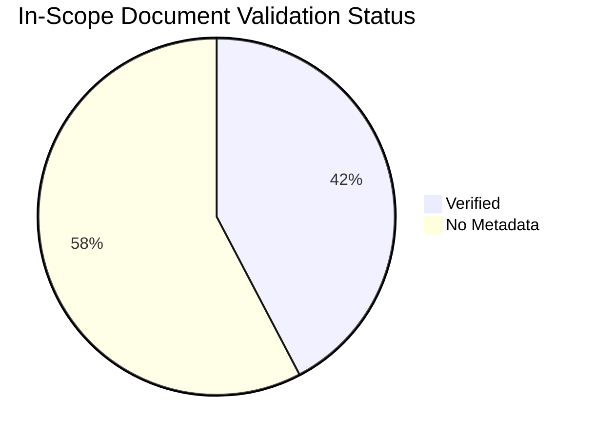

---
content_sources:
  references:
    - type: self-generated
      justification: Auto-generated dashboard tracking content validation status
---

# Content Validation Status

This page tracks `content_validation` metadata for **in-scope factual-claim documents** under `docs/best-practices/`, `docs/operations/`, `docs/platform/`, `docs/service-guides/`, `docs/troubleshooting/`. Pages outside this scope — navigation indexes (`docs/best-practices/index.md`, `docs/operations/index.md`, `docs/platform/index.md`, `docs/service-guides/index.md`, `docs/troubleshooting/first-10-minutes/index.md`, `docs/troubleshooting/index.md`, `docs/troubleshooting/playbooks/index.md`), reference-lookup KQL packs and lab guides (`docs/troubleshooting/kql/`, `docs/troubleshooting/lab-guides/`), tutorials, language guides, and start-here landing pages — are not counted here, even when legacy `content_validation` blocks exist on them (the cleanup tool only removes tautological placeholder claims). See `scripts/lib/content_scope.py` for the executable scope definition.

## Summary

*Generated: 2026-09-06*

| Content Type | Total | Verified | Pending | Unverified | No Metadata |
|---|---:|---:|---:|---:|---:|
| Mermaid Diagrams | 114 | 114 | 0 | 0 | 0 |
| In-Scope Factual-Claim Documents | 52 | 22 | 0 | 0 | 30 |

!!! warning "Validation In Progress"
    30 in-scope document(s) need `content_validation` metadata added.

<!-- diagram-id: content-validation-status-pie -->

```mermaid
pie title In-Scope Document Validation Status
    "Verified" : 22
    "No Metadata" : 30
```

## By Section

### Platform

| Document | Has Sources | Status | Claims | Last Reviewed |
|---|---|---|---|---|
| [Alerts Architecture](../platform/alerts-architecture.md) | ✅ | ✅ Verified | 4/4 | 2026-07-20 |
| [Application Insights](../platform/application-insights.md) | ✅ | ✅ Verified | 4/4 | 2026-07-20 |
| [Data Collection Rules](../platform/data-collection-rules.md) | ✅ | ✅ Verified | 4/4 | 2026-07-20 |
| [Data Platform](../platform/data-platform.md) | ✅ | ✅ Verified | 4/4 | 2026-07-20 |
| [How Azure Monitor Works](../platform/how-azure-monitor-works.md) | ✅ | ✅ Verified | 4/4 | 2026-07-20 |
| [Log Analytics Workspace](../platform/log-analytics-workspace.md) | ✅ | ✅ Verified | 4/4 | 2026-07-20 |
| [Metrics And Dimensions](../platform/metrics-and-dimensions.md) | ✅ | ✅ Verified | 4/4 | 2026-07-20 |
| [Networking And Security](../platform/networking-and-security.md) | ✅ | ✅ Verified | 4/4 | 2026-07-20 |

### Best Practices

| Document | Has Sources | Status | Claims | Last Reviewed |
|---|---|---|---|---|
| [Alert Strategy](../best-practices/alert-strategy.md) | ✅ | ✅ Verified | 4/4 | 2026-07-20 |
| [Cost Optimization](../best-practices/cost-optimization.md) | ✅ | ✅ Verified | 4/4 | 2026-07-20 |
| [Data Retention](../best-practices/data-retention.md) | ✅ | ✅ Verified | 3/3 | 2026-07-20 |
| [Multi Cloud Hybrid](../best-practices/multi-cloud-hybrid.md) | ✅ | ✅ Verified | 4/4 | 2026-07-20 |
| [Security And Access](../best-practices/security-and-access.md) | ✅ | ✅ Verified | 4/4 | 2026-07-20 |
| [Tagging And Organization](../best-practices/tagging-and-organization.md) | ✅ | ✅ Verified | 4/4 | 2026-07-20 |
| [Workspace Design](../best-practices/workspace-design.md) | ✅ | ✅ Verified | 4/4 | 2026-07-20 |

### Operations

| Document | Has Sources | Status | Claims | Last Reviewed |
|---|---|---|---|---|
| [Alert Rule Management](../operations/alert-rule-management.md) | ✅ | ✅ Verified | 4/4 | 2026-07-20 |
| [Cost Control](../operations/cost-control.md) | ✅ | ✅ Verified | 4/4 | 2026-07-20 |
| [Data Collection Rules Ops](../operations/data-collection-rules-ops.md) | ✅ | ✅ Verified | 4/4 | 2026-07-20 |
| [Diagnostic Settings](../operations/diagnostic-settings.md) | ✅ | ✅ Verified | 3/3 | 2026-07-20 |
| [Export And Integration](../operations/export-and-integration.md) | ✅ | ✅ Verified | 3/3 | 2026-07-20 |
| [Workbooks And Dashboards](../operations/workbooks-and-dashboards.md) | ✅ | ✅ Verified | 3/3 | 2026-07-20 |
| [Workspace Management](../operations/workspace-management.md) | ✅ | ✅ Verified | 4/4 | 2026-07-20 |

### Service Guides

| Document | Has Sources | Status | Claims | Last Reviewed |
|---|---|---|---|---|
| [Alerts And Metrics](../service-guides/app-service/alerts-and-metrics.md) | ✅ | ❓ No Metadata | — | — |
| [Application Insights Integration](../service-guides/app-service/application-insights-integration.md) | ✅ | ❓ No Metadata | — | — |
| [Index](../service-guides/aks/index.md) | ✅ | ❓ No Metadata | — | — |
| [Index](../service-guides/vm/index.md) | ✅ | ❓ No Metadata | — | — |
| [Index](../service-guides/functions/index.md) | ✅ | ❓ No Metadata | — | — |
| [Index](../service-guides/container-apps/index.md) | ✅ | ❓ No Metadata | — | — |
| [Index](../service-guides/app-service/index.md) | ✅ | ❓ No Metadata | — | — |
| [Observability](../service-guides/aks/observability.md) | ✅ | ❓ No Metadata | — | — |
| [Observability](../service-guides/vm/observability.md) | ✅ | ❓ No Metadata | — | — |
| [Observability](../service-guides/functions/observability.md) | ✅ | ❓ No Metadata | — | — |
| [Observability](../service-guides/container-apps/observability.md) | ✅ | ❓ No Metadata | — | — |
| [Platform Logs](../service-guides/app-service/platform-logs.md) | ✅ | ❓ No Metadata | — | — |

### Troubleshooting

| Document | Has Sources | Status | Claims | Last Reviewed |
|---|---|---|---|---|
| [Agent Not Reporting](../troubleshooting/playbooks/agent-not-reporting.md) | ✅ | ❓ No Metadata | — | — |
| [Aks Container Insights Issues](../troubleshooting/playbooks/aks-container-insights-issues.md) | ✅ | ❓ No Metadata | — | — |
| [Alert Not Firing](../troubleshooting/first-10-minutes/alert-not-firing.md) | ✅ | ❓ No Metadata | — | — |
| [Alert Not Firing](../troubleshooting/playbooks/alert-not-firing.md) | ✅ | ❓ No Metadata | — | — |
| [Alert Storm](../troubleshooting/playbooks/alert-storm.md) | ✅ | ❓ No Metadata | — | — |
| [Application Insights Gaps](../troubleshooting/playbooks/application-insights-gaps.md) | ✅ | ❓ No Metadata | — | — |
| [Architecture Overview](../troubleshooting/architecture-overview.md) | ✅ | ❓ No Metadata | — | — |
| [Decision Tree](../troubleshooting/decision-tree.md) | ✅ | ❓ No Metadata | — | — |
| [Evidence Map](../troubleshooting/evidence-map.md) | ✅ | ❓ No Metadata | — | — |
| [High Cost](../troubleshooting/first-10-minutes/high-cost.md) | ✅ | ❓ No Metadata | — | — |
| [High Ingestion Cost](../troubleshooting/playbooks/high-ingestion-cost.md) | ✅ | ❓ No Metadata | — | — |
| [Mental Model](../troubleshooting/mental-model.md) | ✅ | ❓ No Metadata | — | — |
| [Missing Application Telemetry](../troubleshooting/playbooks/missing-application-telemetry.md) | ✅ | ❓ No Metadata | — | — |
| [No Data](../troubleshooting/first-10-minutes/no-data.md) | ✅ | ❓ No Metadata | — | — |
| [No Data In Workspace](../troubleshooting/playbooks/no-data-in-workspace.md) | ✅ | ❓ No Metadata | — | — |
| [Query Timeout](../troubleshooting/first-10-minutes/query-timeout.md) | ✅ | ❓ No Metadata | — | — |
| [Quick Diagnosis Cards](../troubleshooting/quick-diagnosis-cards.md) | ✅ | ❓ No Metadata | — | — |
| [Slow Query Performance](../troubleshooting/playbooks/slow-query-performance.md) | ✅ | ❓ No Metadata | — | — |

## Validation Categories

### Source Types

| Type | Description | Allowed? |
|---|---|---|
| `mslearn` | Content directly from or based on Microsoft Learn | Yes |
| `mslearn-adapted` | Microsoft Learn content adapted for this guide | Yes, with source URL |
| `self-generated` | Original content created for this guide | Requires justification |
| `community` | From community sources | Not for core content |
| `unknown` | Source not documented | Must be validated |

### Validation Status

| Status | Description |
|---|---|
| `verified` | All core claims traced to Microsoft Learn sources |
| `pending_review` | Document exists but claims need source verification |
| `unverified` | New document, no validation performed |

## How to Add Validation

Before adding metadata, confirm the page is in scope. The block is required ONLY for factual-claim pages under `docs/platform/`, `docs/best-practices/`, `docs/operations/`, `docs/service-guides/`, and `docs/troubleshooting/` (excluding `troubleshooting/kql/`, `troubleshooting/lab-guides/`, and navigation landing pages listed in `scripts/lib/content_scope.NAVIGATION_INDEXES`).

For an in-scope page, add a `content_validation` block to its frontmatter:

```yaml
---
content_sources:
  references:
    - type: mslearn-adapted
      url: https://learn.microsoft.com/en-us/azure/azure-monitor/...
content_validation:
  status: verified
  last_reviewed: 2026-04-12
  reviewer: ai-agent
  core_claims:
    - claim: "Azure Monitor collects platform metrics automatically for most Azure resources at no cost."
      source: https://learn.microsoft.com/en-us/azure/azure-monitor/essentials/data-platform-metrics
      verified: true
---
```

Each `core_claim` MUST be a verifiable factual assertion about Azure Monitor behavior (a documented limit, default, or feature). Meta-statements such as "this page uses Microsoft Learn as the primary source basis" are tautological and rejected — the marker text `primary source basis` triggers a fail-fast in this generator.

Then regenerate this page:

```bash
python3 scripts/generate_content_validation_status.py
```

## See Also

- [CLI Cheatsheet](cli-cheatsheet.md)
- [Platform Limits](platform-limits.md)

