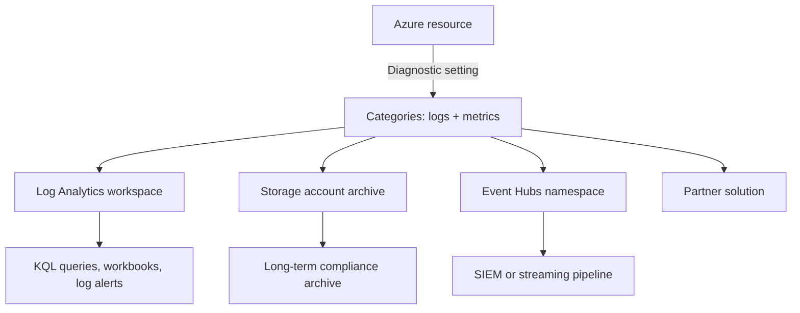

# Diagnostic Settings Matrix (Cross-Service)

Quick-reference matrix that maps each Azure service in the sibling `azure-*-practical-guide` family to its supported diagnostic-settings shape: resource log categories, platform metrics, destinations, and per-service caveats.

Use this page to answer three questions in under a minute:

1. Does this service expose resource logs via diagnostic settings, or does it need a different pipeline (agent, extension, Container Insights)?
2. What are the canonical log categories to enable for a baseline monitoring setup?
3. Where should routing go — Log Analytics workspace, archive Storage, Event Hubs, or a partner solution?

For step-by-step CLI to create a diagnostic setting, see the [Diagnostic Settings runbook](../operations/diagnostic-settings.md). For per-table column schemas that the routed logs land in, see the [Diagnostic Tables Reference](diagnostic-tables.md).

## Destinations

<!-- diagram-id: diagnostic-settings-destinations -->


All four destinations are supported for most resource types. A single diagnostic setting can target multiple destinations simultaneously — send to Log Analytics for daily investigation and Storage for compliance archive in one setting, rather than creating two settings.

## Cross-service matrix

| Service | Resource log categories (examples) | Metrics | Destinations | Sibling deep guide | Caveats |
|---|---|---|---|---|---|
| **Azure Container Apps** | `ContainerAppConsoleLogs`, `ContainerAppSystemLogs` | `AllMetrics` | LAW, Storage, EH, Partner | [Container Apps guide](https://yeongseon.github.io/azure-container-apps-practical-guide/) | Environment-level `appLogsConfiguration` must be set before per-app diagnostic settings emit console/system logs. |
| **App Service** | `AppServiceHTTPLogs`, `AppServiceConsoleLogs`, `AppServiceAppLogs`, `AppServiceAuditLogs`, `AppServicePlatformLogs`, `AppServiceIPSecAuditLogs`, `AppServiceFileAuditLogs`, `AppServiceAntivirusScanAuditLogs` | `AllMetrics` | LAW, Storage, EH, Partner | [App Service guide](https://yeongseon.github.io/azure-app-service-practical-guide/) | Some categories (e.g., `AppServiceFileAuditLogs`) require filesystem logging to be enabled on the app first. |
| **Azure Functions** | Inherits App Service categories + `FunctionAppLogs` | `AllMetrics` | LAW, Storage, EH, Partner | [Functions guide](https://yeongseon.github.io/azure-functions-practical-guide/) | Consumption-plan cold starts delay first log emission; pair with Application Insights for invocation-level tracing. |
| **Azure Kubernetes Service** | `kube-apiserver`, `kube-audit`, `kube-audit-admin`, `kube-controller-manager`, `kube-scheduler`, `cluster-autoscaler`, `guard`, `cloud-controller-manager`, `csi-azuredisk-controller`, `csi-azurefile-controller`, `csi-snapshot-controller` | `AllMetrics` | LAW, Storage, EH, Partner | [AKS guide](https://yeongseon.github.io/azure-kubernetes-service-practical-guide/) | Control-plane only. Pod, container, and node logs require [Container Insights](https://learn.microsoft.com/en-us/azure/azure-monitor/containers/container-insights-overview) or the Prometheus managed service — NOT diagnostic settings. |
| **Virtual Machines** | None via diagnostic settings for guest OS | `AllMetrics` (host-level platform metrics only) | LAW, Storage, EH, Partner | [VM guide](https://yeongseon.github.io/azure-virtual-machine-practical-guide/) | Guest OS logs (syslog, Windows Event Log) and perf counters (CPU, memory, disk) require Azure Monitor Agent + Data Collection Rule, NOT a diagnostic setting. See [Azure Monitor Agent overview](https://learn.microsoft.com/en-us/azure/azure-monitor/agents/azure-monitor-agent-overview). |
| **Storage Accounts** | `StorageRead`, `StorageWrite`, `StorageDelete` per Blob/Queue/Table/File | `Transaction`, `Capacity` (per sub-service) | LAW, Storage, EH, Partner | [Storage guide](https://yeongseon.github.io/azure-storage-practical-guide/) | Configured at the child resource scope (e.g., `blobServices/default`), NOT at the storage account root. |
| **Azure Networking** | Per resource type — see individual services below | Varies | LAW, Storage, EH, Partner | [Networking guide](https://yeongseon.github.io/azure-networking-practical-guide/) | NSG flow logs are a Network Watcher feature (Storage-backed, optionally streamed to LAW via Traffic Analytics), NOT a diagnostic setting on the NSG itself. |
| — Azure Firewall | Legacy: `AzureFirewallApplicationRule`, `AzureFirewallNetworkRule`, `AzureFirewallDnsProxy`, `AzureFirewallThreatIntelLog`. Structured: `AZFWApplicationRule`, `AZFWNetworkRule`, `AZFWDnsQuery`, `AZFWFatFlow`, `AZFWFlowTrace`, `AZFWIdpsSignature`. | `AllMetrics` | LAW, Storage, EH, Partner | (see Networking guide) | Structured Logs and legacy categories are independent. Enabling both duplicates data and doubles ingestion cost — pick one. |
| — Application Gateway | `ApplicationGatewayAccessLog`, `ApplicationGatewayPerformanceLog`, `ApplicationGatewayFirewallLog` | `AllMetrics` | LAW, Storage, EH, Partner | (see Networking guide) | `ApplicationGatewayFirewallLog` requires WAF SKU (WAF_v2). |
| — Front Door | `FrontDoorAccessLog`, `FrontDoorWebApplicationFirewallLog`, `FrontDoorHealthProbeLog` | `AllMetrics` | LAW, Storage, EH, Partner | (see Networking guide) | Front Door Standard/Premium only; classic Front Door uses different category names. |
| **Communication Services** | `AuthOperational`, `CallDiagnostics`, `CallSummary`, `ChatOperational`, `EmailSendMailOperational`, `EmailStatusUpdateOperational`, `EmailUserEngagementOperational`, `JobRouterEvents`, `NetworkTraversalDiagnostics`, `SMSOperational`, `UsageLogs` | `AllMetrics` | LAW, Storage, EH, Partner | [ACS guide](https://yeongseon.github.io/azure-communication-services-practical-guide/) | Per-channel categories — enable only the channels your workload uses to control ingestion cost. |
| **Key Vault** | `AuditEvent`, `AzurePolicyEvaluationDetails` | `AllMetrics` | LAW, Storage, EH, Partner | (referenced across guides) | `AuditEvent` is the primary source for secret-access forensics; enable it on every production vault. |

## When diagnostic settings are not the right tool

Not every observability need is served by diagnostic settings. Reach for a different pipeline in these cases:

- **Guest OS logs and perf counters on VMs and VMSS** — Use Azure Monitor Agent + Data Collection Rule.
- **Kubernetes pod, container, and node logs** — Use Container Insights (Azure Monitor Agent for containers) or the Prometheus managed service.
- **NSG flow logs** — Use Network Watcher flow logs (Storage-backed) with optional Traffic Analytics for LAW ingestion.
- **Application-level tracing (spans, dependencies, exceptions)** — Use Application Insights SDK or auto-instrumentation.
- **Custom application metrics** — Use `customMetrics` in Application Insights, or the Azure Monitor custom metrics REST API.

## Baseline recommendation

For most services, a minimum-viable diagnostic setting emits the audit-equivalent category group and `AllMetrics` to a shared Log Analytics workspace, and optionally archives the same logs to Storage for compliance:

```bash
az monitor diagnostic-settings create \
    --name "diag-<resource>-baseline" \
    --resource "<resource-id>" \
    --workspace "<workspace-id>" \
    --logs '[{"categoryGroup":"audit","enabled":true}]' \
    --metrics '[{"category":"AllMetrics","enabled":true}]'
```

| Command | Purpose |
| --- | --- |
| `az monitor diagnostic-settings create` | Create a diagnostic setting. |
| `--name` | Name of the resource. |
| `--resource` | Target resource ID or name for the operation. |
| `--workspace` | Log Analytics workspace name or resource ID that receives the logs. |
| `--logs` | Log categories or settings to collect. |
| `--metrics` | Metric categories to collect. |

Prefer category groups (`audit`, `allLogs`) over enumerating individual categories when the resource type supports them, because Azure adds new categories over time and category groups pick them up automatically. See [Category groups](https://learn.microsoft.com/en-us/azure/azure-monitor/essentials/diagnostic-settings#category-groups) for the current supported list.

## Destination selection guidance

| Destination | Use when | Trade-off |
|---|---|---|
| Log Analytics workspace | Interactive KQL queries, workbooks, log-based alerts | Highest ingestion cost per GB; use retention tiering (interactive + archive) to control spend |
| Storage account | Long-term compliance archive, replay, out-of-Azure export | Not queryable interactively without external tooling; JSON blobs organized by resource ID and hour |
| Event Hubs namespace | Streaming to SIEM (Sentinel, Splunk, Elastic), custom pipelines | Consumer must handle checkpoint state and back-pressure |
| Partner solution | Native integration with Datadog, Elastic, Logz.io, and others | Locks routing into the partner's schema and billing model |

## See Also

- [Diagnostic Settings runbook](../operations/diagnostic-settings.md)
- [Diagnostic Tables Reference](diagnostic-tables.md)
- [KQL Quick Reference](kql-quick-reference.md)
- [Platform Limits](platform-limits.md)
- [Container Apps observability](../service-guides/container-apps/observability.md)

## Sources

- [Microsoft Learn: Diagnostic settings in Azure Monitor](https://learn.microsoft.com/en-us/azure/azure-monitor/essentials/diagnostic-settings)
- [Microsoft Learn: Supported resource log categories](https://learn.microsoft.com/en-us/azure/azure-monitor/essentials/resource-logs-categories)
- [Microsoft Learn: Diagnostic settings destinations](https://learn.microsoft.com/en-us/azure/azure-monitor/essentials/diagnostic-settings#destinations)
- [Microsoft Learn: Azure Monitor Agent overview](https://learn.microsoft.com/en-us/azure/azure-monitor/agents/azure-monitor-agent-overview)
- [Microsoft Learn: Container Insights overview](https://learn.microsoft.com/en-us/azure/azure-monitor/containers/container-insights-overview)
- [Microsoft Learn: AKS monitoring reference](https://learn.microsoft.com/en-us/azure/aks/monitor-aks-reference)
- [Microsoft Learn: Monitor Azure Blob Storage](https://learn.microsoft.com/en-us/azure/storage/blobs/monitor-blob-storage)
- [Microsoft Learn: Azure Firewall structured logs](https://learn.microsoft.com/en-us/azure/firewall/firewall-structured-logs)
