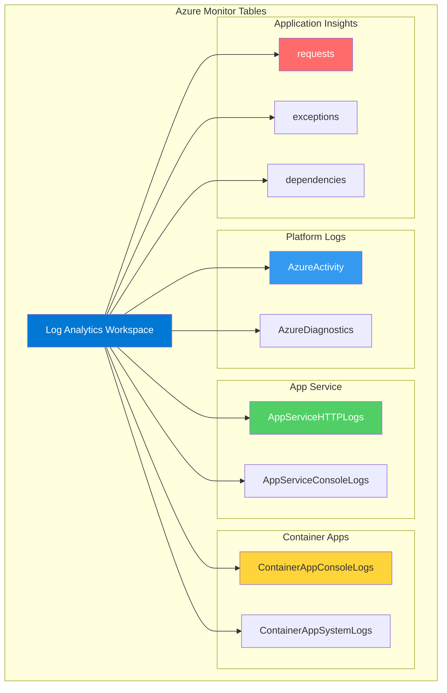

---
content_sources:
  diagrams:
    - id: diagnostic-tables-reference
      type: flowchart
      source: self-generated
      based_on:
        - https://learn.microsoft.com/en-us/azure/azure-monitor/reference/tables/tables-category
        - https://learn.microsoft.com/en-us/azure/azure-monitor/logs/log-analytics-overview
---

# Diagnostic Tables Reference

Summary of common Azure Monitor diagnostic tables by service.

<!-- diagram-id: diagnostic-tables-reference -->

## App Service

### AppServiceHTTPLogs
Incoming HTTP requests for App Service. Use these logs to monitor application health, performance and usage patterns.
| Column | Type | Description |
| --- | --- | --- |
| `TimeGenerated` | datetime | Time when the event was generated |
| `ScStatus` | int | HTTP status code |
| `TimeTaken` | int | Time taken by HTTP request in milliseconds |
| `CsMethod` | string | HTTP method (GET, POST, etc.) |
| `CsUriStem` | string | Target URI of the request |
| `CIp` | string | Client IP address |

### AppServiceConsoleLogs
Console logs (stdout/stderr) from the application container.
| Column | Type | Description |
| --- | --- | --- |
| `TimeGenerated` | datetime | Time when the event was generated |
| `ResultDescription` | string | The actual log message |
| `Level` | string | Log level (Informational, Error, etc.) |

## Container Apps

### ContainerAppConsoleLogs
Console logs from Container App replicas. Includes stdout/stderr from all containers and Dapr sidecars.
| Column | Type | Description |
| --- | --- | --- |
| `TimeGenerated` | datetime | Time (UTC) when the log was generated |
| `Log` | string | The log content emitted to stdout/stderr |
| `ContainerAppName` | string | Name of the Container App |
| `RevisionName` | string | Name of the revision |
| `Stream` | string | Stream source (stdout, stderr) |

## Platform Logs

### AzureActivity
Subscription-level events providing insight into any subscription-level or management group level events.
| Column | Type | Description |
| --- | --- | --- |
| `TimeGenerated` | datetime | Event timestamp |
| `OperationNameValue` | string | The operation performed (e.g., Microsoft.Compute/virtualMachines/write) |
| `ActivityStatusValue` | string | Status (Started, Succeeded, Failed) |
| `Caller` | string | Email or SPN of the user who performed the operation |
| `ResourceGroup` | string | Resource group of the impacted resource |

## Application Insights

### requests
Requests handled by the application.
| Column | Type | Description |
| --- | --- | --- |
| `timestamp` | datetime | Time of request |
| `name` | string | Request name (e.g., GET /Home/Index) |
| `success` | bool | Whether the request was successful |
| `resultCode` | string | HTTP response code |
| `duration` | real | Request duration in milliseconds |

### exceptions
Exceptions and errors thrown by the application.
| Column | Type | Description |
| --- | --- | --- |
| `timestamp` | datetime | Time of exception |
| `problemId` | string | Identifier for the type of exception |
| `outerMessage` | string | Exception message |
| `details` | dynamic | Full stack trace and details |

!!! tip
    Use the `union` operator in KQL to search across multiple log tables:
    `union AppServiceHTTPLogs, AppServiceConsoleLogs | where ResultDescription has "Error" or ScStatus >= 500`

## See Also

- [KQL Quick Reference](kql-quick-reference.md)
- [Platform Limits](platform-limits.md)

## Sources
- [Azure Monitor Tables Reference](https://learn.microsoft.com/azure/azure-monitor/reference/tables/)
- [AppServiceHTTPLogs Reference](https://learn.microsoft.com/azure/azure-monitor/reference/tables/appservicehttplogs)
- [ContainerAppConsoleLogs Reference](https://learn.microsoft.com/azure/azure-monitor/reference/tables/containerappconsolelogs)

