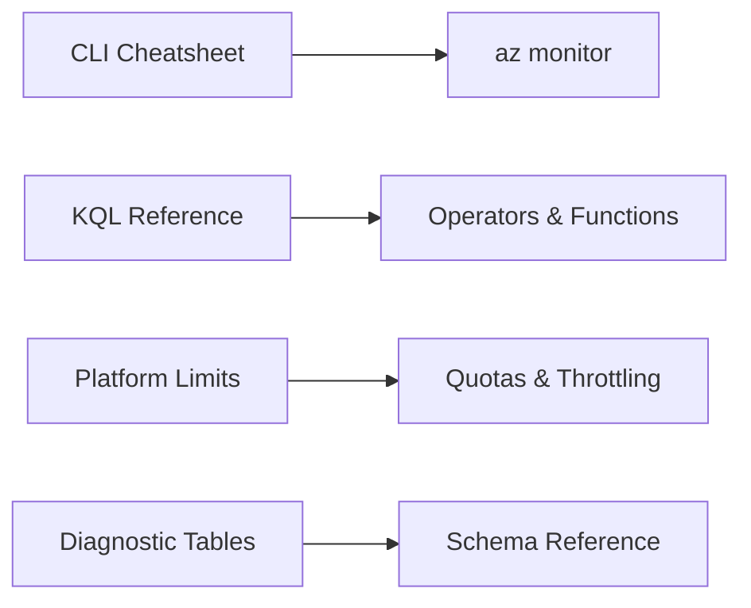

---
content_sources:
  diagrams:
    - id: reference
      type: flowchart
      source: self-generated
      based_on:
        - https://learn.microsoft.com/en-us/azure/azure-monitor/fundamentals/overview
        - https://learn.microsoft.com/en-us/azure/azure-monitor/fundamentals/service-limits
        - https://learn.microsoft.com/en-us/azure/azure-monitor/logs/log-query-overview
---

# Reference

Quick lookup for CLI commands, KQL patterns, and platform limits.

<!-- diagram-id: reference -->

## In This Section

| Page | Description |
|------|-------------|
| [CLI Cheatsheet](cli-cheatsheet.md) | az monitor commands organized by operation category |
| [KQL Quick Reference](kql-quick-reference.md) | Operator summary, time functions, aggregations |
| [Platform Limits](platform-limits.md) | Workspace limits, alert rule limits, query limits |
| [Diagnostic Tables Reference](diagnostic-tables.md) | Common tables by service with schema summaries |

## See Also

- [Troubleshooting](../troubleshooting/index.md)
- [KQL Query Packs](../troubleshooting/kql/index.md)

## Sources

- [az monitor CLI reference](https://learn.microsoft.com/cli/azure/monitor)
- [KQL quick reference](https://learn.microsoft.com/azure/data-explorer/kusto/query/kql-quick-reference)
- [Azure Monitor service limits](https://learn.microsoft.com/azure/azure-monitor/service-limits)
