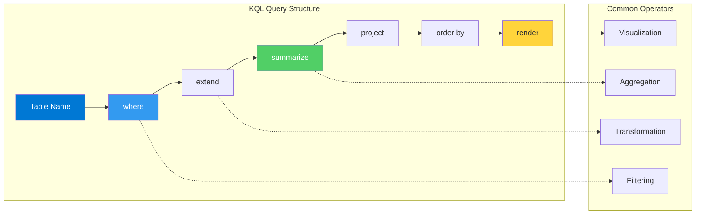

# KQL Quick Reference

Quick patterns for common Azure Monitor Log Analytics operations.



## Time Filtering
```kusto
// Time offset relative to current time
| where TimeGenerated > ago(1h)
| where TimeGenerated > ago(2d)

// Specific range
| where TimeGenerated between(datetime(2025-04-01) .. datetime(2025-04-05))
```

## Aggregations
```kusto
// Count records by time bin
| summarize count() by bin(TimeGenerated, 5m)

// Basic statistics
| summarize avg(TimeTaken), sum(ScBytes), count() by Result

// Distinct values
| distinct ComputerName, Category
```

## Dataset Transformation
```kusto
// Create calculated columns
| extend ResponseSuccess = iff(ScStatus < 400, true, false)
| extend LatencyInSeconds = TimeTaken / 1000.0

// Select specific columns
| project TimeGenerated, CIp, ScStatus, ScUriStem

// Rename columns
| project-rename ClientIP = CIp, RequestPath = ScUriStem
```

## Advanced Operations
```kusto
// Combine multiple tables (union)
AppServiceHTTPLogs | union AppServiceConsoleLogs

// Join related tables
AzureActivity 
| join kind=inner ( Heartbeat ) on _ResourceId
```

## String Operations
```kusto
// Case-insensitive word search (better performance)
| where Log has "Error"

// Substring search
| where Log contains "failure"

// Regex parsing
| parse Log with * "UserID=" UserID:string " Action=" Action:string
```

## Visualization
```kusto
// Line chart over time
| summarize count() by bin(TimeGenerated, 1h)
| render timechart

// Pie chart
| summarize count() by ScStatus
| render piechart
```

## See Also

- [CLI Cheatsheet](cli-cheatsheet.md)
- [Diagnostic Tables Reference](diagnostic-tables.md)
- [KQL Query Packs](../troubleshooting/kql/index.md)

## Sources

- [KQL quick reference](https://learn.microsoft.com/azure/data-explorer/kusto/query/kql-quick-reference)
- [Query best practices](https://learn.microsoft.com/azure/azure-monitor/logs/query-optimization)
- [Log Analytics tutorial](https://learn.microsoft.com/azure/azure-monitor/logs/log-analytics-tutorial)
- [Summarize operator](https://learn.microsoft.com/azure/data-explorer/kusto/query/summarize-operator)
