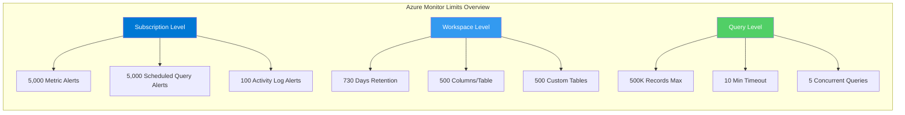

# Platform Limits

Reference of current service limits and quotas for Azure Monitor components. For the most up-to-date values, always refer to the [official Microsoft Learn limits page](https://learn.microsoft.com/azure/azure-monitor/service-limits).

## Log Analytics Workspaces

| Resource | Default Limit | Maximum Limit |
| --- | --- | --- |
| Data Retention (Interactive) | 30 - 730 days | 730 days |
| Data Archive | Up to 12 years | 12 years |
| Daily Ingestion (Free Tier) | 500 MB | 500 MB |
| Maximum columns per table | 500 | 500 |
| Custom log tables per workspace | 500 | Contact Support |

## Alert Rules

| Alert Type | Limit per Subscription | Limit per Resource |
| --- | --- | --- |
| Metric Alerts | 5,000 | N/A |
| Activity Log Alerts | 100 | N/A |
| Scheduled Query Alerts | 5,000 | 1,000 |
| Alert Processing Rules | 1,000 | N/A |
| Action Groups | Unlimited | N/A |

## Query Limits

| Category | Limit | Description |
| --- | --- | --- |
| Max records returned | 500,000 | Maximum number of rows in a single query result |
| Max data returned | ~104 MB | Maximum size of compressed data in portal/API |
| Max query runtime | 10 minutes | Time before a query is automatically terminated |
| Concurrent queries | 5 | Max simultaneous analytics queries per user |
| Query rate | 200 per 30s | Max requests per 30 seconds per user/IP |

## Diagnostic Settings

| Resource | Limit |
| --- | --- |
| Diagnostic settings per resource | 5 |
| Max log categories | Varies by service |

!!! note
    Metric alerts have a limit of 10,000 time-series per alert rule. If you are monitoring at scale, consider using multi-resource alert rules.

## Application Insights Limits

| Resource | Default Limit | Notes |
| --- | --- | --- |
| Total data per day | 100 GB | Can be increased to 1,000 GB in portal |
| Throttling | 32,000 events/sec | Measured over a minute |
| Data retention (logs) | 30 - 730 days | Workspace-based |
| Data retention (metrics) | 90 days | Fixed |
| Max telemetry item size | 64 KB | |

## Requesting Limit Increases

Some limits can be increased by contacting Azure Support:

1. **Navigate** to Azure Portal → Help + Support
2. **Create** a new support request
3. **Select** Service type: Azure Monitor
4. **Specify** the limit you need increased
5. **Provide** justification and expected usage

## See Also

- [CLI Cheatsheet](cli-cheatsheet.md)
- [KQL Quick Reference](kql-quick-reference.md)
- [Operations: Cost Control](../operations/cost-control.md)

## Sources

- [Azure Monitor service limits](https://learn.microsoft.com/azure/azure-monitor/service-limits)
- [Log Analytics workspace limits](https://learn.microsoft.com/azure/azure-monitor/logs/log-analytics-workspace-overview#workspace-limits)
- [Application Insights limits](https://learn.microsoft.com/azure/azure-monitor/app/pricing#limits-summary)

