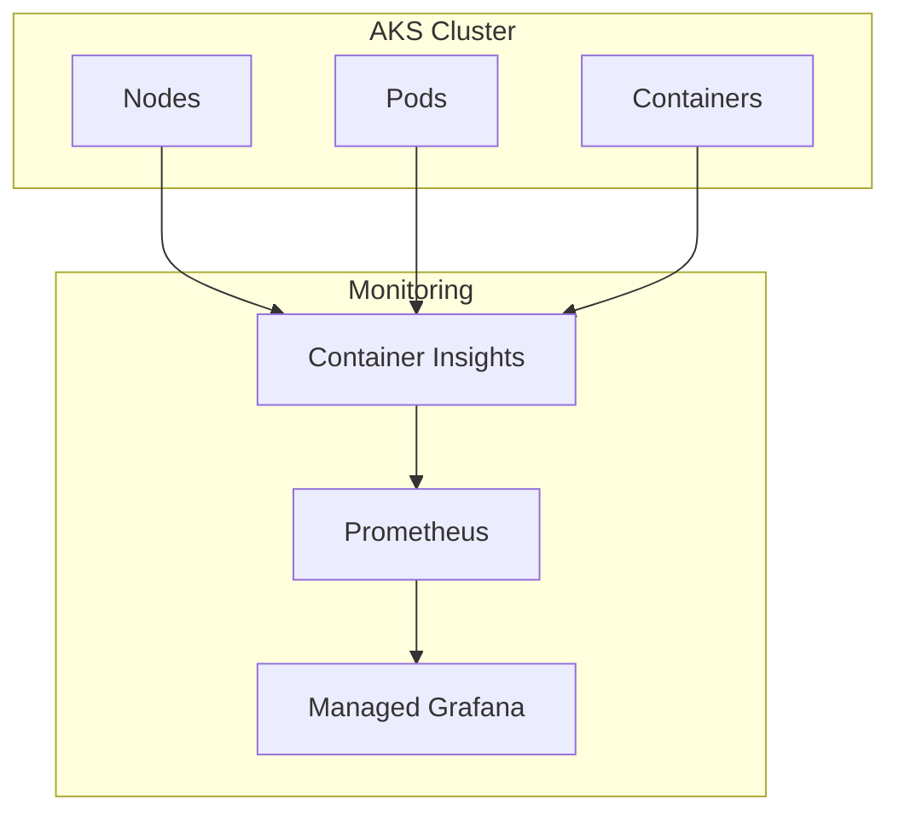

---
content_sources:
  diagrams:
    - id: aks-monitoring
      type: flowchart
      source: self-generated
      based_on:
        - https://learn.microsoft.com/en-us/azure/aks/monitor-aks
        - https://learn.microsoft.com/en-us/azure/azure-monitor/containers/container-insights-overview
---

# AKS Monitoring

Monitoring Azure Kubernetes Service with Container Insights and Prometheus.

<!-- diagram-id: aks-monitoring -->

## In This Section

| Page | Description |
|------|-------------|
| [Observability](observability.md) | Container Insights, Prometheus metrics, Managed Grafana, node/pod/container metrics |

## See Also

- [Platform: Data Collection Rules](../../platform/data-collection-rules.md)
- [Operations: Workspace Management](../../operations/workspace-management.md)

## Sources

- [Monitor Azure Kubernetes Service (AKS)](https://learn.microsoft.com/azure/aks/monitor-aks)
- [Container insights overview](https://learn.microsoft.com/azure/azure-monitor/containers/container-insights-overview)
