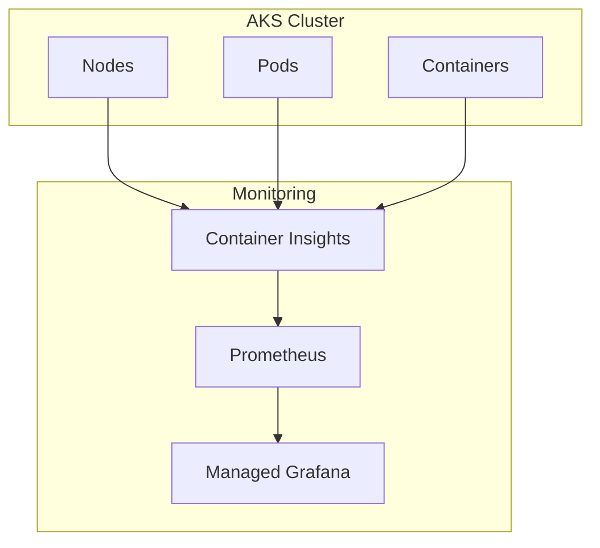

---
content_sources:
  diagrams:
    - id: aks-monitoring
      type: flowchart
      source: self-generated
      justification: "Overview diagram synthesizing the AKS observability stack (Nodes/Pods/Containers -> Container Insights -> Prometheus -> Managed Grafana) for the AKS service-guide hub. Combines the AKS-Container Insights integration and Managed Prometheus / Managed Grafana concepts documented across the based_on Microsoft Learn articles into a single navigational map; not derived from any single Microsoft Learn diagram."
      based_on:
        - https://learn.microsoft.com/en-us/azure/aks/monitor-aks
        - https://learn.microsoft.com/en-us/azure/azure-monitor/containers/container-insights-overview
---

# AKS Monitoring

Monitoring Azure Kubernetes Service with Container Insights and Prometheus.

<!-- diagram-id: aks-monitoring -->

```mermaid
graph TB
    subgraph "AKS Cluster"
        A[Nodes]
        B[Pods]
        C[Containers]
    end
    
    subgraph "Monitoring"
        D[Container Insights]
        E[Prometheus]
        F[Managed Grafana]
    end
    
    A & B & C --> D
    D --> E --> F
```

## In This Section

| Page | Description |
|------|-------------|
| [Observability](observability.md) | Container Insights, Prometheus metrics, Managed Grafana, node/pod/container metrics |

## See Also

- [Platform: Data Collection Rules](../../platform/data-collection-rules.md)
- [Operations: Workspace Management](../../operations/workspace-management.md)

## Sources

- [Monitor Azure Kubernetes Service (AKS)](https://learn.microsoft.com/azure/aks/monitor-aks)
- [Container insights overview](https://learn.microsoft.com/azure/azure-monitor/containers/container-insights-overview)
