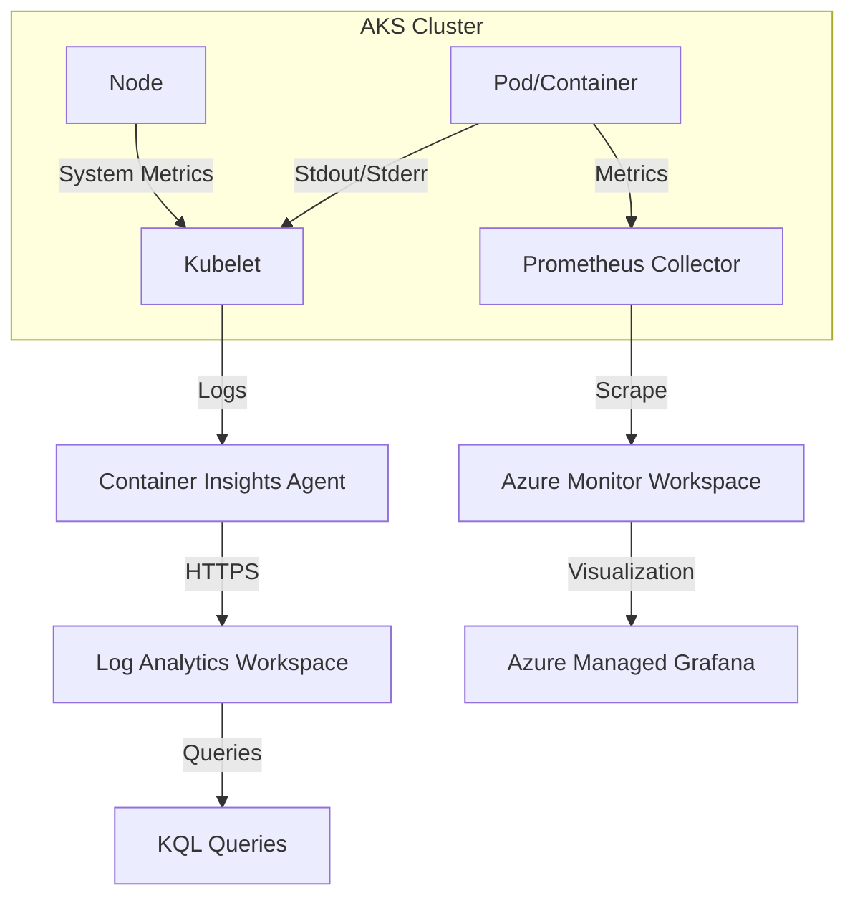

# AKS Observability

Monitoring Azure Kubernetes Service (AKS) requires a multi-layered approach covering the control plane, nodes, and containerized workloads. This is achieved through Container Insights, Azure Monitor Managed Service for Prometheus, and Azure Managed Grafana.

## Data Flow Diagram



## Monitoring Components

- **Container Insights**: Collects memory and processor metrics from controllers, nodes, and containers. It also captures container stdout/stderr logs and Kubernetes events.
- **Managed Prometheus**: A fully managed service based on the Prometheus project from the Cloud Native Computing Foundation. It scrapes metrics from your nodes and pods.
- **Azure Managed Grafana**: Provides pre-built dashboards for visualizing Prometheus metrics and Container Insights data.

## Configuration Examples

### Enabling Container Insights via CLI

To enable the monitoring addon for an existing AKS cluster and link it to a Log Analytics workspace:

```bash
az aks enable-addons \
    --resource-group "my-resource-group" \
    --name "my-aks-cluster" \
    --addons monitoring \
    --workspace-resource-id "/subscriptions/{subscriptionId}/resourceGroups/{resourceGroupName}/providers/Microsoft.OperationalInsights/workspaces/{workspaceName}"
```

### Enabling Managed Prometheus via CLI

```bash
az aks update \
    --resource-group "my-resource-group" \
    --name "my-aks-cluster" \
    --enable-azure-monitor-metrics
```

## KQL Query Examples

### Search Pod Logs

Retrieve stdout/stderr logs for a specific pod.

```kusto
ContainerLogV2
| where TimeGenerated > ago(1h)
| where PodName == "my-pod-name"
| project TimeGenerated, LogSource, Message
| order by TimeGenerated desc
```

### Monitor Node CPU Usage

Analyze average CPU utilization across all nodes in the cluster.

```kusto
KubeNodeInventory
| where TimeGenerated > ago(1h)
| summarize AvgCPU = avg(CpuUsageNanoCores) by NodeName, bin(TimeGenerated, 5m)
| render timechart
```

### Find Failed Pods

List pods that are not in a 'Running' state.

```kusto
KubePodInventory
| where TimeGenerated > ago(1h)
| where PodStatus != "Running"
| summarize count() by PodStatus, Name
```

### Correlate Restarts With Namespace

Use `KubePodInventory` to find pods that restart frequently even if they eventually return to `Running`.

```kusto
KubePodInventory
| where TimeGenerated > ago(24h)
| summarize RestartCount = max(ContainerRestartCount) by Namespace, Name, ClusterName
| where RestartCount > 3
| order by RestartCount desc
```

### Surface Kubernetes Events That Need Immediate Review

This query helps operators focus on warning events such as failed scheduling, image pull problems, or probe failures.

```kusto
KubeEvents
| where TimeGenerated > ago(6h)
| where Type == "Warning"
| project TimeGenerated, Namespace, ObjectKind, Name, Reason, Message
| order by TimeGenerated desc
```

### Sample Output

```text
TimeGenerated              Namespace     ObjectKind   Name                              Reason             Message
-------------------------  ------------  -----------  --------------------------------  -----------------  ------------------------------------------
2026-04-06T01:15:00Z       payments      Pod          payments-api-7df5b7c9b6-k2n4q    Unhealthy          Readiness probe failed: HTTP 500
2026-04-06T01:12:00Z       kube-system   Pod          coredns-6d4b75cb6d-8m2zt         BackOff            Back-off restarting failed container
2026-04-06T01:08:00Z       orders        Pod          orders-worker-5f8f9d9758-2s9hm   FailedScheduling   0/3 nodes are available: 3 Insufficient cpu
```

## Practical Monitoring Baseline

For production AKS, treat observability as three separate but connected layers:

1. **Platform health**
    - Control plane availability
    - Node readiness and kubelet health
    - Cluster autoscaler behavior
2. **Workload health**
    - Pod restarts
    - Deployment rollout failures
    - Namespace-specific error rates
3. **Application health**
    - Container logs
    - Service latency
    - SLO/SLA metrics exported through Prometheus

If only one layer is enabled, incidents usually take longer to triage. For example, a CPU spike on nodes may look like an application issue until `KubeEvents` and pod restart data are reviewed together.

## Recommended Setup Sequence

### 1. Verify addon and workspace connectivity

```bash
az aks show \
    --resource-group "my-resource-group" \
    --name "my-aks-cluster" \
    --query "addonProfiles.omsagent"
```

Sample output:

```json
{
  "config": {
    "logAnalyticsWorkspaceResourceID": "/subscriptions/<subscription-id>/resourceGroups/rg-monitor/providers/Microsoft.OperationalInsights/workspaces/law-monitoring-prod"
  },
  "enabled": true,
  "identity": {
    "clientId": "system-assigned"
  }
}
```

### 2. Confirm managed Prometheus is enabled

```bash
az aks show \
    --resource-group "my-resource-group" \
    --name "my-aks-cluster" \
    --query "azureMonitorProfile.metrics"
```

Sample output:

```json
{
  "enabled": true,
  "kubeStateMetrics": {
    "metricLabelsAllowlist": "namespaces=[*],pods=[*]"
  }
}
```

### 3. Review data collection before an incident

```bash
az monitor log-analytics query \
    --workspace "law-monitoring-prod" \
    --analytics-query "KubeNodeInventory | summarize Nodes=dcount(Computer)" \
    --output table
```

Sample output:

```text
Nodes
-----
3
```

## Alerting Patterns

Metric alerts are useful for rapid detection, while log alerts are better for Kubernetes-specific state and event analysis.

### Metric alert for node CPU saturation

```bash
az monitor metrics alert create \
    --name "aks-node-cpu-high" \
    --resource-group "my-resource-group" \
    --scopes "/subscriptions/<subscription-id>/resourceGroups/my-resource-group/providers/Microsoft.ContainerService/managedClusters/my-aks-cluster" \
    --condition "avg node_cpu_usage_millicores / avg node_cpu_capacity_millicores * 100 > 85" \
    --description "AKS node CPU usage is above 85 percent" \
    --window-size "5m" \
    --evaluation-frequency "1m" \
    --severity 2 \
    --action "/subscriptions/<subscription-id>/resourceGroups/my-resource-group/providers/Microsoft.Insights/actionGroups/ag-platform-oncall"
```

### Scheduled query alert for failed pods

```bash
az monitor scheduled-query create \
    --name "aks-failed-pods" \
    --resource-group "my-resource-group" \
    --scopes "/subscriptions/<subscription-id>/resourceGroups/my-resource-group/providers/Microsoft.OperationalInsights/workspaces/law-monitoring-prod" \
    --condition "count 'KubePodInventory | where TimeGenerated > ago(5m) | where PodStatus in (\"Failed\", \"Unknown\")' > 0" \
    --description "One or more AKS pods entered Failed or Unknown state" \
    --evaluation-frequency "5m" \
    --window-size "5m" \
    --severity 2 \
    --action-groups "/subscriptions/<subscription-id>/resourceGroups/my-resource-group/providers/Microsoft.Insights/actionGroups/ag-platform-oncall"
```

### What to alert on first

- **High priority**
    - Node NotReady
    - Repeated pod restarts
    - Image pull failures
    - Persistent volume mount failures
- **Medium priority**
    - Namespace-specific latency increase
    - HPA scaling limits reached
    - Elevated warning event volume
- **Low priority / dashboard only**
    - Temporary pod rescheduling during rollouts
    - Short-lived cluster autoscaler adjustments

## Operational Queries for Triage

### Namespace error hunt from container logs

```kusto
ContainerLogV2
| where TimeGenerated > ago(30m)
| where Namespace == "payments"
| where Message has_any ("ERROR", "Exception", "timeout", "connection refused")
| project TimeGenerated, PodName, ContainerName, Message
| order by TimeGenerated desc
```

### Detect nodes with pressure conditions

```kusto
KubeNodeInventory
| where TimeGenerated > ago(30m)
| summarize arg_max(TimeGenerated, *) by ClusterName, Computer
| project ClusterName, Computer, Status, NodeConditions
| where NodeConditions has_any ("DiskPressure", "MemoryPressure", "PIDPressure")
```

### Identify noisy namespaces by log volume

```kusto
ContainerLogV2
| where TimeGenerated > ago(1h)
| summarize LogLines=count() by Namespace
| order by LogLines desc
```

Sample output:

```text
Namespace      LogLines
-------------  --------
payments       18234
orders         9411
ingress-nginx  5228
monitoring     1950
```

## Dashboard and Workbook Ideas

Build one AKS workbook per cluster or environment with the following sections:

- **Cluster overview**
    - Node count
    - Ready vs NotReady nodes
    - Total running pods
- **Workload stability**
    - Top restarting pods
    - Warning events by namespace
    - Failed deployments in the last 24 hours
- **Resource pressure**
    - CPU and memory utilization by node pool
    - Pending pods caused by capacity constraints
- **Application symptoms**
    - Error log trend by namespace
    - Latency histograms from Prometheus or Application Insights

## Troubleshooting Checklist

When alerts fire, review evidence in this order:

1. **Cluster-wide state**
    - Are nodes healthy?
    - Is a node pool unavailable?
2. **Kubernetes events**
    - Are there scheduling or image pull warnings?
3. **Pod stability**
    - Are restarts increasing?
    - Is a rollout stuck?
4. **Container logs**
    - Is the problem isolated to one namespace or deployment?
5. **Prometheus service metrics**
    - Do request rate, error rate, and latency confirm customer impact?

## Cost and Retention Notes

- Container logs can become the largest AKS monitoring cost driver.
- Retain verbose stdout/stderr only as long as needed for incident response.
- Use Prometheus metrics for high-frequency infrastructure trends instead of exporting every event as logs.
- Keep log alerts focused on state changes and failure signals rather than every warning line.

## See Also

- [Container Apps Observability](../container-apps/observability.md)
- [VM Observability](../vm/observability.md)

## Sources

- [Monitor Azure Kubernetes Service (AKS)](https://learn.microsoft.com/en-us/azure/aks/monitor-aks)
- [Container insights overview](https://learn.microsoft.com/en-us/azure/azure-monitor/containers/container-insights-overview)
- [Azure Monitor managed service for Prometheus](https://learn.microsoft.com/en-us/azure/azure-monitor/essentials/prometheus-metrics-overview)
