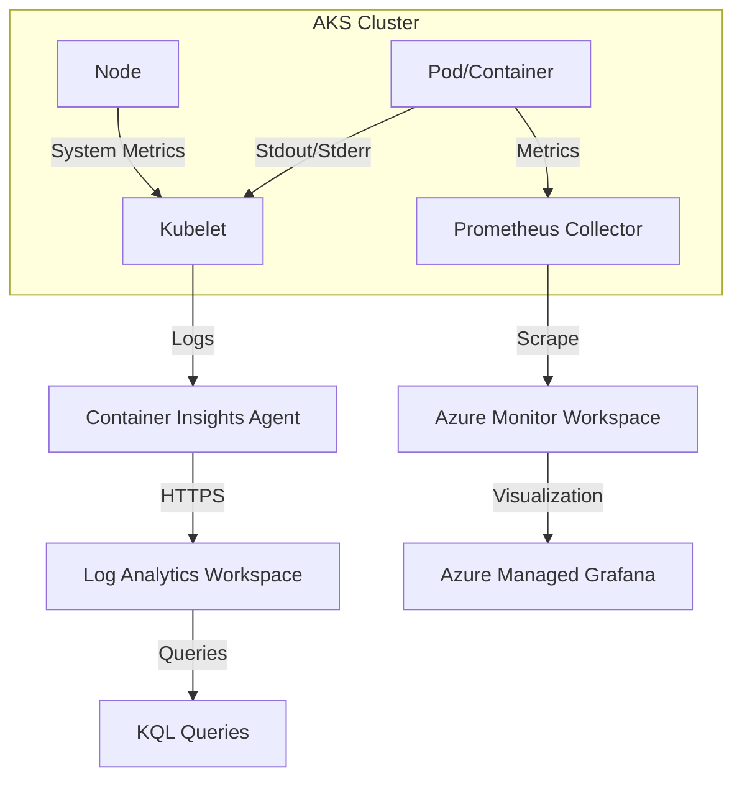

# AKS Observability

Monitoring Azure Kubernetes Service (AKS) requires a multi-layered approach covering the control plane, nodes, and containerized workloads. This is achieved through Container Insights, Azure Monitor Managed Service for Prometheus, and Azure Managed Grafana.

## Data Flow Diagram



## Monitoring Components

- **Container Insights**: Collects memory and processor metrics from controllers, nodes, and containers. It also captures container stdout/stderr logs and Kubernetes events.
- **Managed Prometheus**: A fully managed service based on the Prometheus project from the Cloud Native Computing Foundation. It scrapes metrics from your nodes and pods.
- **Azure Managed Grafana**: Provides pre-built dashboards for visualizing Prometheus metrics and Container Insights data.

## Configuration Examples

### Enabling Container Insights via CLI

To enable the monitoring addon for an existing AKS cluster and link it to a Log Analytics workspace:

```bash
az aks enable-addons \
    --resource-group "my-resource-group" \
    --name "my-aks-cluster" \
    --addons monitoring \
    --workspace-resource-id "/subscriptions/{subscriptionId}/resourceGroups/{resourceGroupName}/providers/Microsoft.OperationalInsights/workspaces/{workspaceName}"
```

### Enabling Managed Prometheus via CLI

```bash
az aks update \
    --resource-group "my-resource-group" \
    --name "my-aks-cluster" \
    --enable-azure-monitor-metrics
```

## KQL Query Examples

### Search Pod Logs

Retrieve stdout/stderr logs for a specific pod.

```kusto
ContainerLogV2
| where TimeGenerated > ago(1h)
| where PodName == "my-pod-name"
| project TimeGenerated, LogSource, Message
| order by TimeGenerated desc
```

### Monitor Node CPU Usage

Analyze average CPU utilization across all nodes in the cluster.

```kusto
KubeNodeInventory
| where TimeGenerated > ago(1h)
| summarize AvgCPU = avg(CpuUsageNanoCores) by NodeName, bin(TimeGenerated, 5m)
| render timechart
```

### Find Failed Pods

List pods that are not in a 'Running' state.

```kusto
KubePodInventory
| where TimeGenerated > ago(1h)
| where PodStatus != "Running"
| summarize count() by PodStatus, Name
```

## See Also

- [Container Apps Observability](../container-apps/observability.md)
- [VM Observability](../vm/observability.md)

## Sources

- [Monitor Azure Kubernetes Service (AKS)](https://learn.microsoft.com/en-us/azure/aks/monitor-aks)
- [Container insights overview](https://learn.microsoft.com/en-us/azure/azure-monitor/containers/container-insights-overview)
- [Azure Monitor managed service for Prometheus](https://learn.microsoft.com/en-us/azure/azure-monitor/essentials/prometheus-metrics-overview)
