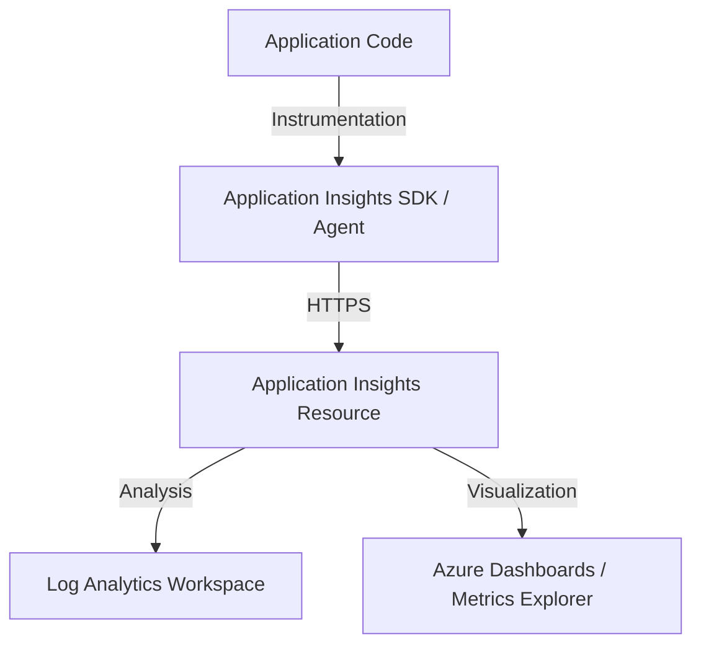

# Application Insights Integration

Azure App Service allows for deeper application-level monitoring through integration with Application Insights. This provides detailed telemetry on requests, dependencies, exceptions, and overall application performance.

## Data Flow Diagram



## Instrumentation Methods

There are two primary ways to integrate Application Insights with Azure App Service:

- **Auto-instrumentation (Codeless)**: No code changes required. Enabled through App Service app settings. Ideal for quickly adding monitoring to existing apps.
- **SDK Setup (Code-based)**: Requires adding the Application Insights SDK to your project code. This method provides more control and allows for custom telemetry.

## Configuration Examples

### Enabling Auto-instrumentation via CLI

Use the `az webapp config appsettings set` command to configure Application Insights for an existing app.

```bash
az webapp config appsettings set \
    --resource-group "my-resource-group" \
    --name "my-app-service" \
    --settings "APPLICATIONINSIGHTS_CONNECTION_STRING=InstrumentationKey=00000000-0000-0000-0000-000000000000;IngestionEndpoint=https://centralus-0.in.applicationinsights.azure.com/" \
    "ApplicationInsightsAgent_EXTENSION_VERSION=~2" \
    "XDT_MicrosoftApplicationInsights_Mode=recommended" \
    "XDT_MicrosoftApplicationInsights_PreemptSdk=1"
```

## KQL Query Examples

### Slowest Requests

Identify the top 10 slowest requests in your application to focus optimization efforts.

```kusto
requests
| where success == true
| order by duration desc
| take 10
| project timestamp, name, duration, success
```

### Dependency Failures

Monitor external dependency calls that are failing, such as database or API calls.

```kusto
dependencies
| where success == false
| summarize count() by name, data
| order by count_ desc
```

### Application Exceptions

List the most common exceptions occurring in your application code.

```kusto
exceptions
| summarize count() by problemId, outerMessage
| order by count_ desc
```

## See Also

- [Platform Logs](platform-logs.md)
- [Alerts and Metrics](alerts-and-metrics.md)

## Sources

- [Monitor Azure App Service](https://learn.microsoft.com/en-us/azure/app-service/monitor-app-service)
- [Application Insights overview](https://learn.microsoft.com/en-us/azure/azure-monitor/app/app-insights-overview)
- [Enable OpenTelemetry with Application Insights for ASP.NET Core](https://learn.microsoft.com/en-us/azure/azure-monitor/app/opentelemetry-enable?tabs=aspnetcore)
