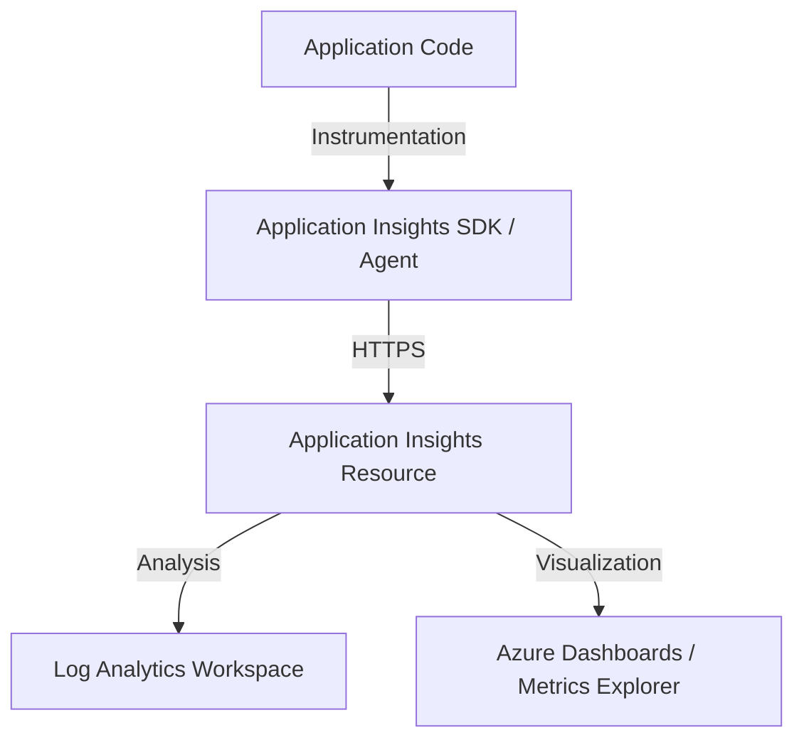

# Application Insights Integration

Azure App Service allows for deeper application-level monitoring through integration with Application Insights. This provides detailed telemetry on requests, dependencies, exceptions, and overall application performance.

## Data Flow Diagram



## Instrumentation Methods

There are two primary ways to integrate Application Insights with Azure App Service:

- **Auto-instrumentation (Codeless)**: No code changes required. Enabled through App Service app settings. Ideal for quickly adding monitoring to existing apps.
- **SDK Setup (Code-based)**: Requires adding the Application Insights SDK to your project code. This method provides more control and allows for custom telemetry.

## Configuration Examples

### Enabling Auto-instrumentation via CLI

Use the `az webapp config appsettings set` command to configure Application Insights for an existing app.

```bash
az webapp config appsettings set \
    --resource-group "my-resource-group" \
    --name "my-app-service" \
    --settings "APPLICATIONINSIGHTS_CONNECTION_STRING=InstrumentationKey=00000000-0000-0000-0000-000000000000;IngestionEndpoint=https://centralus-0.in.applicationinsights.azure.com/" \
    "ApplicationInsightsAgent_EXTENSION_VERSION=~2" \
    "XDT_MicrosoftApplicationInsights_Mode=recommended" \
    "XDT_MicrosoftApplicationInsights_PreemptSdk=1"
```

## KQL Query Examples

### Slowest Requests

Identify the top 10 slowest requests in your application to focus optimization efforts.

```kusto
requests
| where success == true
| order by duration desc
| take 10
| project timestamp, name, duration, success
```

### Dependency Failures

Monitor external dependency calls that are failing, such as database or API calls.

```kusto
dependencies
| where success == false
| summarize count() by name, data
| order by count_ desc
```

### Application Exceptions

List the most common exceptions occurring in your application code.

```kusto
exceptions
| summarize count() by problemId, outerMessage
| order by count_ desc
```

### Correlate Slow Requests With Dependencies

Use operation correlation to verify whether a slow request is caused by external services such as SQL, Redis, or HTTP APIs.

```kusto
requests
| where timestamp > ago(1h)
| where duration > 2s
| project operation_Id, RequestName=name, RequestDuration=duration, resultCode, cloud_RoleName
| join kind=leftouter (
    dependencies
    | where timestamp > ago(1h)
    | project operation_Id, DependencyName=name, DependencyType=type, DependencyDuration=duration, DependencySuccess=success
) on operation_Id
| order by RequestDuration desc
```

### Review Live Failure Trend

```kusto
union requests, dependencies, exceptions
| where timestamp > ago(30m)
| summarize Count=count() by itemType, success, bin(timestamp, 5m)
| order by timestamp asc
```

Sample output:

```text
timestamp                  itemType      success  Count
-------------------------  ------------  -------  -----
2026-04-06T00:40:00Z       request       true     1580
2026-04-06T00:40:00Z       dependency    false    24
2026-04-06T00:40:00Z       exception              7
```

## Recommended Integration Pattern

For App Service, use Application Insights for **application behavior**, and use App Service platform logs for **hosting behavior**. The combination answers two different operational questions:

- **Did the app fail?**
    - Requests
    - Dependencies
    - Exceptions
    - Traces
- **Did the platform contribute to the failure?**
    - App restart events
    - Console logs
    - HTTP platform logs

This separation helps during incidents. A spike in failed requests with no platform anomalies usually points to code, dependency, or configuration problems.

## CLI Configuration Workflow

### 1. Create an Application Insights resource

```bash
az monitor app-insights component create \
    --app "my-app-insights" \
    --location "koreacentral" \
    --resource-group "my-resource-group" \
    --workspace "/subscriptions/<subscription-id>/resourceGroups/my-resource-group/providers/Microsoft.OperationalInsights/workspaces/law-monitoring-prod" \
    --application-type "web"
```

Sample output:

```json
{
  "appId": "a1b2c3d4-e5f6-7890-abcd-ef1234567890",
  "applicationType": "web",
  "connectionString": "<connection-string>",
  "name": "my-app-insights"
}
```

### 2. Retrieve the connection string

```bash
az monitor app-insights component show \
    --app "my-app-insights" \
    --resource-group "my-resource-group" \
    --query "connectionString" \
    --output tsv
```

Sample output:

```text
InstrumentationKey=00000000-0000-0000-0000-000000000000;IngestionEndpoint=https://koreacentral-0.in.applicationinsights.azure.com/;ApplicationId=a1b2c3d4-e5f6-7890-abcd-ef1234567890
```

### 3. Validate that settings were applied to the app

```bash
az webapp config appsettings list \
    --resource-group "my-resource-group" \
    --name "my-app-service" \
    --query "[?name=='APPLICATIONINSIGHTS_CONNECTION_STRING' || name=='ApplicationInsightsAgent_EXTENSION_VERSION']"
```

Sample output:

```json
[
  {
    "name": "APPLICATIONINSIGHTS_CONNECTION_STRING",
    "value": "InstrumentationKey=00000000-0000-0000-0000-000000000000;IngestionEndpoint=https://koreacentral-0.in.applicationinsights.azure.com/"
  },
  {
    "name": "ApplicationInsightsAgent_EXTENSION_VERSION",
    "value": "~2"
  }
]
```

## Validation Queries After Enablement

Run these queries 5 to 15 minutes after deployment or configuration changes.

### Confirm request ingestion

```kusto
requests
| where timestamp > ago(15m)
| summarize RequestCount=count(), FailureCount=countif(success == false) by cloud_RoleName
```

### Confirm trace ingestion from application logs

```kusto
traces
| where timestamp > ago(15m)
| summarize TraceCount=count() by severityLevel, cloud_RoleName
| order by severityLevel asc
```

### Confirm exception details include operation correlation

```kusto
exceptions
| where timestamp > ago(1h)
| project timestamp, operation_Id, type, outerMessage, cloud_RoleName
| order by timestamp desc
```

## Practical Alert Examples

### Scheduled query alert for dependency failure burst

```bash
az monitor scheduled-query create \
    --name "appsvc-dependency-failures" \
    --resource-group "my-resource-group" \
    --scopes "/subscriptions/<subscription-id>/resourceGroups/my-resource-group/providers/Microsoft.OperationalInsights/workspaces/law-monitoring-prod" \
    --condition "count 'dependencies | where timestamp > ago(5m) | where cloud_RoleName == \"my-app-service\" and success == false' > 25" \
    --description "Dependency failures exceeded threshold for App Service application" \
    --evaluation-frequency "5m" \
    --window-size "5m" \
    --severity 2 \
    --action-groups "/subscriptions/<subscription-id>/resourceGroups/my-resource-group/providers/Microsoft.Insights/actionGroups/ag-app-oncall"
```

### Scheduled query alert for unhandled exceptions

```bash
az monitor scheduled-query create \
    --name "appsvc-unhandled-exceptions" \
    --resource-group "my-resource-group" \
    --scopes "/subscriptions/<subscription-id>/resourceGroups/my-resource-group/providers/Microsoft.OperationalInsights/workspaces/law-monitoring-prod" \
    --condition "count 'exceptions | where timestamp > ago(10m) | where cloud_RoleName == \"my-app-service\"' > 10" \
    --description "Unhandled exception volume is above normal baseline" \
    --evaluation-frequency "5m" \
    --window-size "10m" \
    --severity 3 \
    --action-groups "/subscriptions/<subscription-id>/resourceGroups/my-resource-group/providers/Microsoft.Insights/actionGroups/ag-app-oncall"
```

## What Good Telemetry Looks Like

A well-integrated App Service application normally shows:

- Requests with meaningful operation names
- Dependencies with target, result, and duration populated
- Exceptions linked to the failing request via `operation_Id`
- Traces with enough context to explain the business step or tenant flow
- Stable `cloud_RoleName` values so multi-service queries remain easy to group

## Common Pitfalls

- Enabling codeless instrumentation but not validating that telemetry actually arrives
- Treating Application Insights as a replacement for platform logs
- Not correlating slow requests with dependency latency
- Emitting overly verbose traces and increasing ingestion cost without improving triage quality

## Workbook Suggestions

Create one Application Insights workbook section for each of these views:

- Request rate, failure rate, and duration trend
- Top failing dependencies by count and duration
- Exception count by type after deployment
- End-to-end transaction drill-down using `operation_Id`
- Trace samples for one failing request path

## See Also

- [Platform Logs](platform-logs.md)
- [Alerts and Metrics](alerts-and-metrics.md)

## Sources

- [Monitor Azure App Service](https://learn.microsoft.com/en-us/azure/app-service/monitor-app-service)
- [Application Insights overview](https://learn.microsoft.com/en-us/azure/azure-monitor/app/app-insights-overview)
- [Enable OpenTelemetry with Application Insights for ASP.NET Core](https://learn.microsoft.com/en-us/azure/azure-monitor/app/opentelemetry-enable?tabs=aspnetcore)
