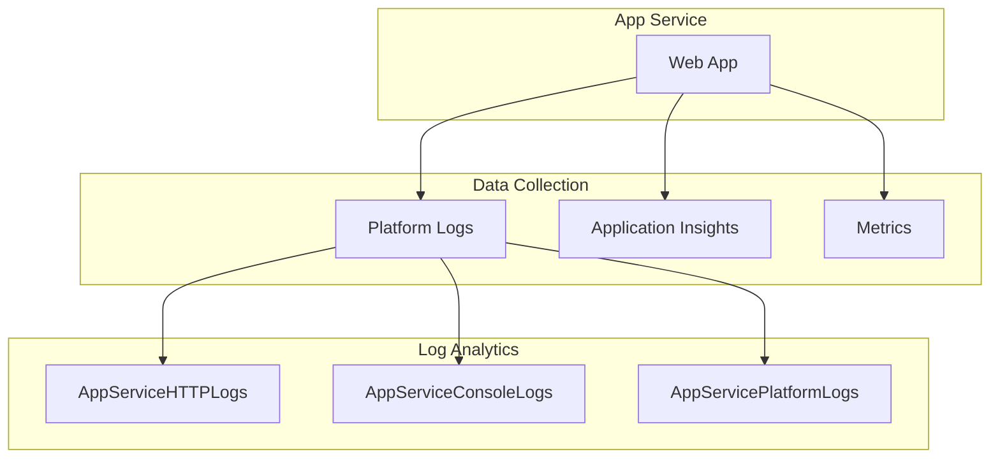

# App Service Monitoring

Monitoring Azure App Service with platform logs, Application Insights, and metrics.

## In This Section

| Page | Description |
|------|-------------|
| [Platform Logs](platform-logs.md) | AppServiceHTTPLogs, ConsoleLogs, PlatformLogs tables |
| [Application Insights Integration](application-insights-integration.md) | Auto-instrumentation, SDK setup, correlation |
| [Alerts and Metrics](alerts-and-metrics.md) | Key metrics, recommended alert rules |

## See Also

- [Platform: Application Insights](../../platform/application-insights.md)
- [Operations: Diagnostic Settings](../../operations/diagnostic-settings.md)

## Sources

- [Monitor App Service](https://learn.microsoft.com/azure/app-service/monitor-app-service)
- [Enable diagnostics logging for apps in Azure App Service](https://learn.microsoft.com/azure/app-service/troubleshoot-diagnostic-logs)
