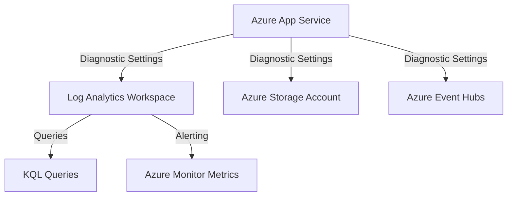

# App Service Platform Logs

Azure App Service generates several types of platform logs that provide insight into the operation and status of your web applications. These logs are essential for troubleshooting issues, monitoring traffic, and auditing access.

## Data Flow Diagram



## Key Log Categories

App Service exposes several diagnostic log categories:

- **AppServiceHTTPLogs**: Detailed information about HTTP requests made to your app.
- **AppServiceConsoleLogs**: Output from the application's console (stdout/stderr).
- **AppServicePlatformLogs**: Logs from the underlying App Service platform, including operations and platform-level events.

## Configuration Examples

### Enabling Diagnostic Logs via CLI

To enable diagnostic logs and send them to a Log Analytics workspace, use the `az monitor diagnostic-settings create` command with long flags.

```bash
az monitor diagnostic-settings create \
    --resource "/subscriptions/{subscriptionId}/resourceGroups/{resourceGroupName}/providers/Microsoft.Web/sites/{appName}" \
    --name "app-service-diagnostic-logs" \
    --workspace "/subscriptions/{subscriptionId}/resourceGroups/{resourceGroupName}/providers/Microsoft.OperationalInsights/workspaces/{workspaceName}" \
    --logs '[
        {
            "category": "AppServiceHTTPLogs",
            "enabled": true
        },
        {
            "category": "AppServiceConsoleLogs",
            "enabled": true
        },
        {
            "category": "AppServicePlatformLogs",
            "enabled": true
        }
    ]'
```

## KQL Query Examples

### Monitor HTTP Request Status Codes

Identify trends in HTTP response codes to detect spikes in errors.

```kusto
AppServiceHTTPLogs
| where TimeGenerated > ago(1h)
| summarize count() by Result, bin(TimeGenerated, 5m)
| render timechart
```

### Search Console Logs for Errors

Find specific error messages emitted by your application to stdout or stderr.

```kusto
AppServiceConsoleLogs
| where TimeGenerated > ago(4h)
| where Result contains "Error" or Result contains "Exception"
| project TimeGenerated, Result
| order by TimeGenerated desc
```

### Analyze Platform Events

Monitor platform events that might affect your app's availability.

```kusto
AppServicePlatformLogs
| where TimeGenerated > ago(24h)
| project TimeGenerated, Message, Level
| order by TimeGenerated desc
```

## See Also

- [Application Insights Integration](application-insights-integration.md)
- [Alerts and Metrics](alerts-and-metrics.md)

## Sources

- [Monitor Azure App Service](https://learn.microsoft.com/en-us/azure/app-service/monitor-app-service)
- [Troubleshoot diagnostic logs](https://learn.microsoft.com/en-us/azure/app-service/troubleshoot-diagnostic-logs)
