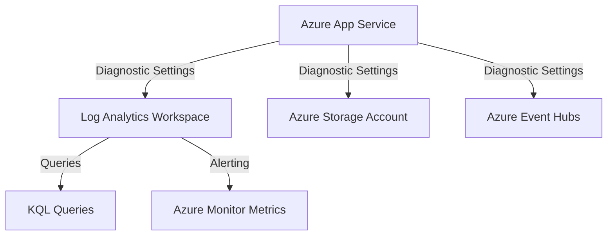

---
content_sources:
  diagrams:
    - id: data-flow-diagram
      type: flowchart
      source: mslearn-adapted
      based_on:
        - https://learn.microsoft.com/en-us/azure/app-service/monitor-app-service
        - https://learn.microsoft.com/en-us/azure/app-service/troubleshoot-diagnostic-logs
---

# App Service Platform Logs

Azure App Service generates several types of platform logs that provide insight into the operation and status of your web applications. These logs are essential for troubleshooting issues, monitoring traffic, and auditing access.

## Data Flow Diagram

<!-- diagram-id: data-flow-diagram -->


## Key Log Categories

App Service exposes several diagnostic log categories:

- **AppServiceHTTPLogs**: Detailed information about HTTP requests made to your app.
- **AppServiceConsoleLogs**: Output from the application's console (stdout/stderr).
- **AppServicePlatformLogs**: Logs from the underlying App Service platform, including operations and platform-level events.

## Configuration Examples

### Enabling Diagnostic Logs via CLI

To enable diagnostic logs and send them to a Log Analytics workspace, use the `az monitor diagnostic-settings create` command with long flags.

```bash
az monitor diagnostic-settings create \
    --resource "/subscriptions/{subscriptionId}/resourceGroups/{resourceGroupName}/providers/Microsoft.Web/sites/{appName}" \
    --name "app-service-diagnostic-logs" \
    --workspace "/subscriptions/{subscriptionId}/resourceGroups/{resourceGroupName}/providers/Microsoft.OperationalInsights/workspaces/{workspaceName}" \
    --logs '[
        {
            "category": "AppServiceHTTPLogs",
            "enabled": true
        },
        {
            "category": "AppServiceConsoleLogs",
            "enabled": true
        },
        {
            "category": "AppServicePlatformLogs",
            "enabled": true
        }
    ]'
```

## KQL Query Examples

### Monitor HTTP Request Status Codes

Identify trends in HTTP response codes to detect spikes in errors.

```kusto
AppServiceHTTPLogs
| where TimeGenerated > ago(1h)
| summarize count() by Result, bin(TimeGenerated, 5m)
| render timechart
```

### Search Console Logs for Errors

Find specific error messages emitted by your application to stdout or stderr.

```kusto
AppServiceConsoleLogs
| where TimeGenerated > ago(4h)
| where Result contains "Error" or Result contains "Exception"
| project TimeGenerated, Result
| order by TimeGenerated desc
```

### Analyze Platform Events

Monitor platform events that might affect your app's availability.

```kusto
AppServicePlatformLogs
| where TimeGenerated > ago(24h)
| project TimeGenerated, Message, Level
| order by TimeGenerated desc
```

### Review HTTP Failures by Client IP and Path

```kusto
AppServiceHTTPLogs
| where TimeGenerated > ago(1h)
| where ScStatus >= 500
| summarize FailureCount=count() by CsUriStem, CIp, ScStatus
| order by FailureCount desc
```

### Detect Restart-Related Platform Messages

```kusto
AppServicePlatformLogs
| where TimeGenerated > ago(24h)
| where Message has_any ("restart", "recycle", "container start", "container stop")
| project TimeGenerated, Level, Message
| order by TimeGenerated desc
```

Sample output:

```text
TimeGenerated              Level    Message
-------------------------  -------  ------------------------------------------------------
2026-04-06T00:12:00Z       Informational  Worker process recycled after application setting change
2026-04-06T00:11:00Z       Informational  Container start completed in 18 seconds
```

## What Platform Logs Answer

App Service platform logs are most useful when you need to separate **application defects** from **hosting and runtime behavior**.

- **HTTP logs** answer:
    - Which routes are failing?
    - Which status codes increased?
    - Is a particular client or path affected?
- **Console logs** answer:
    - What did the app emit to stdout/stderr?
    - Did startup fail?
    - Are there framework-level stack traces?
- **Platform logs** answer:
    - Did the app restart or recycle?
    - Was there deployment-related host activity?
    - Did the container startup sequence fail?

## Recommended Logging Baseline

Enable platform logs on production apps when at least one of these is true:

- The application is customer-facing and requires incident evidence beyond metrics
- The team deploys frequently and needs restart or startup visibility
- The runtime is container-based and console output is part of the troubleshooting workflow
- The application shares a plan and operators must distinguish app issues from plan capacity issues

## CLI Verification Steps

### Check current diagnostic settings

```bash
az monitor diagnostic-settings list \
    --resource "/subscriptions/<subscription-id>/resourceGroups/my-resource-group/providers/Microsoft.Web/sites/my-app-service"
```

Sample output:

```json
[
  {
    "name": "app-service-diagnostic-logs",
    "workspaceId": "/subscriptions/<subscription-id>/resourceGroups/my-resource-group/providers/Microsoft.OperationalInsights/workspaces/law-monitoring-prod",
    "logs": [
      { "category": "AppServiceHTTPLogs", "enabled": true },
      { "category": "AppServiceConsoleLogs", "enabled": true },
      { "category": "AppServicePlatformLogs", "enabled": true }
    ]
  }
]
```

### Query the workspace for fresh App Service HTTP logs

```bash
az monitor log-analytics query \
    --workspace "law-monitoring-prod" \
    --analytics-query "AppServiceHTTPLogs | where TimeGenerated > ago(15m) | summarize count()" \
    --output table
```

Sample output:

```text
Count
-----
4210
```

## Practical Alert Examples

### Scheduled query alert for platform restart messages

```bash
az monitor scheduled-query create \
    --name "appsvc-platform-restart-events" \
    --resource-group "my-resource-group" \
    --scopes "/subscriptions/<subscription-id>/resourceGroups/my-resource-group/providers/Microsoft.OperationalInsights/workspaces/law-monitoring-prod" \
    --condition "count 'AppServicePlatformLogs | where TimeGenerated > ago(5m) | where Message has_any (\"restart\", \"recycle\")' > 0" \
    --description "App Service platform recorded restart or recycle activity" \
    --evaluation-frequency "5m" \
    --window-size "5m" \
    --severity 3 \
    --action-groups "/subscriptions/<subscription-id>/resourceGroups/my-resource-group/providers/Microsoft.Insights/actionGroups/ag-app-oncall"
```

### Scheduled query alert for repeated 5xx paths in HTTP logs

```bash
az monitor scheduled-query create \
    --name "appsvc-http-log-5xx-paths" \
    --resource-group "my-resource-group" \
    --scopes "/subscriptions/<subscription-id>/resourceGroups/my-resource-group/providers/Microsoft.OperationalInsights/workspaces/law-monitoring-prod" \
    --condition "count 'AppServiceHTTPLogs | where TimeGenerated > ago(5m) | where ScStatus >= 500' > 20" \
    --description "HTTP logs show repeated 5xx responses in the last 5 minutes" \
    --evaluation-frequency "5m" \
    --window-size "5m" \
    --severity 2 \
    --action-groups "/subscriptions/<subscription-id>/resourceGroups/my-resource-group/providers/Microsoft.Insights/actionGroups/ag-app-oncall"
```

## Investigation Workflow

When an App Service incident starts, use this order:

1. **HTTP logs**
    - Confirm whether users saw 4xx or 5xx responses
    - Identify the affected route or client pattern
2. **Platform logs**
    - Check for host restart, recycle, or startup messages
3. **Console logs**
    - Read stack traces and dependency connection errors
4. **Application Insights**
    - Correlate the failing route with request, dependency, and exception telemetry

This sequence reduces false assumptions. For example, an increase in 5xx responses with a recent recycle event often points to startup or configuration regressions, not just application logic bugs.

## Retention and Cost Notes

- HTTP logs can grow quickly on high-traffic apps.
- Console logs become expensive if the application writes verbose debug-level output continuously.
- Keep noisy frameworks from logging request bodies or low-value health probe entries unless there is a compliance need.
- For long-term auditing, send a second copy to Storage or Event Hubs instead of retaining everything in Log Analytics for extended periods.

## Workbook Suggestions

- HTTP status distribution by route
- Top failing user agents or client IPs
- Restart and recycle timeline
- Console error trend after each deployment
- Drill-through link from `ScStatus >= 500` rows to Application Insights request details

## See Also

- [Application Insights Integration](application-insights-integration.md)
- [Alerts and Metrics](alerts-and-metrics.md)

## Sources

- [Monitor Azure App Service](https://learn.microsoft.com/en-us/azure/app-service/monitor-app-service)
- [Troubleshoot diagnostic logs](https://learn.microsoft.com/en-us/azure/app-service/troubleshoot-diagnostic-logs)
