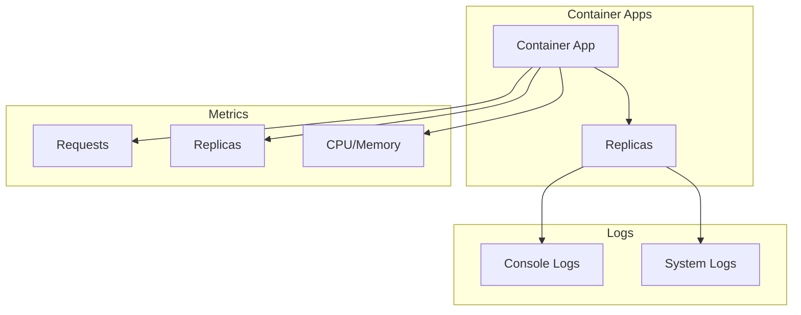

# Container Apps Monitoring

Monitoring Azure Container Apps observability.

## In This Section

| Page | Description |
|------|-------------|
| [Observability](observability.md) | Console logs, system logs, Application Insights, scaling metrics |

## See Also

- [Platform: Log Analytics Workspace](../../platform/log-analytics-workspace.md)
- [Operations: Diagnostic Settings](../../operations/diagnostic-settings.md)

## Sources

- [Observability in Azure Container Apps](https://learn.microsoft.com/azure/container-apps/observability)
- [Log streaming in Azure Container Apps](https://learn.microsoft.com/azure/container-apps/log-streaming)
