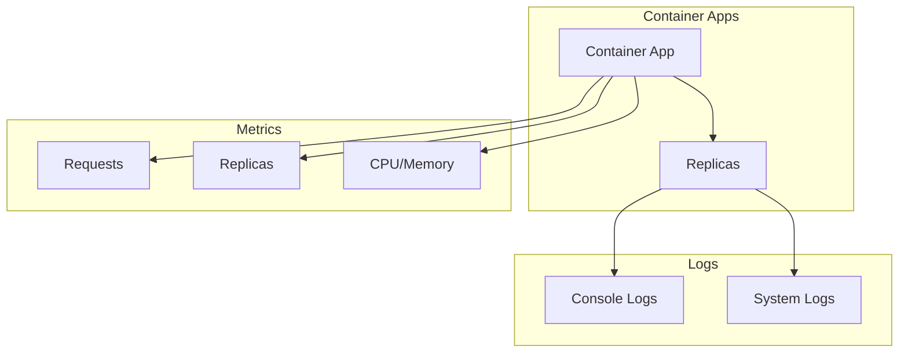

---
content_sources:
  diagrams:
    - id: container-apps-monitoring
      type: flowchart
      source: self-generated
      justification: "Overview diagram synthesizing Container Apps observability signals (Container App + Replicas -> Console Logs / System Logs and Request / Replica / CPU-Memory metrics) for the Container Apps service-guide hub. Combines the Container Apps observability model and Log Analytics workspace ingestion behavior documented in the based_on Microsoft Learn articles into a single navigational map; not derived from any single Microsoft Learn diagram."
      based_on:
        - https://learn.microsoft.com/en-us/azure/container-apps/observability
        - https://learn.microsoft.com/en-us/azure/azure-monitor/logs/log-analytics-overview
---

# Container Apps Monitoring

Monitoring Azure Container Apps observability.

<!-- diagram-id: container-apps-monitoring -->

```mermaid
graph TB
    subgraph "Container Apps"
        A[Container App]
        B[Replicas]
    end
    
    subgraph "Logs"
        C[Console Logs]
        D[System Logs]
    end
    
    subgraph "Metrics"
        E[Requests]
        F[Replicas]
        G[CPU/Memory]
    end
    
    A --> B
    B --> C & D
    A --> E & F & G
```

## In This Section

| Page | Description |
|------|-------------|
| [Observability](observability.md) | Console logs, system logs, Application Insights, scaling metrics |

## See Also

- [Platform: Log Analytics Workspace](../../platform/log-analytics-workspace.md)
- [Operations: Diagnostic Settings](../../operations/diagnostic-settings.md)

## Sources

- [Observability in Azure Container Apps](https://learn.microsoft.com/azure/container-apps/observability)
- [Log streaming in Azure Container Apps](https://learn.microsoft.com/azure/container-apps/log-streaming)
