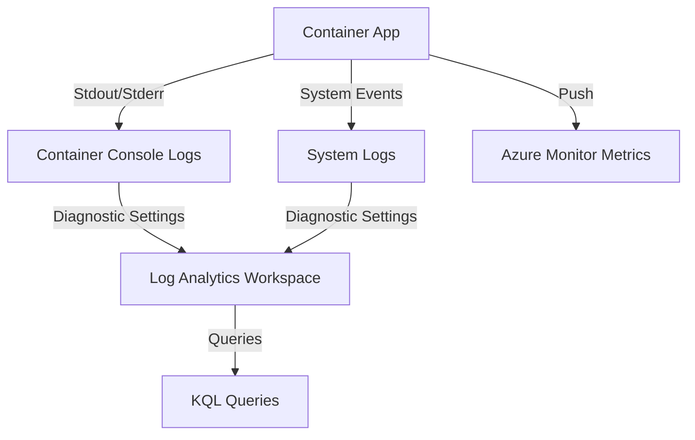

---
content_sources:
  diagrams:
    - id: data-flow-diagram
      type: flowchart
      source: mslearn-adapted
      based_on:
        - https://learn.microsoft.com/en-us/azure/container-apps/observability
        - https://learn.microsoft.com/en-us/azure/container-apps/log-streaming
---

# Observability in Azure Container Apps

Azure Container Apps provides several built-in observability features that help you monitor and diagnose the state of your application throughout its lifecycle.

## Data Flow Diagram

<!-- diagram-id: data-flow-diagram -->


## Log Types

Container Apps separates logs into two main categories:

- **Console Logs**: These are the `stdout` and `stderr` streams from your containers. They are stored in the `ContainerAppConsoleLogs_CL` table.
- **System Logs**: These logs are generated by the Container Apps service itself (e.g., scaling events, deployment status). They are stored in the `ContainerAppSystemLogs_CL` table.

Treat these two streams as different evidence sources instead of as interchangeable logs:

- **Console logs answer application questions**
    - Did the code throw an exception?
    - Did dependency calls time out?
    - Did the container start with the expected configuration?
- **System logs answer platform questions**
    - Did a new revision fail readiness or provisioning?
    - Did a scale rule trigger a replica change?
    - Did secret resolution, ingress, or environment configuration fail before the app even started?

During incidents, start with system logs when the symptom began right after deployment, scale activity, or secret rotation. Start with console logs when the symptom is request failures, error bursts, or a single revision behaving differently from the rest.

## Scaling Metrics

Container Apps can scale based on various metrics:

- **HTTP Requests**: Scale based on the number of concurrent HTTP requests per second.
- **CPU Utilization**: Scale when average CPU usage exceeds a threshold.
- **Memory Utilization**: Scale when average memory usage exceeds a threshold.
- **Custom Metrics**: Scale based on external triggers like Azure Service Bus queue length or KEDA scalers.

## Configuration Examples

### Viewing Streamed Logs via CLI

To view live logs from a specific container app, use the `az containerapp logs show` command.

```bash
az containerapp logs show \
    --resource-group "my-resource-group" \
    --name "my-container-app" \
    --follow true \
    --format text
```

## KQL Query Examples

### Search Console Logs for Errors

Identify application-level errors by searching the console logs.

```kusto
ContainerAppConsoleLogs_CL
| where TimeGenerated > ago(1h)
| where Log_s contains "error" or Log_s contains "exception"
| project TimeGenerated, ContainerName_s, Log_s
| order by TimeGenerated desc
```

### Monitor Scaling Events

Track when and why your container app scaled.

```kusto
ContainerAppSystemLogs_CL
| where TimeGenerated > ago(24h)
| where Type_s == "Scaling"
| project TimeGenerated, Reason_s, Log_s
| order by TimeGenerated desc
```

### Find Revision Rollout Problems

```kusto
ContainerAppSystemLogs_CL
| where TimeGenerated > ago(24h)
| where Log_s has_any ("revision", "deployment", "provisioning", "failed")
| project TimeGenerated, RevisionName_s, ReplicaName_s, Log_s
| order by TimeGenerated desc
```

### Identify Noisy Replicas

```kusto
ContainerAppConsoleLogs_CL
| where TimeGenerated > ago(1h)
| summarize LogLines=count() by ContainerAppName_s, RevisionName_s, ReplicaName_s
| order by LogLines desc
```

Sample output:

```text
ContainerAppName_s   RevisionName_s     ReplicaName_s                 LogLines
------------------   -----------------  ----------------------------  --------
payments-api         payments-api--r12  payments-api--r12-6c9d7c9    3120
payments-api         payments-api--r12  payments-api--r12-8m4s1j2    2988
```

## Monitoring Baseline

Container Apps monitoring should cover four areas together:

1. **Ingress and request behavior**
    - Request volume and latency
    - HTTP error spikes
2. **Revision health**
    - New revision startup failures
    - Replica churn after configuration changes
3. **Scaling behavior**
    - KEDA-triggered scale-out and scale-in events
    - Saturation before new replicas are added
4. **Application logs**
    - Dependency failures
    - Crash loops
    - Configuration or secret resolution errors

## CLI Workflow

### Show Container App configuration

```bash
az containerapp show \
    --resource-group "my-resource-group" \
    --name "my-container-app"
```

Sample output:

```json
{
  "name": "my-container-app",
  "properties": {
    "configuration": {
      "ingress": {
        "external": true,
        "targetPort": 8080
      }
    },
    "latestReadyRevisionName": "my-container-app--r12",
    "runningStatus": "Running"
  }
}
```

### View recent revisions

```bash
az containerapp revision list \
    --resource-group "my-resource-group" \
    --name "my-container-app" \
    --output table
```

Sample output:

```text
Name                   Active    Replicas    CreatedTime
---------------------  --------  ----------  -------------------------
my-container-app--r12  True      3           2026-04-06T00:22:00+00:00
my-container-app--r11  False     0           2026-04-05T18:10:00+00:00
```

### Query logs from the workspace

```bash
az monitor log-analytics query \
    --workspace "law-monitoring-prod" \
    --analytics-query "ContainerAppSystemLogs_CL | where TimeGenerated > ago(15m) | take 5" \
    --output table
```

## Diagnostic Settings Strategy

Container Apps observability is strongest when you deliberately route both log categories to the same Log Analytics workspace that your alerts and workbooks use.

### Recommended categories to enable

- **Always enable**
    - `ContainerAppConsoleLogs`
    - `ContainerAppSystemLogs`
- **Keep metrics enabled**
    - `AllMetrics`

This split keeps application evidence and platform evidence queryable without mixing ownership boundaries. Application teams usually act on console logs, while platform teams investigate system logs for revision rollout, scaler, and infrastructure issues.

### Create diagnostic settings for both log streams

```bash
az monitor diagnostic-settings create \
    --name "diag-containerapp-observability" \
    --resource "/subscriptions/<subscription-id>/resourceGroups/my-resource-group/providers/Microsoft.App/containerApps/my-container-app" \
    --workspace "/subscriptions/<subscription-id>/resourceGroups/my-resource-group/providers/Microsoft.OperationalInsights/workspaces/law-monitoring-prod" \
    --logs '[
        {
            "category": "ContainerAppConsoleLogs",
            "enabled": true
        },
        {
            "category": "ContainerAppSystemLogs",
            "enabled": true
        }
    ]' \
    --metrics '[
        {
            "category": "AllMetrics",
            "enabled": true
        }
    ]'
```

### Validate enabled categories

```bash
az monitor diagnostic-settings show \
    --name "diag-containerapp-observability" \
    --resource "/subscriptions/<subscription-id>/resourceGroups/my-resource-group/providers/Microsoft.App/containerApps/my-container-app"
```

Sample output:

```json
{
  "logs": [
    {
      "category": "ContainerAppConsoleLogs",
      "enabled": true
    },
    {
      "category": "ContainerAppSystemLogs",
      "enabled": true
    }
  ],
  "metrics": [
    {
      "category": "AllMetrics",
      "enabled": true
    }
  ],
  "workspaceId": "/subscriptions/<subscription-id>/resourceGroups/my-resource-group/providers/Microsoft.OperationalInsights/workspaces/law-monitoring-prod"
}
```

## Additional KQL for Scale and Dapr Analysis

### Separate platform failures from app failures

Use this query when users report errors after a deployment and you need to determine whether the fault started in the platform or inside the container.

```kusto
let PlatformSignals =
    ContainerAppSystemLogs_CL
    | where TimeGenerated > ago(2h)
    | summarize SystemEvents=count() by bin(TimeGenerated, 10m), ContainerAppName_s;
let AppSignals =
    ContainerAppConsoleLogs_CL
    | where TimeGenerated > ago(2h)
    | where Log_s has_any ("ERROR", "Exception", "timeout", "connection refused")
    | summarize ConsoleErrors=count() by bin(TimeGenerated, 10m), ContainerAppName_s;
PlatformSignals
| join kind=fullouter AppSignals on TimeGenerated, ContainerAppName_s
| project TimeGenerated, ContainerAppName_s, SystemEvents=coalesce(SystemEvents, 0), ConsoleErrors=coalesce(ConsoleErrors, 0)
| order by TimeGenerated desc
```

Sample output:

| TimeGenerated | ContainerAppName_s | SystemEvents | ConsoleErrors | Interpretation |
|---|---|---:|---:|---|
| 2026-04-06T01:10:00Z | payments-api | 14 | 0 | Platform activity spiked without matching app errors; check revision rollout or scaling. |
| 2026-04-06T01:20:00Z | payments-api | 2 | 37 | App-level failure pattern; inspect code, secrets, or dependencies in console logs. |

### Track scale decisions and replica churn

This query surfaces whether scale activity is concentrated on one app or revision.

```kusto
ContainerAppSystemLogs_CL
| where TimeGenerated > ago(24h)
| where Log_s has_any ("scale", "scaler", "replica", "KEDA")
| summarize ScaleEvents=count(), LatestEvent=max(TimeGenerated) by ContainerAppName_s, RevisionName_s, Reason_s
| order by ScaleEvents desc
```

Sample output:

| ContainerAppName_s | RevisionName_s | Reason_s | ScaleEvents | LatestEvent | Interpretation |
|---|---|---|---:|---|---|
| payments-api | payments-api--r12 | HTTP concurrency | 26 | 2026-04-06T01:22:00Z | Normal scale activity under rising request load. |
| order-worker | order-worker--r08 | Service Bus scaler | 18 | 2026-04-06T01:18:00Z | Queue-driven workload is actively scaling. Validate backlog drain rate. |
| email-sender | email-sender--r03 | Revision provisioning | 9 | 2026-04-06T00:54:00Z | Replica churn is tied to revision issues, not customer demand. |

### Inspect Dapr sidecar warnings

If your environment uses Dapr, service invocation and pub/sub failures frequently appear as sidecar or component-related messages in system and console logs.

```kusto
union isfuzzy=true
    (ContainerAppSystemLogs_CL | project TimeGenerated, ContainerAppName_s, RevisionName_s, Source="system", Message=Log_s),
    (ContainerAppConsoleLogs_CL | project TimeGenerated, ContainerAppName_s, RevisionName_s, Source="console", Message=Log_s)
| where TimeGenerated > ago(6h)
| where Message has_any ("dapr", "sidecar", "pubsub", "state store", "service invocation")
| order by TimeGenerated desc
```

Sample output:

| TimeGenerated | ContainerAppName_s | RevisionName_s | Source | Message | Interpretation |
|---|---|---|---|---|---|
| 2026-04-06T00:48:00Z | checkout-api | checkout-api--r09 | system | Dapr sidecar failed readiness probe for component pubsub-orders | Dapr sidecar health blocked the revision from stabilizing. |
| 2026-04-06T00:49:00Z | checkout-api | checkout-api--r09 | console | error publishing event via dapr pubsub component | Application code sees the same Dapr issue; check component config and secrets. |

## Scaling Metrics and Decision Monitoring

Azure Container Apps emits platform metrics to Azure Monitor even when the most detailed explanation of a scale event comes from system logs. Use metrics for thresholds and trends, then use system logs to explain *why* scaling happened.

### Metrics to pin first

- **Replica count**
    - Detect whether the app is stuck at min replicas or oscillating rapidly.
- **Requests / requests per replica**
    - Validate whether scale-out kept up with load.
- **CPU percentage and memory working set**
    - Confirm resource pressure before blaming the scaler.
- **Ingress response status distribution**
    - Correlate scale activity with 4xx or 5xx bursts.

### Metric check from CLI

```bash
az monitor metrics list \
    --resource "/subscriptions/<subscription-id>/resourceGroups/my-resource-group/providers/Microsoft.App/containerApps/my-container-app" \
    --metric "Requests" "Replicas" \
    --interval "PT5M" \
    --aggregation "Average" "Maximum"
```

Sample output:

```json
{
  "value": [
    {
      "name": {
        "value": "Requests"
      }
    },
    {
      "name": {
        "value": "Replicas"
      }
    }
  ]
}
```

## Dapr Integration Observability

When Dapr is enabled for Container Apps, add a separate investigation path for the sidecar and component layer:

1. **Sidecar health**
    - Review system logs for readiness or startup failures.
2. **Component reachability**
    - Look for secret, state store, or pub/sub initialization errors.
3. **App-to-sidecar interaction**
    - Search console logs for connection-refused, timeout, or component-not-found messages.
4. **Business symptom correlation**
    - Confirm whether retries, duplicate deliveries, or missing events align with Dapr warnings.

If Dapr is not enabled, keep the workbook tabs ready but hidden; the same guide can still be reused across mixed environments.


## Practical Alert Examples

### Alert on revision provisioning failures

```bash
az monitor scheduled-query create \
    --name "aca-revision-failed" \
    --resource-group "my-resource-group" \
    --scopes "/subscriptions/<subscription-id>/resourceGroups/my-resource-group/providers/Microsoft.OperationalInsights/workspaces/law-monitoring-prod" \
    --condition "count 'ContainerAppSystemLogs_CL | where TimeGenerated > ago(5m) | where Log_s has_any (\"revision failed\", \"provisioning failed\")' > 0" \
    --description "Azure Container Apps revision provisioning failed" \
    --evaluation-frequency "5m" \
    --window-size "5m" \
    --severity 2 \
    --action-groups "/subscriptions/<subscription-id>/resourceGroups/my-resource-group/providers/Microsoft.Insights/actionGroups/ag-app-oncall"
```

### Alert on application error bursts in console logs

```bash
az monitor scheduled-query create \
    --name "aca-console-errors" \
    --resource-group "my-resource-group" \
    --scopes "/subscriptions/<subscription-id>/resourceGroups/my-resource-group/providers/Microsoft.OperationalInsights/workspaces/law-monitoring-prod" \
    --condition "count 'ContainerAppConsoleLogs_CL | where TimeGenerated > ago(5m) | where Log_s has_any (\"ERROR\", \"Exception\")' > 30" \
    --description "Container App console logs contain elevated error volume" \
    --evaluation-frequency "5m" \
    --window-size "5m" \
    --severity 2 \
    --action-groups "/subscriptions/<subscription-id>/resourceGroups/my-resource-group/providers/Microsoft.Insights/actionGroups/ag-app-oncall"
```

## Triage Workflow

1. **Check latest revision status**
    - Did a new revision just roll out?
2. **Read system logs**
    - Are there provisioning, secret, or scaler errors?
3. **Read console logs**
    - Are dependencies timing out or is the app crashing?
4. **Review scaling events**
    - Did demand exceed the current replica count?
5. **Validate ingress**
    - Are HTTP failures concentrated on one revision?

## Operational Tips

- Keep revision names visible in dashboards so you can compare pre-deployment and post-deployment behavior.
- Separate alerts for system logs and console logs; they signal different owners and different fixes.
- Streaming logs are useful for live investigation, but workspace queries are better for pattern detection and alerting.
- For event-driven workloads, pair Container Apps logs with the upstream trigger metric or queue depth metric.

## Workbook Suggestions

- Revision timeline with deployment markers
- Replica count and scaling event trend
- Console error rate by revision
- Top messages in system logs for the last 24 hours
- Correlation view between ingress errors and scaling activity

## Dashboard and Workbook Recommendations

Use the built-in Azure Monitor workbook experience as the primary operator surface, then pin a few high-signal charts to a shared dashboard for NOC or on-call use.

### Workbook layout

- **Overview tab**
    - Current revision and latest ready revision
    - Active replica count
    - Request volume and failed request rate
- **Scale behavior tab**
    - Replica count over time
    - System log count for scaling reasons
    - Requests per replica during peak windows
- **Deployment health tab**
    - Revision rollout events
    - Provisioning failures
    - Secret or configuration resolution messages
- **Dapr tab**
    - Dapr sidecar warnings
    - Component-related failures
    - Retry and timeout messages from console logs

### Dashboard pins

- Pin **Replicas** and **Requests** side by side.
- Pin a log tile for `ContainerAppSystemLogs_CL` where `Log_s` contains `failed`.
- Pin a log tile for `ContainerAppConsoleLogs_CL` where `Log_s` contains `Exception`.
- Pin a deployment marker chart so rollout-related incidents are visible without opening Logs.

## Common Pitfalls

### Mistake 1: Alerting only on console logs

**What happens**: Revision provisioning and scaler issues are missed until the app is already unhealthy.

**Correction**: Create separate alerts for `ContainerAppSystemLogs_CL` and `ContainerAppConsoleLogs_CL`, because platform failures often occur before the application emits any message.

### Mistake 2: Using streaming logs as the main historical source

**What happens**: Operators can observe a live issue, but they cannot trend it, correlate it, or alert on it later.

**Correction**: Use log streaming only for active troubleshooting. Persist the same evidence in Log Analytics through diagnostic settings.

### Mistake 3: Ignoring scale decisions when latency increases

**What happens**: Teams blame code changes even though the real issue is scaler lag, min replica limits, or external trigger delay.

**Correction**: Review replica metrics and scaling-related system logs before concluding that a deployment introduced the slowdown.

## Cost Considerations

Container Apps costs usually grow from log volume faster than from metrics volume.

- **Console log estimate**
    - A busy API writing 1 KB per request for 500,000 requests per day can ingest roughly 500 MB/day before indexing overhead.
- **System log estimate**
    - System logs are usually much smaller, often tens of MB/day per app, but they become valuable during scale churn or failed revisions.
- **Optimization tips**
    - Reduce chatty info-level application logging in production.
    - Keep stack traces for errors, but avoid emitting full request payloads.
    - Use metrics for continuous scale trend visualization instead of writing custom heartbeat logs.
    - Send Dapr troubleshooting logs only to the needed workspace and control retention according to incident response needs.

When ingestion cost rises unexpectedly, query the noisiest revisions first and determine whether one rollout, one scaler, or one Dapr component introduced the volume increase.

## See Also

- [App Service Platform Logs](../app-service/platform-logs.md)
- [AKS Observability](../aks/observability.md)

## Sources

- [Observability in Azure Container Apps](https://learn.microsoft.com/en-us/azure/container-apps/observability)
- [Log streaming in Azure Container Apps](https://learn.microsoft.com/en-us/azure/container-apps/log-streaming)
