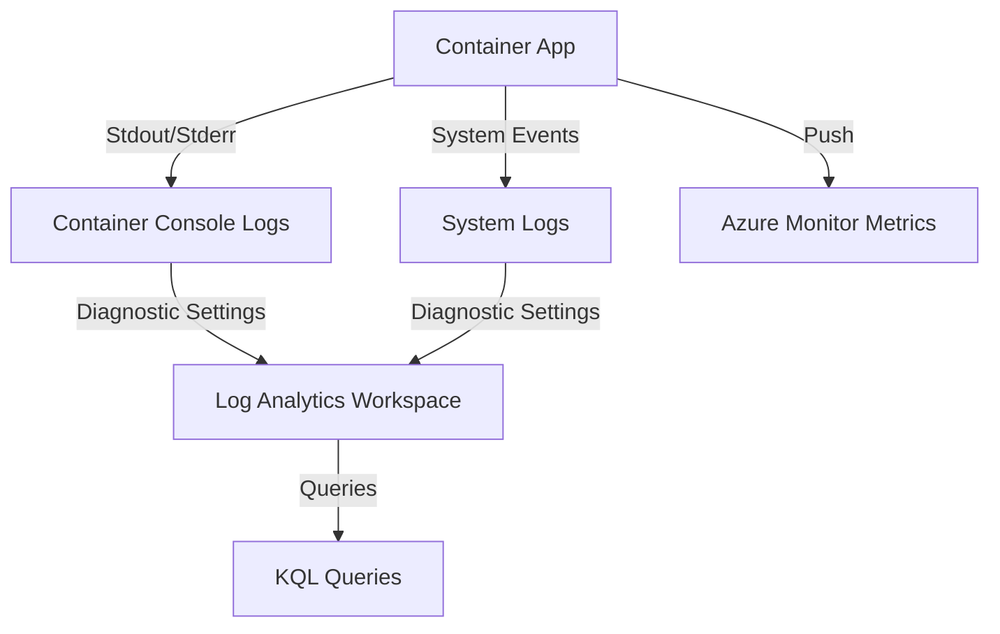

# Observability in Azure Container Apps

Azure Container Apps provides several built-in observability features that help you monitor and diagnose the state of your application throughout its lifecycle.

## Data Flow Diagram



## Log Types

Container Apps separates logs into two main categories:

- **Console Logs**: These are the `stdout` and `stderr` streams from your containers. They are stored in the `ContainerAppConsoleLogs_CL` table.
- **System Logs**: These logs are generated by the Container Apps service itself (e.g., scaling events, deployment status). They are stored in the `ContainerAppSystemLogs_CL` table.

## Scaling Metrics

Container Apps can scale based on various metrics:

- **HTTP Requests**: Scale based on the number of concurrent HTTP requests per second.
- **CPU Utilization**: Scale when average CPU usage exceeds a threshold.
- **Memory Utilization**: Scale when average memory usage exceeds a threshold.
- **Custom Metrics**: Scale based on external triggers like Azure Service Bus queue length or KEDA scalers.

## Configuration Examples

### Viewing Streamed Logs via CLI

To view live logs from a specific container app, use the `az containerapp logs show` command.

```bash
az containerapp logs show \
    --resource-group "my-resource-group" \
    --name "my-container-app" \
    --follow true \
    --format text
```

## KQL Query Examples

### Search Console Logs for Errors

Identify application-level errors by searching the console logs.

```kusto
ContainerAppConsoleLogs_CL
| where TimeGenerated > ago(1h)
| where Log_s contains "error" or Log_s contains "exception"
| project TimeGenerated, ContainerName_s, Log_s
| order by TimeGenerated desc
```

### Monitor Scaling Events

Track when and why your container app scaled.

```kusto
ContainerAppSystemLogs_CL
| where TimeGenerated > ago(24h)
| where Type_s == "Scaling"
| project TimeGenerated, Reason_s, Log_s
| order by TimeGenerated desc
```

## See Also

- [App Service Platform Logs](../app-service/platform-logs.md)
- [AKS Observability](../aks/observability.md)

## Sources

- [Observability in Azure Container Apps](https://learn.microsoft.com/en-us/azure/container-apps/observability)
- [Log streaming in Azure Container Apps](https://learn.microsoft.com/en-us/azure/container-apps/log-streaming)
