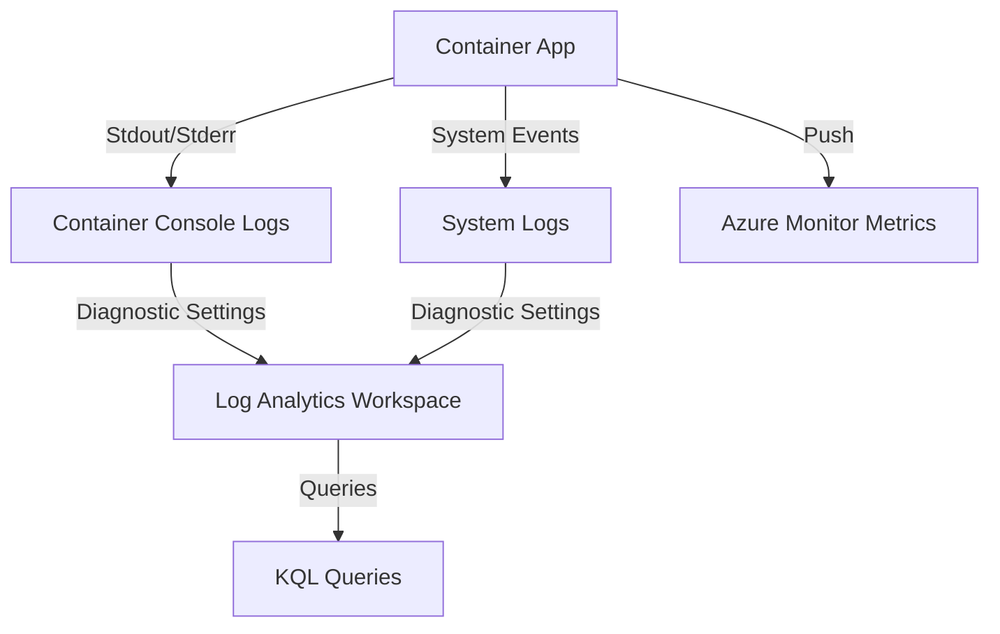

---
content_sources:
  diagrams:
    - id: data-flow-diagram
      type: flowchart
      source: mslearn-adapted
      based_on:
        - https://learn.microsoft.com/en-us/azure/container-apps/observability
        - https://learn.microsoft.com/en-us/azure/container-apps/log-streaming
---

# Observability in Azure Container Apps

Azure Container Apps provides several built-in observability features that help you monitor and diagnose the state of your application throughout its lifecycle.

## Data Flow Diagram

<!-- diagram-id: data-flow-diagram -->


## Log Types

Container Apps separates logs into two main categories:

- **Console Logs**: These are the `stdout` and `stderr` streams from your containers. They are stored in the `ContainerAppConsoleLogs_CL` table.
- **System Logs**: These logs are generated by the Container Apps service itself (e.g., scaling events, deployment status). They are stored in the `ContainerAppSystemLogs_CL` table.

## Scaling Metrics

Container Apps can scale based on various metrics:

- **HTTP Requests**: Scale based on the number of concurrent HTTP requests per second.
- **CPU Utilization**: Scale when average CPU usage exceeds a threshold.
- **Memory Utilization**: Scale when average memory usage exceeds a threshold.
- **Custom Metrics**: Scale based on external triggers like Azure Service Bus queue length or KEDA scalers.

## Configuration Examples

### Viewing Streamed Logs via CLI

To view live logs from a specific container app, use the `az containerapp logs show` command.

```bash
az containerapp logs show \
    --resource-group "my-resource-group" \
    --name "my-container-app" \
    --follow true \
    --format text
```

## KQL Query Examples

### Search Console Logs for Errors

Identify application-level errors by searching the console logs.

```kusto
ContainerAppConsoleLogs_CL
| where TimeGenerated > ago(1h)
| where Log_s contains "error" or Log_s contains "exception"
| project TimeGenerated, ContainerName_s, Log_s
| order by TimeGenerated desc
```

### Monitor Scaling Events

Track when and why your container app scaled.

```kusto
ContainerAppSystemLogs_CL
| where TimeGenerated > ago(24h)
| where Type_s == "Scaling"
| project TimeGenerated, Reason_s, Log_s
| order by TimeGenerated desc
```

### Find Revision Rollout Problems

```kusto
ContainerAppSystemLogs_CL
| where TimeGenerated > ago(24h)
| where Log_s has_any ("revision", "deployment", "provisioning", "failed")
| project TimeGenerated, RevisionName_s, ReplicaName_s, Log_s
| order by TimeGenerated desc
```

### Identify Noisy Replicas

```kusto
ContainerAppConsoleLogs_CL
| where TimeGenerated > ago(1h)
| summarize LogLines=count() by ContainerAppName_s, RevisionName_s, ReplicaName_s
| order by LogLines desc
```

Sample output:

```text
ContainerAppName_s   RevisionName_s     ReplicaName_s                 LogLines
------------------   -----------------  ----------------------------  --------
payments-api         payments-api--r12  payments-api--r12-6c9d7c9    3120
payments-api         payments-api--r12  payments-api--r12-8m4s1j2    2988
```

## Monitoring Baseline

Container Apps monitoring should cover four areas together:

1. **Ingress and request behavior**
    - Request volume and latency
    - HTTP error spikes
2. **Revision health**
    - New revision startup failures
    - Replica churn after configuration changes
3. **Scaling behavior**
    - KEDA-triggered scale-out and scale-in events
    - Saturation before new replicas are added
4. **Application logs**
    - Dependency failures
    - Crash loops
    - Configuration or secret resolution errors

## CLI Workflow

### Show Container App configuration

```bash
az containerapp show \
    --resource-group "my-resource-group" \
    --name "my-container-app"
```

Sample output:

```json
{
  "name": "my-container-app",
  "properties": {
    "configuration": {
      "ingress": {
        "external": true,
        "targetPort": 8080
      }
    },
    "latestReadyRevisionName": "my-container-app--r12",
    "runningStatus": "Running"
  }
}
```

### View recent revisions

```bash
az containerapp revision list \
    --resource-group "my-resource-group" \
    --name "my-container-app" \
    --output table
```

Sample output:

```text
Name                   Active    Replicas    CreatedTime
---------------------  --------  ----------  -------------------------
my-container-app--r12  True      3           2026-04-06T00:22:00+00:00
my-container-app--r11  False     0           2026-04-05T18:10:00+00:00
```

### Query logs from the workspace

```bash
az monitor log-analytics query \
    --workspace "law-monitoring-prod" \
    --analytics-query "ContainerAppSystemLogs_CL | where TimeGenerated > ago(15m) | take 5" \
    --output table
```

## Practical Alert Examples

### Alert on revision provisioning failures

```bash
az monitor scheduled-query create \
    --name "aca-revision-failed" \
    --resource-group "my-resource-group" \
    --scopes "/subscriptions/<subscription-id>/resourceGroups/my-resource-group/providers/Microsoft.OperationalInsights/workspaces/law-monitoring-prod" \
    --condition "count 'ContainerAppSystemLogs_CL | where TimeGenerated > ago(5m) | where Log_s has_any (\"revision failed\", \"provisioning failed\")' > 0" \
    --description "Azure Container Apps revision provisioning failed" \
    --evaluation-frequency "5m" \
    --window-size "5m" \
    --severity 2 \
    --action-groups "/subscriptions/<subscription-id>/resourceGroups/my-resource-group/providers/Microsoft.Insights/actionGroups/ag-app-oncall"
```

### Alert on application error bursts in console logs

```bash
az monitor scheduled-query create \
    --name "aca-console-errors" \
    --resource-group "my-resource-group" \
    --scopes "/subscriptions/<subscription-id>/resourceGroups/my-resource-group/providers/Microsoft.OperationalInsights/workspaces/law-monitoring-prod" \
    --condition "count 'ContainerAppConsoleLogs_CL | where TimeGenerated > ago(5m) | where Log_s has_any (\"ERROR\", \"Exception\")' > 30" \
    --description "Container App console logs contain elevated error volume" \
    --evaluation-frequency "5m" \
    --window-size "5m" \
    --severity 2 \
    --action-groups "/subscriptions/<subscription-id>/resourceGroups/my-resource-group/providers/Microsoft.Insights/actionGroups/ag-app-oncall"
```

## Triage Workflow

1. **Check latest revision status**
    - Did a new revision just roll out?
2. **Read system logs**
    - Are there provisioning, secret, or scaler errors?
3. **Read console logs**
    - Are dependencies timing out or is the app crashing?
4. **Review scaling events**
    - Did demand exceed the current replica count?
5. **Validate ingress**
    - Are HTTP failures concentrated on one revision?

## Operational Tips

- Keep revision names visible in dashboards so you can compare pre-deployment and post-deployment behavior.
- Separate alerts for system logs and console logs; they signal different owners and different fixes.
- Streaming logs are useful for live investigation, but workspace queries are better for pattern detection and alerting.
- For event-driven workloads, pair Container Apps logs with the upstream trigger metric or queue depth metric.

## Workbook Suggestions

- Revision timeline with deployment markers
- Replica count and scaling event trend
- Console error rate by revision
- Top messages in system logs for the last 24 hours
- Correlation view between ingress errors and scaling activity

## See Also

- [App Service Platform Logs](../app-service/platform-logs.md)
- [AKS Observability](../aks/observability.md)

## Sources

- [Observability in Azure Container Apps](https://learn.microsoft.com/en-us/azure/container-apps/observability)
- [Log streaming in Azure Container Apps](https://learn.microsoft.com/en-us/azure/container-apps/log-streaming)
