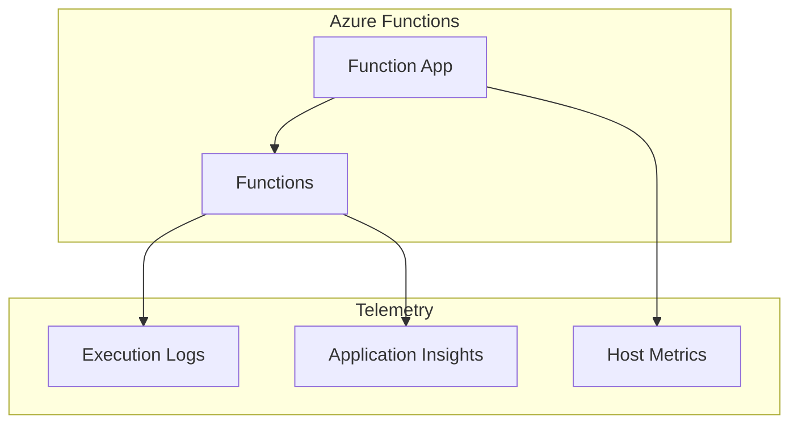

# Functions Monitoring

Monitoring Azure Functions execution and performance.

## In This Section

| Page | Description |
|------|-------------|
| [Observability](observability.md) | Execution logs, Application Insights bindings, host metrics, invocation tracing |

## See Also

- [Platform: Application Insights](../../platform/application-insights.md)
- [Service Guides: App Service](../app-service/index.md)

## Sources

- [Monitor Azure Functions](https://learn.microsoft.com/azure/azure-functions/functions-monitoring)
- [Analyze Azure Functions telemetry in Application Insights](https://learn.microsoft.com/azure/azure-functions/analyze-telemetry-data)
