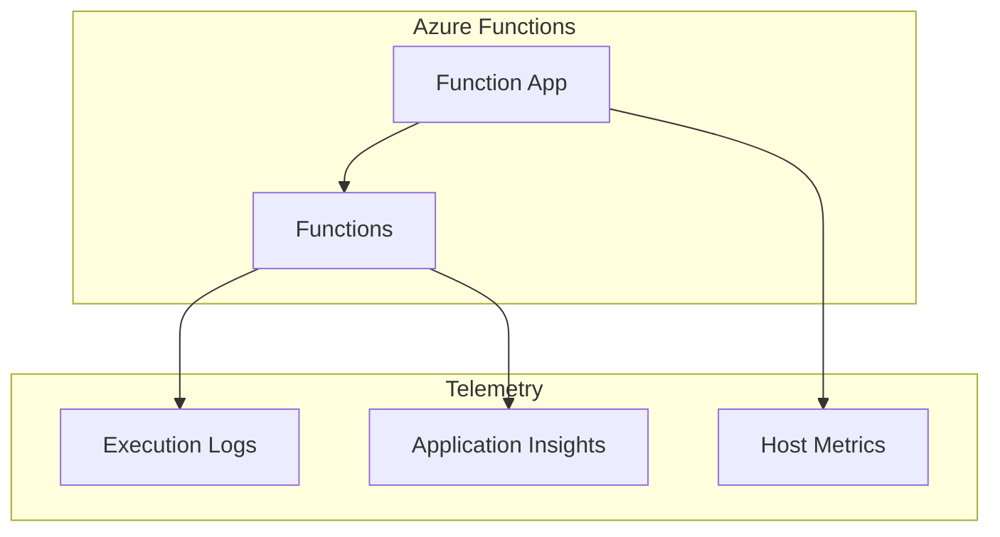

---
content_sources:
  diagrams:
    - id: functions-monitoring
      type: flowchart
      source: self-generated
      justification: "Overview diagram synthesizing the Functions telemetry paths (Function App -> Functions -> Execution Logs / Application Insights / Host Metrics) for the Functions service-guide hub. Combines Functions-native monitoring semantics and Application Insights integration documented in the based_on Microsoft Learn articles into a single navigational map; not derived from any single Microsoft Learn diagram."
      based_on:
        - https://learn.microsoft.com/en-us/azure/azure-functions/monitor-functions
        - https://learn.microsoft.com/en-us/azure/azure-functions/functions-monitoring
---

# Functions Monitoring

Monitoring Azure Functions execution and performance.

<!-- diagram-id: functions-monitoring -->

```mermaid
graph TB
    subgraph "Azure Functions"
        A[Function App]
        B[Functions]
    end
    
    subgraph "Telemetry"
        C[Execution Logs]
        D[Application Insights]
        E[Host Metrics]
    end
    
    A --> B
    B --> C & D
    A --> E
```

## In This Section

| Page | Description |
|------|-------------|
| [Observability](observability.md) | Execution logs, Application Insights bindings, host metrics, invocation tracing |

## See Also

- [Platform: Application Insights](../../platform/application-insights.md)
- [Service Guides: App Service](../app-service/index.md)

## Sources

- [Monitor Azure Functions](https://learn.microsoft.com/azure/azure-functions/functions-monitoring)
- [Analyze Azure Functions telemetry in Application Insights](https://learn.microsoft.com/azure/azure-functions/analyze-telemetry-data)
