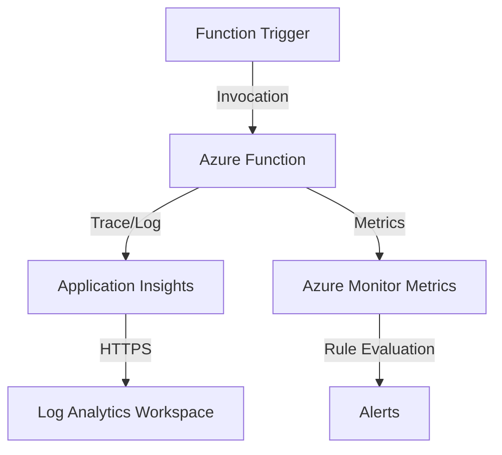

# Observability in Azure Functions

Azure Functions has built-in integration with Application Insights and Azure Monitor to provide comprehensive observability for your serverless applications.

## Data Flow Diagram



## Key Monitoring Areas

- **Execution Logs**: Detailed information about each function execution, including traces, exceptions, and requests.
- **Host Metrics**: Platform-level performance data such as CPU, memory usage, and function invocation counts.
- **Invocation Tracing**: Correlation of events across different services (e.g., tracking a message from a queue through function processing).

## Log Categories in Log Analytics

When diagnostic logs are enabled, you can find function logs in these tables:

- **FunctionAppLogs**: Traces generated by the function host and your application code.
- **AppServiceHTTPLogs**: Details about incoming HTTP requests to your function.

## Configuration Examples

### Connecting Application Insights via CLI

To enable Application Insights for a function app, set the `APPLICATIONINSIGHTS_CONNECTION_STRING` in the app settings.

```bash
az functionapp config appsettings set \
    --resource-group "my-resource-group" \
    --name "my-function-app" \
    --settings "APPLICATIONINSIGHTS_CONNECTION_STRING=InstrumentationKey=00000000-0000-0000-0000-000000000000;IngestionEndpoint=https://centralus-0.in.applicationinsights.azure.com/"
```

## KQL Query Examples

### Monitor Function Execution Status

Summarize function execution results over the last hour.

```kusto
requests
| where timestamp > ago(1h)
| summarize count() by success, name
| order by name asc
```

### Analyze Function Duration

Find the average and maximum duration of your function executions.

```kusto
requests
| where timestamp > ago(12h)
| summarize avg(duration), max(duration) by name
| order by avg_duration desc
```

### Find Common Exceptions

List the top errors occurring in your function app.

```kusto
exceptions
| summarize count() by problemId, outerMessage
| order by count_ desc
```

## See Also

- [App Service Observability](../app-service/platform-logs.md)
- [Container Apps Observability](../container-apps/observability.md)

## Sources

- [Monitor executions in Azure Functions](https://learn.microsoft.com/en-us/azure/azure-functions/functions-monitoring)
- [Monitor Azure Functions](https://learn.microsoft.com/en-us/azure/azure-functions/monitor-functions)
