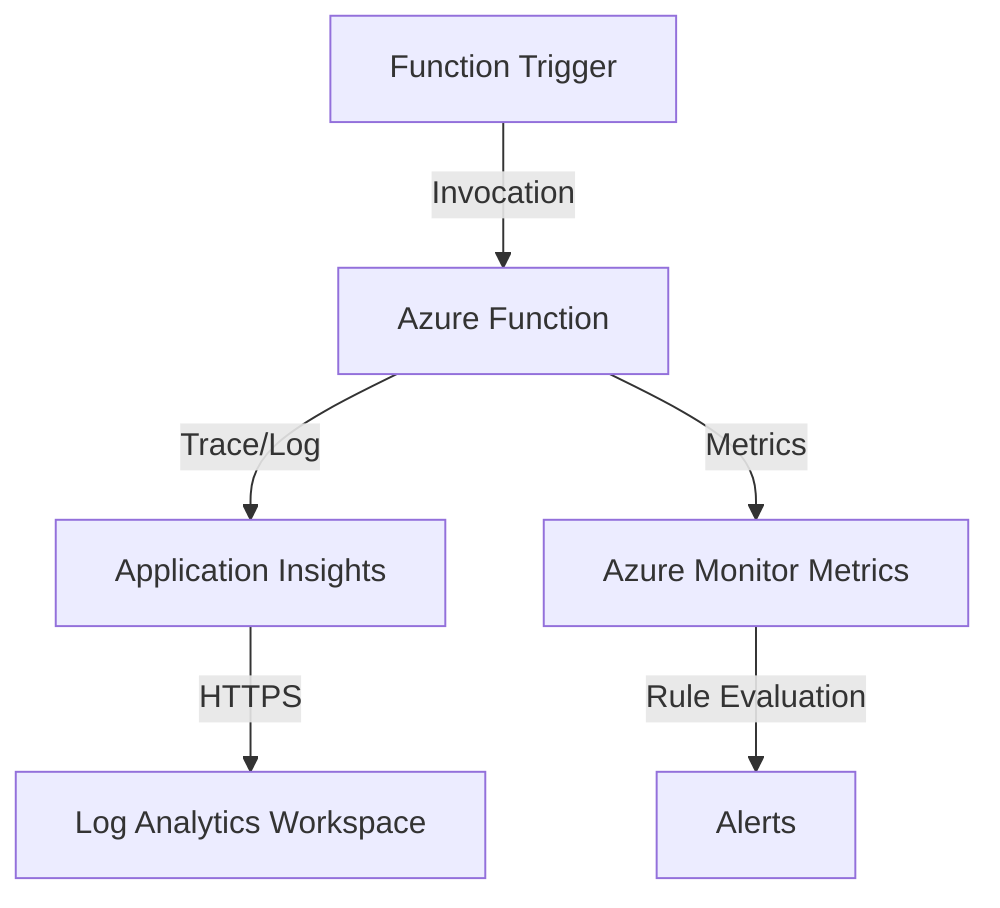

---
content_sources:
  diagrams:
    - id: data-flow-diagram
      type: flowchart
      source: mslearn-adapted
      based_on:
        - https://learn.microsoft.com/en-us/azure/azure-functions/functions-monitoring
        - https://learn.microsoft.com/en-us/azure/azure-functions/monitor-functions
---

# Observability in Azure Functions

Azure Functions has built-in integration with Application Insights and Azure Monitor to provide comprehensive observability for your serverless applications.

## Data Flow Diagram

<!-- diagram-id: data-flow-diagram -->


## Key Monitoring Areas

- **Execution Logs**: Detailed information about each function execution, including traces, exceptions, and requests.
- **Host Metrics**: Platform-level performance data such as CPU, memory usage, and function invocation counts.
- **Invocation Tracing**: Correlation of events across different services (e.g., tracking a message from a queue through function processing).

## Log Categories in Log Analytics

When diagnostic logs are enabled, you can find function logs in these tables:

- **FunctionAppLogs**: Traces generated by the function host and your application code.
- **AppServiceHTTPLogs**: Details about incoming HTTP requests to your function.

## Configuration Examples

### Connecting Application Insights via CLI

To enable Application Insights for a function app, set the `APPLICATIONINSIGHTS_CONNECTION_STRING` in the app settings.

```bash
az functionapp config appsettings set \
    --resource-group "my-resource-group" \
    --name "my-function-app" \
    --settings "APPLICATIONINSIGHTS_CONNECTION_STRING=InstrumentationKey=00000000-0000-0000-0000-000000000000;IngestionEndpoint=https://centralus-0.in.applicationinsights.azure.com/"
```

## KQL Query Examples

### Monitor Function Execution Status

Summarize function execution results over the last hour.

```kusto
requests
| where timestamp > ago(1h)
| summarize count() by success, name
| order by name asc
```

### Analyze Function Duration

Find the average and maximum duration of your function executions.

```kusto
requests
| where timestamp > ago(12h)
| summarize avg(duration), max(duration) by name
| order by avg_duration desc
```

### Find Common Exceptions

List the top errors occurring in your function app.

```kusto
exceptions
| summarize count() by problemId, outerMessage
| order by count_ desc
```

### Correlate Failed Invocations With Dependencies

```kusto
requests
| where timestamp > ago(1h)
| where success == false
| project operation_Id, name, duration, resultCode, cloud_RoleName
| join kind=leftouter (
    dependencies
    | where timestamp > ago(1h)
    | project operation_Id, DependencyName=name, DependencyType=type, DependencySuccess=success, DependencyDuration=duration
) on operation_Id
| order by duration desc
```

### Review Host-Level Traces

```kusto
traces
| where timestamp > ago(30m)
| where cloud_RoleName == "my-function-app"
| where message has_any ("Host started", "Function started", "Executing", "Failed")
| project timestamp, severityLevel, message
| order by timestamp desc
```

Sample output:

```text
timestamp                  severityLevel  message
-------------------------  -------------  ---------------------------------------------------------
2026-04-06T01:05:00Z       3              Executed 'ProcessOrders' (Failed, Id=a1b2c3d4, Duration=2145ms)
2026-04-06T01:05:00Z       2              Executing 'ProcessOrders' (Reason='New queue message detected')
```

## Monitoring Baseline

For Azure Functions, split monitoring into these four operational views:

1. **Invocation success**
    - Failed executions
    - Retry patterns
    - Trigger-specific backlog symptoms
2. **Performance**
    - Function duration
    - Cold-start symptoms for HTTP triggers
    - Dependency latency
3. **Host behavior**
    - Host restarts
    - Scaling changes
    - Runtime version or configuration changes
4. **Application behavior**
    - Traces
    - Exceptions
    - Custom business events if instrumented

## CLI Workflow

### Confirm application settings

```bash
az functionapp config appsettings list \
    --resource-group "my-resource-group" \
    --name "my-function-app" \
    --query "[?name=='APPLICATIONINSIGHTS_CONNECTION_STRING']"
```

Sample output:

```json
[
  {
    "name": "APPLICATIONINSIGHTS_CONNECTION_STRING",
    "value": "InstrumentationKey=00000000-0000-0000-0000-000000000000;IngestionEndpoint=https://koreacentral-0.in.applicationinsights.azure.com/"
  }
]
```

### Check Function App configuration and runtime

```bash
az functionapp show \
    --resource-group "my-resource-group" \
    --name "my-function-app" \
    --query "{state:state, defaultHostName:defaultHostName, kind:kind, reserved:reserved}"
```

Sample output:

```json
{
  "defaultHostName": "my-function-app.azurewebsites.net",
  "kind": "functionapp,linux",
  "reserved": true,
  "state": "Running"
}
```

### Query recent failed executions

```bash
az monitor app-insights query \
    --app "my-app-insights" \
    --analytics-query "requests | where timestamp > ago(30m) | where success == false | summarize count() by name" \
    --output table
```

Sample output:

```text
name                 count_
-------------------  ------
ProcessOrders        7
HttpWebhookReceiver  2
```

## Practical Alert Examples

### Alert on failed executions

```bash
az monitor scheduled-query create \
    --name "func-failed-executions" \
    --resource-group "my-resource-group" \
    --scopes "/subscriptions/<subscription-id>/resourceGroups/my-resource-group/providers/Microsoft.OperationalInsights/workspaces/law-monitoring-prod" \
    --condition "count 'requests | where timestamp > ago(5m) | where cloud_RoleName == \"my-function-app\" and success == false' > 5" \
    --description "Azure Functions failed execution count exceeded threshold" \
    --evaluation-frequency "5m" \
    --window-size "5m" \
    --severity 2 \
    --action-groups "/subscriptions/<subscription-id>/resourceGroups/my-resource-group/providers/Microsoft.Insights/actionGroups/ag-app-oncall"
```

### Alert on exception bursts

```bash
az monitor scheduled-query create \
    --name "func-exception-burst" \
    --resource-group "my-resource-group" \
    --scopes "/subscriptions/<subscription-id>/resourceGroups/my-resource-group/providers/Microsoft.OperationalInsights/workspaces/law-monitoring-prod" \
    --condition "count 'exceptions | where timestamp > ago(10m) | where cloud_RoleName == \"my-function-app\"' > 20" \
    --description "Exception volume is above the normal Functions baseline" \
    --evaluation-frequency "5m" \
    --window-size "10m" \
    --severity 3 \
    --action-groups "/subscriptions/<subscription-id>/resourceGroups/my-resource-group/providers/Microsoft.Insights/actionGroups/ag-app-oncall"
```

## Trigger-Specific Investigation Tips

- **HTTP trigger**
    - Compare response latency and failure rate before checking host internals
- **Queue or Service Bus trigger**
    - Correlate failures with dependency timeouts and upstream queue depth
- **Timer trigger**
    - Watch for missed schedules or host restarts around the expected execution time
- **Event-driven trigger**
    - Use `operation_Id` to connect trigger ingestion to dependency calls and final outcome

## Triage Workflow

1. **Failed requests**
    - Which function names are failing?
2. **Exception details**
    - Are failures grouped by one exception type?
3. **Dependency correlation**
    - Is the root cause external, such as SQL, Storage, or HTTP API latency?
4. **Host traces**
    - Did the host restart or scale during the incident window?
5. **Platform metrics**
    - Is CPU, memory, or concurrency pressure contributing to the symptom?

## Workbook Suggestions

- Invocation count and failure rate by function name
- Duration trend with percentile breakdown
- Top dependency failures by function
- Exception trend after deployment
- Host trace samples for the latest failed execution

## See Also

- [App Service Observability](../app-service/platform-logs.md)
- [Container Apps Observability](../container-apps/observability.md)

## Sources

- [Monitor executions in Azure Functions](https://learn.microsoft.com/en-us/azure/azure-functions/functions-monitoring)
- [Monitor Azure Functions](https://learn.microsoft.com/en-us/azure/azure-functions/monitor-functions)
