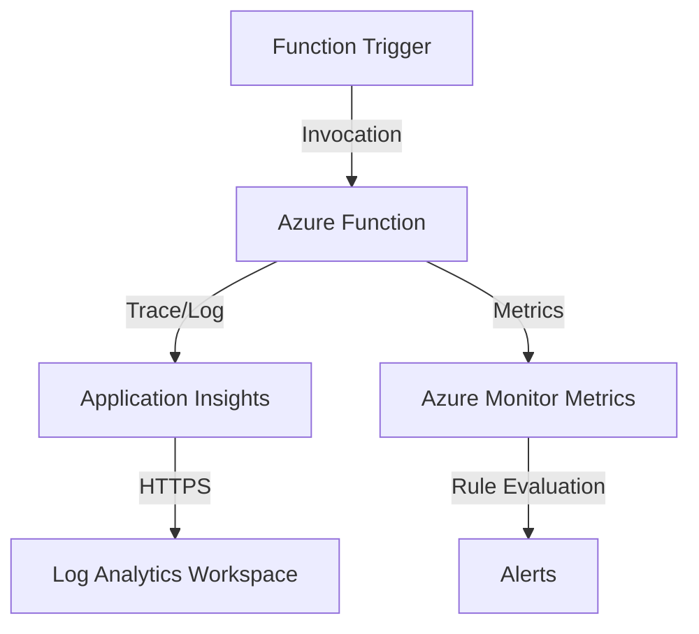

---
content_sources:
  diagrams:
    - id: data-flow-diagram
      type: flowchart
      source: mslearn-adapted
      based_on:
        - https://learn.microsoft.com/en-us/azure/azure-functions/functions-monitoring
        - https://learn.microsoft.com/en-us/azure/azure-functions/monitor-functions
---

# Observability in Azure Functions

Azure Functions has built-in integration with Application Insights and Azure Monitor to provide comprehensive observability for your serverless applications.

## Data Flow Diagram

<!-- diagram-id: data-flow-diagram -->


## Key Monitoring Areas

- **Execution Logs**: Detailed information about each function execution, including traces, exceptions, and requests.
- **Host Metrics**: Platform-level performance data such as CPU, memory usage, and function invocation counts.
- **Invocation Tracing**: Correlation of events across different services (e.g., tracking a message from a queue through function processing).

Keep host telemetry and invocation telemetry separate during analysis:

- **Host metrics** describe the Functions runtime and underlying App Service worker behavior.
    - CPU percentage
    - Memory working set
    - Instance count
    - Host restarts or runtime initialization traces
- **Invocation metrics** describe what each function execution experienced.
    - Invocation count
    - Success rate
    - Duration percentiles
    - Trigger-specific retries or throttling symptoms

If duration rises while host metrics remain stable, the problem is often dependency latency or upstream backlog rather than worker saturation. If both host metrics and invocation metrics degrade together, investigate plan capacity, scaling, and runtime configuration first.

## Log Categories in Log Analytics

When diagnostic logs are enabled, you can find function logs in these tables:

- **FunctionAppLogs**: Traces generated by the function host and your application code.
- **AppServiceHTTPLogs**: Details about incoming HTTP requests to your function.

Depending on trigger type and hosting plan, operators often also enable adjacent App Service categories for broader context:

- **Useful in most environments**
    - `FunctionAppLogs`
    - `AppServiceHTTPLogs`
    - `AppServiceConsoleLogs`
    - `AppServicePlatformLogs`
- **Enable selectively**
    - `AppServiceAuditLogs`
    - `AppServiceIPSecAuditLogs`

`FunctionAppLogs` is the best default source for runtime execution evidence, but HTTP-triggered workloads benefit from `AppServiceHTTPLogs` when you need the request envelope and web server perspective alongside Application Insights telemetry.

## Configuration Examples

### Connecting Application Insights via CLI

To enable Application Insights for a function app, set the `APPLICATIONINSIGHTS_CONNECTION_STRING` in the app settings.

```bash
az functionapp config appsettings set \
    --resource-group "my-resource-group" \
    --name "my-function-app" \
    --settings "APPLICATIONINSIGHTS_CONNECTION_STRING=<connection-string>"
```

## KQL Query Examples

### Monitor Function Execution Status

Summarize function execution results over the last hour.

```kusto
requests
| where timestamp > ago(1h)
| summarize count() by success, name
| order by name asc
```

### Analyze Function Duration

Find the average and maximum duration of your function executions.

```kusto
requests
| where timestamp > ago(12h)
| summarize avg(duration), max(duration) by name
| order by avg_duration desc
```

### Find Common Exceptions

List the top errors occurring in your function app.

```kusto
exceptions
| summarize count() by problemId, outerMessage
| order by count_ desc
```

### Correlate Failed Invocations With Dependencies

```kusto
requests
| where timestamp > ago(1h)
| where success == false
| project operation_Id, name, duration, resultCode, cloud_RoleName
| join kind=leftouter (
    dependencies
    | where timestamp > ago(1h)
    | project operation_Id, DependencyName=name, DependencyType=type, DependencySuccess=success, DependencyDuration=duration
) on operation_Id
| order by duration desc
```

### Review Host-Level Traces

```kusto
traces
| where timestamp > ago(30m)
| where cloud_RoleName == "my-function-app"
| where message has_any ("Host started", "Function started", "Executing", "Failed")
| project timestamp, severityLevel, message
| order by timestamp desc
```

Sample output:

```text
timestamp                  severityLevel  message
-------------------------  -------------  ---------------------------------------------------------
2026-04-06T01:05:00Z       3              Executed 'ProcessOrders' (Failed, Id=a1b2c3d4, Duration=2145ms)
2026-04-06T01:05:00Z       2              Executing 'ProcessOrders' (Reason='New queue message detected')
```

## Monitoring Baseline

For Azure Functions, split monitoring into these four operational views:

1. **Invocation success**
    - Failed executions
    - Retry patterns
    - Trigger-specific backlog symptoms
2. **Performance**
    - Function duration
    - Cold-start symptoms for HTTP triggers
    - Dependency latency
3. **Host behavior**
    - Host restarts
    - Scaling changes
    - Runtime version or configuration changes
4. **Application behavior**
    - Traces
    - Exceptions
    - Custom business events if instrumented

## CLI Workflow

### Confirm application settings

```bash
az functionapp config appsettings list \
    --resource-group "my-resource-group" \
    --name "my-function-app" \
    --query "[?name=='APPLICATIONINSIGHTS_CONNECTION_STRING']"
```

Sample output:

```json
[
  {
    "name": "APPLICATIONINSIGHTS_CONNECTION_STRING",
    "value": "<connection-string>"
  }
]
```

### Check Function App configuration and runtime

```bash
az functionapp show \
    --resource-group "my-resource-group" \
    --name "my-function-app" \
    --query "{state:state, defaultHostName:defaultHostName, kind:kind, reserved:reserved}"
```

Sample output:

```json
{
  "defaultHostName": "my-function-app.azurewebsites.net",
  "kind": "functionapp,linux",
  "reserved": true,
  "state": "Running"
}
```

### Query recent failed executions

```bash
az monitor app-insights query \
    --app "my-app-insights" \
    --analytics-query "requests | where timestamp > ago(30m) | where success == false | summarize count() by name" \
    --output table
```

Sample output:

```text
name                 count_
-------------------  ------
ProcessOrders        7
HttpWebhookReceiver  2
```

## Diagnostic Settings Strategy

Azure Functions usually sends rich application telemetry through Application Insights, but diagnostic settings still matter because they capture host and platform context that can be missing from request telemetry alone.

### Recommended categories to enable

- **Minimum baseline**
    - `FunctionAppLogs`
    - `AppServicePlatformLogs`
    - `AllMetrics`
- **Add for HTTP-heavy workloads**
    - `AppServiceHTTPLogs`
- **Add for startup or custom logging investigations**
    - `AppServiceConsoleLogs`

### Create diagnostic settings for a function app

```bash
az monitor diagnostic-settings create \
    --name "diag-functionapp-observability" \
    --resource "/subscriptions/<subscription-id>/resourceGroups/my-resource-group/providers/Microsoft.Web/sites/my-function-app" \
    --workspace "/subscriptions/<subscription-id>/resourceGroups/my-resource-group/providers/Microsoft.OperationalInsights/workspaces/law-monitoring-prod" \
    --logs '[
        {
            "category": "FunctionAppLogs",
            "enabled": true
        },
        {
            "category": "AppServiceHTTPLogs",
            "enabled": true
        },
        {
            "category": "AppServiceConsoleLogs",
            "enabled": true
        },
        {
            "category": "AppServicePlatformLogs",
            "enabled": true
        }
    ]' \
    --metrics '[
        {
            "category": "AllMetrics",
            "enabled": true
        }
    ]'
```

### Check categories before rollout

```bash
az monitor diagnostic-settings categories list \
    --resource "/subscriptions/<subscription-id>/resourceGroups/my-resource-group/providers/Microsoft.Web/sites/my-function-app"
```

Use the category list in CI or during standards reviews so Linux, Windows, and plan-specific deployments are validated against the same observability baseline.

## Additional KQL for Timeout and Plan Behavior

### Detect long-running executions nearing timeout

Timeout symptoms are often visible before full failures occur. This query highlights functions with long-running executions and separates successful completions from failures.

```kusto
requests
| where timestamp > ago(24h)
| where cloud_RoleName == "my-function-app"
| summarize InvocationCount=count(), P95Duration=percentile(duration, 95), MaxDuration=max(duration), Failures=countif(success == false) by name
| order by P95Duration desc
```

Sample output:

| name | InvocationCount | P95Duration | MaxDuration | Failures | Interpretation |
|---|---:|---:|---:|---:|---|
| ProcessOrders | 1842 | 00:00:52 | 00:01:18 | 14 | Queue processing is running near timeout risk; review dependency latency and batch sizing. |
| HttpWebhookReceiver | 9211 | 00:00:04 | 00:00:11 | 3 | HTTP trigger latency is normal and not the main incident driver. |

### Correlate host restarts with invocation degradation

```kusto
let HostEvents =
    traces
    | where timestamp > ago(6h)
    | where cloud_RoleName == "my-function-app"
    | where message has_any ("Host started", "Host initialized", "Stopping JobHost", "Generating", "Host lock lease")
    | summarize HostTraceCount=count() by bin(timestamp, 10m);
let InvocationFailures =
    requests
    | where timestamp > ago(6h)
    | where cloud_RoleName == "my-function-app"
    | summarize FailedInvocations=countif(success == false), TotalInvocations=count() by bin(timestamp, 10m);
HostEvents
| join kind=fullouter InvocationFailures on timestamp
| project timestamp, HostTraceCount=coalesce(HostTraceCount, 0), FailedInvocations=coalesce(FailedInvocations, 0), TotalInvocations=coalesce(TotalInvocations, 0)
| order by timestamp desc
```

Sample output:

| timestamp | HostTraceCount | FailedInvocations | TotalInvocations | Interpretation |
|---|---:|---:|---:|---|
| 2026-04-06T01:00:00Z | 12 | 18 | 220 | Host churn and invocation failures rose together; inspect scaling or runtime recycle causes. |
| 2026-04-06T01:10:00Z | 1 | 17 | 225 | Failures continued after host stabilized; investigate downstream dependencies. |

### Compare dependency latency with execution duration

```kusto
requests
| where timestamp > ago(4h)
| where cloud_RoleName == "my-function-app"
| summarize AvgExecution=avg(duration), P95Execution=percentile(duration, 95) by operation_Id, name
| join kind=inner (
    dependencies
    | where timestamp > ago(4h)
    | summarize AvgDependency=avg(duration), FailedDependencies=countif(success == false) by operation_Id
) on operation_Id
| summarize AvgExecution=avg(AvgExecution), P95Execution=max(P95Execution), AvgDependency=avg(AvgDependency), FailedDependencies=sum(FailedDependencies) by name
| order by P95Execution desc
```

Sample output:

| name | AvgExecution | P95Execution | AvgDependency | FailedDependencies | Interpretation |
|---|---:|---:|---:|---:|---|
| ProcessOrders | 00:00:09 | 00:00:41 | 00:00:07 | 28 | Most execution time is spent waiting on dependencies. |
| GenerateInvoice | 00:00:03 | 00:00:07 | 00:00:01 | 0 | Healthy function; not part of the slowdown. |

## Execution Duration and Timeout Monitoring

Treat timeout monitoring as a combination of three signals:

1. **Duration percentiles**
    - P50 shows normal behavior.
    - P95 and P99 show customer-impacting tail latency.
2. **Near-timeout executions**
    - Long-running successes are an early warning before hard failures.
3. **Timeout exceptions**
    - Runtime-generated errors or canceled dependency calls confirm the ceiling was reached.

For queue, Service Bus, and Event Hub triggers, rising duration often means upstream backlog will grow even before invocation failures appear. For HTTP triggers, near-timeout executions often map directly to customer-facing latency.

## Consumption Plan vs Premium Plan Monitoring Differences

The same KQL patterns work across plans, but the operational meaning differs:

### Consumption plan

- Expect cold starts and instance churn to appear more often in host traces.
- Prioritize:
    - Invocation duration percentiles
    - Instance count changes
    - Queue backlog or retry signals
- Watch for:
    - Burst traffic exceeding scale-out speed
    - Short-lived startup penalties after idle periods

### Premium plan

- Pre-warmed instances reduce cold-start noise, so persistent latency is more likely to be application or dependency related.
- Prioritize:
    - Sustained CPU and memory saturation on workers
    - Long-running executions consuming concurrency
    - Dependency bottlenecks hidden behind stable host startup behavior

### Practical interpretation

If a Consumption app shows a short spike in host initialization traces, that can be normal. If a Premium app shows the same pattern repeatedly, review runtime restarts, deployment churn, or configuration drift instead of assuming expected scale behavior.

## Practical Alert Examples

### Alert on failed executions

```bash
az monitor scheduled-query create \
    --name "func-failed-executions" \
    --resource-group "my-resource-group" \
    --scopes "/subscriptions/<subscription-id>/resourceGroups/my-resource-group/providers/Microsoft.OperationalInsights/workspaces/law-monitoring-prod" \
    --condition "count 'requests | where timestamp > ago(5m) | where cloud_RoleName == \"my-function-app\" and success == false' > 5" \
    --description "Azure Functions failed execution count exceeded threshold" \
    --evaluation-frequency "5m" \
    --window-size "5m" \
    --severity 2 \
    --action-groups "/subscriptions/<subscription-id>/resourceGroups/my-resource-group/providers/Microsoft.Insights/actionGroups/ag-app-oncall"
```

### Alert on exception bursts

```bash
az monitor scheduled-query create \
    --name "func-exception-burst" \
    --resource-group "my-resource-group" \
    --scopes "/subscriptions/<subscription-id>/resourceGroups/my-resource-group/providers/Microsoft.OperationalInsights/workspaces/law-monitoring-prod" \
    --condition "count 'exceptions | where timestamp > ago(10m) | where cloud_RoleName == \"my-function-app\"' > 20" \
    --description "Exception volume is above the normal Functions baseline" \
    --evaluation-frequency "5m" \
    --window-size "10m" \
    --severity 3 \
    --action-groups "/subscriptions/<subscription-id>/resourceGroups/my-resource-group/providers/Microsoft.Insights/actionGroups/ag-app-oncall"
```

## Trigger-Specific Investigation Tips

- **HTTP trigger**
    - Compare response latency and failure rate before checking host internals
- **Queue or Service Bus trigger**
    - Correlate failures with dependency timeouts and upstream queue depth
- **Timer trigger**
    - Watch for missed schedules or host restarts around the expected execution time
- **Event-driven trigger**
    - Use `operation_Id` to connect trigger ingestion to dependency calls and final outcome

## Triage Workflow

1. **Failed requests**
    - Which function names are failing?
2. **Exception details**
    - Are failures grouped by one exception type?
3. **Dependency correlation**
    - Is the root cause external, such as SQL, Storage, or HTTP API latency?
4. **Host traces**
    - Did the host restart or scale during the incident window?
5. **Platform metrics**
    - Is CPU, memory, or concurrency pressure contributing to the symptom?

## Workbook Suggestions

- Invocation count and failure rate by function name
- Duration trend with percentile breakdown
- Top dependency failures by function
- Exception trend after deployment
- Host trace samples for the latest failed execution

## Dashboard and Workbook Recommendations

### Built-in experiences to use first

- **Application Insights Application Dashboard**
    - Requests, failures, and dependencies for quick service health review.
- **Metrics explorer for the function app**
    - Execution count, execution units, response time, and instance count.
- **Log Analytics workbooks**
    - Best for combining `requests`, `dependencies`, `exceptions`, and `traces` in one view.

### Workbook tabs to build

- **Execution health**
    - Invocation count by function name
    - Failure rate by trigger type
    - P95 and P99 duration trend
- **Host behavior**
    - Host restart traces
    - Instance count
    - CPU and memory utilization
- **Dependency view**
    - Slowest dependencies
    - Failed dependency trend
    - Top operations by dependency wait time
- **Timeout risk**
    - Functions closest to timeout thresholds
    - Long-running successes vs failures
    - Retry-heavy executions

### High-value dashboard pins

- Pin a chart for **failed invocations by function name**.
- Pin a chart for **P95 duration**.
- Pin a chart for **instance count** to reveal scale behavior.
- Pin a Logs tile for host traces containing `Host started` or `Stopping JobHost`.

## Common Pitfalls

### Mistake 1: Treating host metrics as proof of business health

**What happens**: CPU and memory look stable, so teams assume the app is healthy while queue backlog or dependency latency keeps growing.

**Correction**: Pair host metrics with invocation duration, failure rate, and trigger backlog evidence.

### Mistake 2: Alerting only on failed invocations

**What happens**: You learn about issues only after customers are already impacted.

**Correction**: Add alerts for high P95 duration, host restart bursts, and dependency failure spikes so degradation is caught earlier.

### Mistake 3: Ignoring plan-specific behavior

**What happens**: Consumption cold starts are investigated as incidents, or Premium resource saturation is dismissed as expected scaling.

**Correction**: Interpret traces and metrics in the context of the hosting plan before escalating.

## Cost Considerations

Functions observability spend is usually driven by Application Insights ingestion and retention rather than by platform metrics.

- **Telemetry volume estimate**
    - A function app processing 1 million invocations per day with request, dependency, and trace telemetry can easily generate multiple GB/day depending on sampling and custom logs.
- **Primary optimization levers**
    - Use adaptive or fixed-rate sampling for low-value successful requests.
    - Keep exceptions unsampled when they are needed for incident response.
    - Reduce verbose traces in hot execution paths.
    - Route only required diagnostic categories to Log Analytics.
- **When to review cost**
    - After introducing new dependency instrumentation
    - After enabling verbose startup logging
    - After moving from a low-volume timer workload to bursty queue or HTTP traffic

If cost rises suddenly, compare telemetry volume by table first. Many Functions environments discover that `traces` and dependency telemetry expanded faster than failed-request volume.

## See Also

- [App Service Observability](../app-service/platform-logs.md)
- [Container Apps Observability](../container-apps/observability.md)

## Sources

- [Monitor executions in Azure Functions](https://learn.microsoft.com/en-us/azure/azure-functions/functions-monitoring)
- [Monitor Azure Functions](https://learn.microsoft.com/en-us/azure/azure-functions/monitor-functions)
