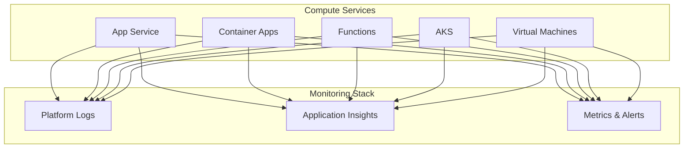

---
content_sources:
  diagrams:
    - id: service-guides
      type: flowchart
      source: self-generated
      based_on:
        - https://learn.microsoft.com/en-us/azure/azure-monitor/fundamentals/overview
        - https://learn.microsoft.com/en-us/azure/app-service/monitor-app-service
        - https://learn.microsoft.com/en-us/azure/aks/monitor-aks
        - https://learn.microsoft.com/en-us/azure/azure-monitor/vm/monitor-virtual-machine
---

# Service Guides

Per-service monitoring guides for common Azure workloads.

<!-- diagram-id: service-guides -->

## In This Section

| Service | Description | Pages |
|---------|-------------|-------|
| [App Service](app-service/index.md) | Platform logs, Application Insights integration, alerts and metrics | 3 |
| [Container Apps](container-apps/index.md) | Console logs, system logs, scaling metrics | 1 |
| [Functions](functions/index.md) | Execution logs, host metrics, invocation tracing | 1 |
| [AKS](aks/index.md) | Container Insights, Prometheus metrics, node/pod metrics | 1 |
| [Virtual Machines](vm/index.md) | Azure Monitor Agent, VM Insights, performance counters | 1 |

## See Also

- [Platform](../platform/index.md)
- [Operations](../operations/index.md)

## Sources

- [Monitor App Service](https://learn.microsoft.com/azure/app-service/monitor-app-service)
- [Monitor Container Apps](https://learn.microsoft.com/azure/container-apps/observability)
- [Monitor Azure Functions](https://learn.microsoft.com/azure/azure-functions/functions-monitoring)
- [Monitor AKS](https://learn.microsoft.com/azure/aks/monitor-aks)
- [Monitor virtual machines](https://learn.microsoft.com/azure/azure-monitor/vm/monitor-virtual-machine)
