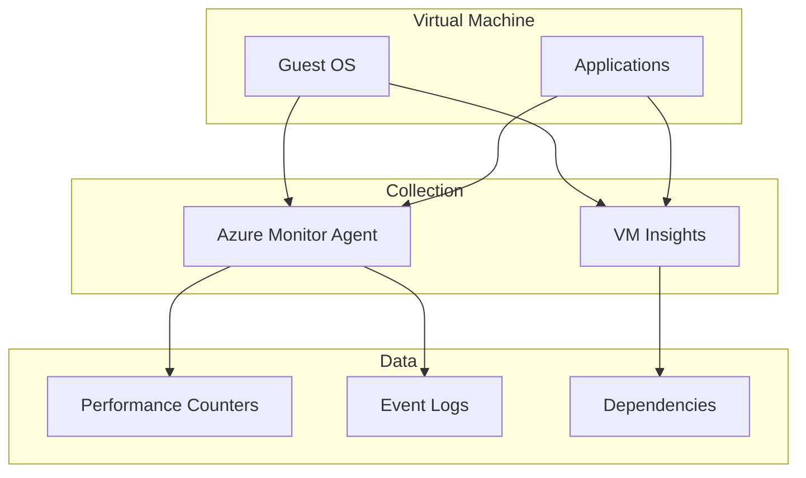

# VM Monitoring

Monitoring Azure Virtual Machines with Azure Monitor Agent and VM Insights.

## In This Section

| Page | Description |
|------|-------------|
| [Observability](observability.md) | Azure Monitor Agent, VM Insights, performance counters, guest OS metrics, heartbeat |

## See Also

- [Platform: Data Collection Rules](../../platform/data-collection-rules.md)
- [Operations: Data Collection Rules Operations](../../operations/data-collection-rules-ops.md)

## Sources

- [Monitor virtual machines with Azure Monitor](https://learn.microsoft.com/azure/azure-monitor/vm/monitor-virtual-machine)
- [VM insights overview](https://learn.microsoft.com/azure/azure-monitor/vm/vminsights-overview)
