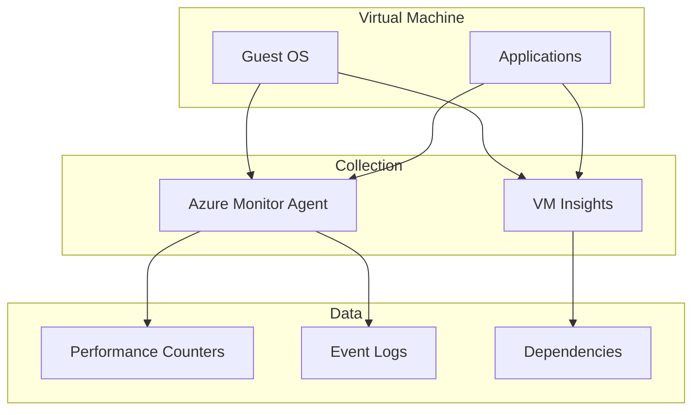

---
content_sources:
  diagrams:
    - id: vm-monitoring
      type: flowchart
      source: self-generated
      justification: "Overview diagram synthesizing the VM monitoring collection path (Guest OS + Applications -> Azure Monitor Agent + VM Insights -> Performance Counters / Event Logs / Dependencies) for the VM service-guide hub. Combines Azure Monitor Agent collection behavior and VM Insights dependency-map semantics documented in the based_on Microsoft Learn articles into a single navigational map; not derived from any single Microsoft Learn diagram."
      based_on:
        - https://learn.microsoft.com/en-us/azure/azure-monitor/vm/monitor-virtual-machine
        - https://learn.microsoft.com/en-us/azure/azure-monitor/vm/vminsights-overview
---

# VM Monitoring

Monitoring Azure Virtual Machines with Azure Monitor Agent and VM Insights.

<!-- diagram-id: vm-monitoring -->

```mermaid
graph TB
    subgraph "Virtual Machine"
        A[Guest OS]
        B[Applications]
    end
    
    subgraph "Collection"
        C[Azure Monitor Agent]
        D[VM Insights]
    end
    
    subgraph "Data"
        E[Performance Counters]
        F[Event Logs]
        G[Dependencies]
    end
    
    A & B --> C & D
    C --> E & F
    D --> G
```

## In This Section

| Page | Description |
|------|-------------|
| [Observability](observability.md) | Azure Monitor Agent, VM Insights, performance counters, guest OS metrics, heartbeat |

## See Also

- [Platform: Data Collection Rules](../../platform/data-collection-rules.md)
- [Operations: Data Collection Rules Operations](../../operations/data-collection-rules-ops.md)

## Sources

- [Monitor virtual machines with Azure Monitor](https://learn.microsoft.com/azure/azure-monitor/vm/monitor-virtual-machine)
- [VM insights overview](https://learn.microsoft.com/azure/azure-monitor/vm/vminsights-overview)
