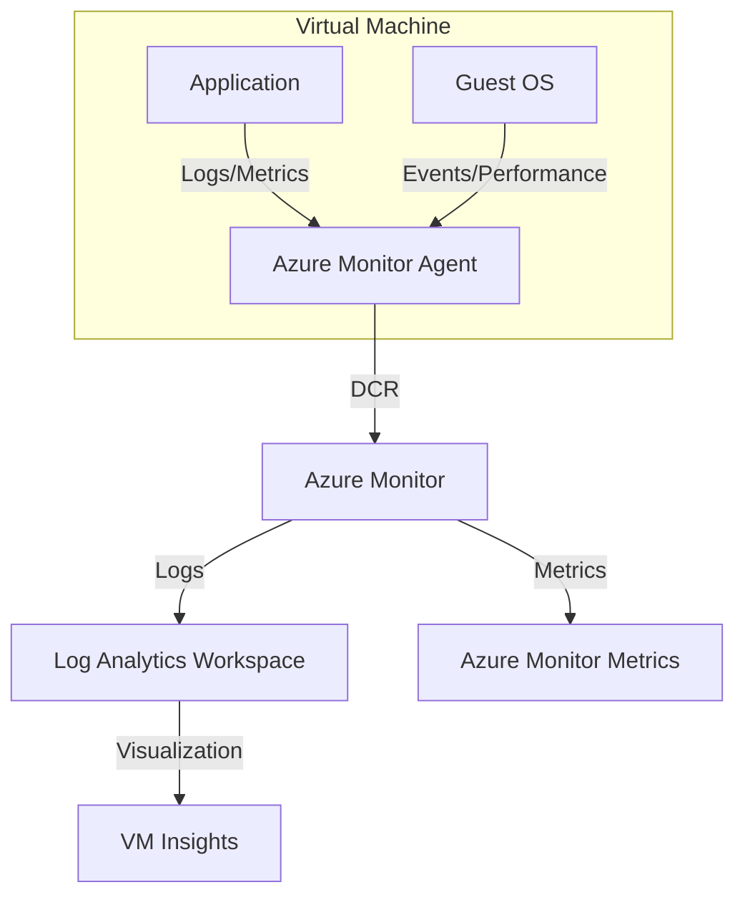

---
content_sources:
  diagrams:
    - id: data-flow-diagram
      type: flowchart
      source: mslearn-adapted
      based_on:
        - https://learn.microsoft.com/en-us/azure/azure-monitor/vm/monitor-virtual-machine
        - https://learn.microsoft.com/en-us/azure/azure-monitor/agents/azure-monitor-agent-overview
        - https://learn.microsoft.com/en-us/azure/azure-monitor/vm/vminsights-overview
---

# VM Observability

Monitoring Azure Virtual Machines involves collecting data from the host, the guest operating system (OS), and the workloads running within. This is primarily achieved using the Azure Monitor Agent (AMA) and VM Insights.

## Data Flow Diagram

<!-- diagram-id: data-flow-diagram -->


## Core Components

- **Azure Monitor Agent (AMA)**: The primary agent for collecting guest OS telemetry. It replaces legacy agents like the Log Analytics agent and Diagnostics extension.
- **Data Collection Rules (DCR)**: Define what data to collect from the agent and where to send it. DCRs provide granular control over data ingestion.
- **VM Insights**: A feature that provides a simplified onboarding experience and pre-defined visualizations for performance, health, and dependencies (Map).

For production operations, think of the stack as three layers:

1. **Platform layer**
    - Azure Monitor metrics from the VM resource
    - Activity Log and resource health events
2. **Guest OS layer**
    - Heartbeat
    - Windows Event logs or Linux Syslog
    - Guest performance counters through AMA and DCRs
3. **Experience layer**
    - VM Insights workbooks
    - Fleet dashboards
    - Alert rules and log queries

If only the platform layer is enabled, CPU or availability issues are visible but root-cause evidence inside the guest remains missing. If only the guest layer is enabled, Azure-side maintenance or resource health signals can be overlooked.

## Configuration Examples

### Installing Azure Monitor Agent via CLI

To install the AMA extension on a Linux VM:

```bash
az vm extension set \
    --name "AzureMonitorLinuxAgent" \
    --publisher "Microsoft.Azure.Monitor" \
    --resource-group "my-resource-group" \
    --vm-name "my-linux-vm" \
    --enable-auto-upgrade true
```

### Associating a DCR via CLI

After creating a Data Collection Rule, associate it with a VM:

```bash
az monitor data-collection rule association create \
    --name "my-vm-dcr-association" \
    --resource "/subscriptions/{subscriptionId}/resourceGroups/{resourceGroupName}/providers/Microsoft.Compute/virtualMachines/{vmName}" \
    --rule-id "/subscriptions/{subscriptionId}/resourceGroups/{resourceGroupName}/providers/Microsoft.Insights/dataCollectionRules/{dcrName}"
```

## AMA vs Legacy Agent Comparison

Microsoft recommends Azure Monitor Agent for new deployments because it separates collection policy from agent installation and aligns with Data Collection Rules.

| Capability | Azure Monitor Agent (AMA) | Legacy Log Analytics / Diagnostics agents |
|---|---|---|
| Collection control | Uses DCRs for centralized policy | Configuration is tied more directly to each VM or extension |
| Destinations | Supports modern Azure Monitor routing patterns | Older, less flexible collection model |
| New feature investment | Current strategic agent | Legacy path; not where new monitoring features land |
| VM Insights alignment | Native onboarding path | Transitional or legacy approach |
| Fleet governance | Better for standardized policy at scale | Harder to keep consistent across large estates |

Operationally, this means you should standardize on AMA for new VM onboarding and use DCRs as the source of truth for guest telemetry collection.

## KQL Query Examples

### Monitor VM Heartbeat

Verify that your virtual machines are actively reporting to the workspace.

```kusto
Heartbeat
| where TimeGenerated > ago(1h)
| summarize LastHeartbeat = max(TimeGenerated) by Computer
| order by LastHeartbeat desc
```

### Analyze CPU Performance Counters

Retrieve CPU utilization trends for all monitored VMs.

```kusto
InsightsMetrics
| where Origin == "vm.azm.ms"
| where Namespace == "Processor" and Name == "UtilizationPercentage"
| summarize AvgCPU = avg(Val) by Computer, bin(TimeGenerated, 15m)
| render timechart
```

### Search System Event Logs (Windows)

Find critical errors in the Windows System event log.

```kusto
Event
| where EventLog == "System" and EventLevelName == "Error"
| summarize count() by Source, EventID
| order by count_ desc
```

### Detect Missing Heartbeats

```kusto
Heartbeat
| summarize LastHeartbeat=max(TimeGenerated) by Computer, OSType
| extend MinutesSinceHeartbeat = datetime_diff('minute', now(), LastHeartbeat) * -1
| where MinutesSinceHeartbeat > 10
| order by MinutesSinceHeartbeat desc
```

### Review Linux Syslog Errors

```kusto
Syslog
| where TimeGenerated > ago(4h)
| where SeverityLevel in ("err", "crit", "alert", "emerg")
| project TimeGenerated, Computer, ProcessName, SyslogMessage
| order by TimeGenerated desc
```

Sample output:

```text
TimeGenerated              Computer       ProcessName   SyslogMessage
-------------------------  -------------  ------------  ---------------------------------------------
2026-04-06T00:52:00Z       vm-linux-01    systemd       Failed to start contoso-agent.service
2026-04-06T00:51:00Z       vm-linux-01    kernel        Out of memory: Killed process 4217 (python)
```

## Monitoring Baseline

For Azure Virtual Machines, build your baseline around these four evidence streams:

1. **Reachability and heartbeat**
    - Heartbeat freshness
    - Agent health
2. **Performance**
    - CPU, memory, disk, and network saturation
    - Process-level anomalies if collected
3. **Operating system logs**
    - Windows Event logs
    - Linux Syslog
4. **Change visibility**
    - Extension changes
    - DCR association changes
    - Planned maintenance or reboots

## CLI Workflow

### Verify Azure Monitor Agent extension

```bash
az vm extension list \
    --resource-group "my-resource-group" \
    --vm-name "my-linux-vm" \
    --output table
```

Sample output:

```text
Name                     Publisher                 ProvisioningState
-----------------------  ------------------------  -----------------
AzureMonitorLinuxAgent   Microsoft.Azure.Monitor   Succeeded
```

### Review DCR associations

```bash
az monitor data-collection rule association list \
    --resource "/subscriptions/<subscription-id>/resourceGroups/my-resource-group/providers/Microsoft.Compute/virtualMachines/my-linux-vm"
```

Sample output:

```json
[
  {
    "name": "my-vm-dcr-association",
    "dataCollectionRuleId": "/subscriptions/<subscription-id>/resourceGroups/my-resource-group/providers/Microsoft.Insights/dataCollectionRules/dcr-vm-perf"
  }
]
```

### Query recent heartbeats

```bash
az monitor log-analytics query \
    --workspace "law-monitoring-prod" \
    --analytics-query "Heartbeat | where TimeGenerated > ago(30m) | summarize LastHeartbeat=max(TimeGenerated) by Computer" \
    --output table
```

Sample output:

```text
Computer       LastHeartbeat
-------------  -------------------------
vm-linux-01    2026-04-06T01:02:10.000Z
vm-win-01      2026-04-06T01:02:03.000Z
```

## Diagnostic Settings and Collection Strategy

VM monitoring uses two different configuration paths that are often confused:

- **Diagnostic settings** export platform-level signals such as VM metrics and subscription or resource-level Azure events.
- **AMA + DCR** collect guest operating system logs and performance counters from inside the VM.

Use both. Diagnostic settings alone do not replace guest telemetry, and DCRs alone do not capture Azure-side platform events.

### VM resource diagnostic settings baseline

For the VM resource, enable metrics export so platform metrics are available centrally.

```bash
az monitor diagnostic-settings create \
    --name "diag-vm-platform-metrics" \
    --resource "/subscriptions/<subscription-id>/resourceGroups/my-resource-group/providers/Microsoft.Compute/virtualMachines/my-linux-vm" \
    --workspace "/subscriptions/<subscription-id>/resourceGroups/my-resource-group/providers/Microsoft.OperationalInsights/workspaces/law-monitoring-prod" \
    --metrics '[
        {
            "category": "AllMetrics",
            "enabled": true
        }
    ]'
```

### Subscription Activity Log categories to correlate with VM incidents

For platform-side change and outage visibility, route these Activity Log categories to the same workspace used for VM investigations:

- `Administrative`
- `ResourceHealth`
- `ServiceHealth`
- `Alert`

```bash
az monitor diagnostic-settings create \
    --name "diag-subscription-platform-events" \
    --resource "/subscriptions/<subscription-id>" \
    --workspace "/subscriptions/<subscription-id>/resourceGroups/my-resource-group/providers/Microsoft.OperationalInsights/workspaces/law-monitoring-prod" \
    --logs '[
        {
            "category": "Administrative",
            "enabled": true
        },
        {
            "category": "ResourceHealth",
            "enabled": true
        },
        {
            "category": "ServiceHealth",
            "enabled": true
        },
        {
            "category": "Alert",
            "enabled": true
        }
    ]'
```

### Why this matters

When a VM restarts or becomes unreachable, guest logs may stop abruptly. Subscription-level `ResourceHealth` and `ServiceHealth` events help you determine whether the interruption was caused by Azure platform maintenance, a host issue, or a guest OS problem.

## Performance Counter Collection Configuration

Performance counters are where cost and diagnostic usefulness must be balanced carefully.

### Recommended guest counter baseline

- **Windows**
    - `\\Processor(_Total)\\% Processor Time`
    - `\\Memory\\Available MBytes`
    - `\\LogicalDisk(_Total)\\% Free Space`
    - `\\LogicalDisk(_Total)\\Disk Transfers/sec`
- **Linux**
    - Processor utilization
    - Available memory
    - Filesystem usage
    - Network throughput

### Create a DCR with performance counters

```bash
az monitor data-collection rule create \
    --resource-group "my-resource-group" \
    --name "dcr-vm-perf" \
    --location "koreacentral" \
    --data-flows '[
        {
            "streams": ["Microsoft-InsightsMetrics"],
            "destinations": ["la-workspace"]
        }
    ]' \
    --destinations '{
        "logAnalytics": [
            {
                "workspaceResourceId": "/subscriptions/<subscription-id>/resourceGroups/my-resource-group/providers/Microsoft.OperationalInsights/workspaces/law-monitoring-prod",
                "name": "la-workspace"
            }
        ]
    }' \
    --data-sources '{
        "performanceCounters": [
            {
                "name": "vmPerfCounters",
                "streams": ["Microsoft-InsightsMetrics"],
                "samplingFrequencyInSeconds": 60,
                "counterSpecifiers": [
                    "\\\\Processor(_Total)\\\\% Processor Time",
                    "\\\\Memory\\\\Available MBytes",
                    "\\\\LogicalDisk(_Total)\\\\% Free Space"
                ]
            }
        ]
    }'
```

The exact counter set can differ by operating system, but the pattern stays the same: keep a small high-value baseline at 60-second frequency and add specialized counters only when the workload justifies them.

## Additional KQL for Guest OS and VM Insights Analysis

### Find memory pressure before heartbeat loss

```kusto
InsightsMetrics
| where TimeGenerated > ago(6h)
| where Origin == "vm.azm.ms"
| where Namespace == "Memory" and Name in ("AvailableMB", "AvailableMBs")
| summarize MinAvailableMemory=min(Val), AvgAvailableMemory=avg(Val) by Computer, bin(TimeGenerated, 15m)
| order by TimeGenerated desc
```

Sample output:

| Computer | TimeGenerated | MinAvailableMemory | AvgAvailableMemory | Interpretation |
|---|---|---:|---:|---|
| vm-linux-01 | 2026-04-06T00:45:00Z | 182 | 240 | Memory pressure likely contributed to instability; correlate with Syslog or kernel OOM events. |
| vm-win-01 | 2026-04-06T00:45:00Z | 3240 | 3395 | Memory is healthy; investigate CPU, disk, or application-specific causes instead. |

### Correlate heartbeat gaps with platform health events

```kusto
let MissingHeartbeat =
    Heartbeat
    | summarize LastHeartbeat=max(TimeGenerated) by Computer, _ResourceId
    | extend MinutesSinceHeartbeat = datetime_diff('minute', now(), LastHeartbeat) * -1
    | where MinutesSinceHeartbeat > 10;
AzureActivity
| where TimeGenerated > ago(24h)
| where CategoryValue in ("Administrative", "ResourceHealth", "ServiceHealth")
| project TimeGenerated, ResourceId, OperationNameValue, ActivityStatusValue
| join kind=leftouter MissingHeartbeat on $left.ResourceId == $right._ResourceId
```

Sample output:

| TimeGenerated | ResourceId | OperationNameValue | ActivityStatusValue | Computer | MinutesSinceHeartbeat | Interpretation |
|---|---|---|---|---|---:|---|
| 2026-04-06T00:58:00Z | /subscriptions/<subscription-id>/resourceGroups/my-resource-group/providers/Microsoft.Compute/virtualMachines/my-linux-vm | Microsoft.ResourceHealth/healthevent/Activated/action | Active | vm-linux-01 | 17 | Missing heartbeat may align with Azure-side platform health activity. |

### Surface noisy event log sources

```kusto
Event
| where TimeGenerated > ago(12h)
| summarize EventCount=count() by Computer, Source, EventLevelName
| order by EventCount desc
```

Sample output:

| Computer | Source | EventLevelName | EventCount | Interpretation |
|---|---|---|---:|---|
| vm-win-01 | Service Control Manager | Error | 46 | Repeated service restarts are a likely primary symptom. |
| vm-win-01 | Disk | Warning | 18 | Storage subsystem issues may be contributing to degraded performance. |

## VM Insights Setup and Capabilities

VM Insights provides a quicker operator experience than raw queries alone because it layers fleet visualizations and dependency views on top of AMA-collected telemetry.

### What VM Insights is best for

- Fleet-wide performance comparison
- Fast identification of unhealthy machines
- Dependency map review for connected processes and endpoints
- Out-of-box charts for CPU, memory, disk, and network trends

### What it does not replace

- DCR design
- KQL-based incident-specific investigations
- Workload-specific application telemetry

Use VM Insights as the first stop for posture and trend review, then move to Logs when you need detailed OS evidence or cross-resource correlation.

## Guest OS Metrics Collection Guidance

Guest OS metrics are more precise than Azure resource metrics for many operating system investigations because they reflect the VM interior rather than only the hypervisor view.

### Use guest metrics for

- Available memory and swap pressure
- Filesystem free space inside the guest
- Per-disk queue or transfer rates
- Process and service troubleshooting when combined with Event or Syslog data

### Use platform metrics for

- High-level CPU trend monitoring
- Fast alerting with minimal ingestion cost
- Azure resource-centric dashboards shared across teams

The strongest operating model is to alert first on platform metrics, then diagnose with guest metrics and logs.

## Practical Alert Examples

### Alert on missing heartbeat

```bash
az monitor scheduled-query create \
    --name "vm-missing-heartbeat" \
    --resource-group "my-resource-group" \
    --scopes "/subscriptions/<subscription-id>/resourceGroups/my-resource-group/providers/Microsoft.OperationalInsights/workspaces/law-monitoring-prod" \
    --condition "count 'Heartbeat | summarize LastHeartbeat=max(TimeGenerated) by Computer | extend MinutesSinceHeartbeat = datetime_diff(\"minute\", now(), LastHeartbeat) * -1 | where MinutesSinceHeartbeat > 10' > 0" \
    --description "One or more virtual machines stopped sending heartbeats" \
    --evaluation-frequency "5m" \
    --window-size "5m" \
    --severity 1 \
    --action-groups "/subscriptions/<subscription-id>/resourceGroups/my-resource-group/providers/Microsoft.Insights/actionGroups/ag-platform-oncall"
```

### Alert on sustained CPU saturation

```bash
az monitor metrics alert create \
    --name "vm-cpu-high" \
    --resource-group "my-resource-group" \
    --scopes "/subscriptions/<subscription-id>/resourceGroups/my-resource-group/providers/Microsoft.Compute/virtualMachines/my-linux-vm" \
    --condition "avg Percentage CPU > 85" \
    --window-size "15m" \
    --evaluation-frequency "5m" \
    --severity 2 \
    --description "Virtual machine CPU usage is above 85 percent" \
    --action "/subscriptions/<subscription-id>/resourceGroups/my-resource-group/providers/Microsoft.Insights/actionGroups/ag-platform-oncall"
```

## Investigation Workflow

1. **Heartbeat**
    - Did the VM stop sending data entirely?
2. **Performance counters / InsightsMetrics**
    - Was CPU, memory, or disk already degrading before the symptom?
3. **OS logs**
    - Are there service failures, kernel issues, or driver errors?
4. **Recent changes**
    - Was the AMA extension updated?
    - Did the DCR change?
5. **Workload context**
    - Is the issue application-specific or host-wide?

## Windows and Linux Coverage Guidance

- **Windows VMs**
    - Collect System and Application event logs for baseline operations
    - Add Security logs only when required and sized appropriately
- **Linux VMs**
    - Collect Syslog with severity filters to control ingestion
    - Include performance counters for CPU, memory, filesystem, and network activity
- **Both**
    - Use the same workspace naming and DCR pattern across environments for easier fleet queries

## Workbook Suggestions

- Fleet heartbeat status
- Top VMs by CPU and memory utilization
- Windows error events by source and event ID
- Linux Syslog error trend by host
- DCR coverage view to find VMs missing associations

## Dashboard and Workbook Recommendations

### Built-in views to rely on first

- **VM Insights performance workbook**
    - CPU, memory, disk, and network trend views
    - Fast drill-down from fleet to individual VM
- **Metrics explorer**
    - Best for low-latency metric alert tuning
- **Log Analytics workbooks**
    - Best for combining Heartbeat, InsightsMetrics, Event, Syslog, and AzureActivity data

### Recommended workbook tabs

- **Fleet health**
    - Last heartbeat by VM
    - VMs missing AMA extension
    - VMs without DCR association
- **Performance**
    - CPU, available memory, disk free space
    - Top resource-saturated VMs
- **Operating system evidence**
    - Windows Event errors by source
    - Linux Syslog critical entries by process
- **Platform correlation**
    - Resource health events
    - Administrative changes
    - Alert firing history by VM

### Dashboard pins

- Pin **Last heartbeat by VM**.
- Pin **Top VMs by CPU**.
- Pin **Top VMs by low memory**.
- Pin a log tile for Windows `Event` errors and another for Linux `Syslog` critical messages.

## Common Pitfalls

### Mistake 1: Assuming AMA installation alone means monitoring is complete

**What happens**: The extension exists, but no DCR is attached, so expected guest logs and counters never arrive.

**Correction**: Validate both extension health and DCR association for every monitored VM.

### Mistake 2: Collecting too many event logs or counters by default

**What happens**: Ingestion cost grows quickly, and operators struggle to find the high-signal data.

**Correction**: Start with a small baseline of heartbeat, essential counters, and targeted Windows or Linux logs, then expand only for justified scenarios.

### Mistake 3: Ignoring subscription-level platform events during outages

**What happens**: Teams investigate guest OS logs for hours even when Azure resource health already explains the interruption.

**Correction**: Route `ResourceHealth` and `ServiceHealth` to the same workspace and check them early in the incident flow.

## Cost Notes

- Heartbeat and core performance counters are low-cost and high-value; collect them everywhere.
- Security or verbose application logs can dominate ingestion cost if sent without filters.
- Use DCRs to narrow Windows Event IDs and Linux Syslog facilities instead of collecting everything by default.

## Cost Considerations

VM observability cost usually scales with guest log breadth rather than with the core VM metric set.

- **Low-cost baseline**
    - Heartbeat
    - Small set of performance counters at 60-second sampling
    - Targeted System/Application events or Syslog severity filtering
- **Higher-cost patterns**
    - Broad Windows Security log collection
    - Verbose application logs forwarded from the guest
    - High-frequency counters with little operational value
- **Practical estimate**
    - A baseline of heartbeat plus a few counters is often measured in MB/day per VM, while verbose security or application logging can increase that by an order of magnitude.
- **Optimization tips**
    - Use one DCR baseline per environment and attach workload-specific add-on DCRs only where needed.
    - Filter Linux Syslog by severity and facility.
    - Restrict Windows Event collection to required channels and IDs.
    - Review per-table ingestion monthly to confirm `Event`, `Syslog`, or custom logs are not crowding out the baseline signals.

## See Also

- [AKS Observability](../aks/observability.md)
- [App Service Platform Logs](../app-service/platform-logs.md)

## Sources

- [Monitor virtual machines with Azure Monitor](https://learn.microsoft.com/en-us/azure/azure-monitor/vm/monitor-virtual-machine)
- [Azure Monitor Agent overview](https://learn.microsoft.com/en-us/azure/azure-monitor/agents/azure-monitor-agent-overview)
- [VM insights overview](https://learn.microsoft.com/en-us/azure/azure-monitor/vm/vminsights-overview)
