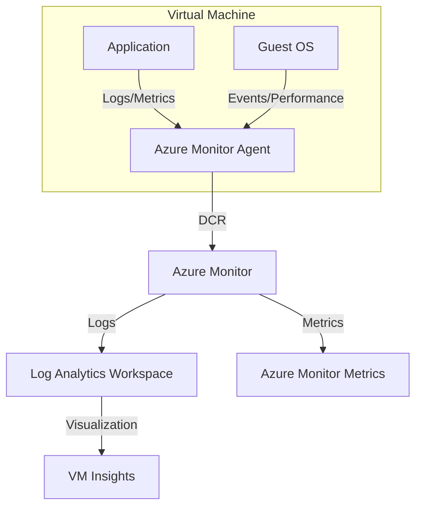

---
content_sources:
  diagrams:
    - id: data-flow-diagram
      type: flowchart
      source: mslearn-adapted
      based_on:
        - https://learn.microsoft.com/en-us/azure/azure-monitor/vm/monitor-virtual-machine
        - https://learn.microsoft.com/en-us/azure/azure-monitor/agents/azure-monitor-agent-overview
        - https://learn.microsoft.com/en-us/azure/azure-monitor/vm/vminsights-overview
---

# VM Observability

Monitoring Azure Virtual Machines involves collecting data from the host, the guest operating system (OS), and the workloads running within. This is primarily achieved using the Azure Monitor Agent (AMA) and VM Insights.

## Data Flow Diagram

<!-- diagram-id: data-flow-diagram -->


## Core Components

- **Azure Monitor Agent (AMA)**: The primary agent for collecting guest OS telemetry. It replaces legacy agents like the Log Analytics agent and Diagnostics extension.
- **Data Collection Rules (DCR)**: Define what data to collect from the agent and where to send it. DCRs provide granular control over data ingestion.
- **VM Insights**: A feature that provides a simplified onboarding experience and pre-defined visualizations for performance, health, and dependencies (Map).

## Configuration Examples

### Installing Azure Monitor Agent via CLI

To install the AMA extension on a Linux VM:

```bash
az vm extension set \
    --name "AzureMonitorLinuxAgent" \
    --publisher "Microsoft.Azure.Monitor" \
    --resource-group "my-resource-group" \
    --vm-name "my-linux-vm" \
    --enable-auto-upgrade true
```

### Associating a DCR via CLI

After creating a Data Collection Rule, associate it with a VM:

```bash
az monitor data-collection rule association create \
    --name "my-vm-dcr-association" \
    --resource "/subscriptions/{subscriptionId}/resourceGroups/{resourceGroupName}/providers/Microsoft.Compute/virtualMachines/{vmName}" \
    --rule-id "/subscriptions/{subscriptionId}/resourceGroups/{resourceGroupName}/providers/Microsoft.Insights/dataCollectionRules/{dcrName}"
```

## KQL Query Examples

### Monitor VM Heartbeat

Verify that your virtual machines are actively reporting to the workspace.

```kusto
Heartbeat
| where TimeGenerated > ago(1h)
| summarize LastHeartbeat = max(TimeGenerated) by Computer
| order by LastHeartbeat desc
```

### Analyze CPU Performance Counters

Retrieve CPU utilization trends for all monitored VMs.

```kusto
InsightsMetrics
| where Origin == "vm.azm.ms"
| where Namespace == "Processor" and Name == "UtilizationPercentage"
| summarize AvgCPU = avg(Val) by Computer, bin(TimeGenerated, 15m)
| render timechart
```

### Search System Event Logs (Windows)

Find critical errors in the Windows System event log.

```kusto
Event
| where EventLog == "System" and EventLevelName == "Error"
| summarize count() by Source, EventID
| order by count_ desc
```

### Detect Missing Heartbeats

```kusto
Heartbeat
| summarize LastHeartbeat=max(TimeGenerated) by Computer, OSType
| extend MinutesSinceHeartbeat = datetime_diff('minute', now(), LastHeartbeat) * -1
| where MinutesSinceHeartbeat > 10
| order by MinutesSinceHeartbeat desc
```

### Review Linux Syslog Errors

```kusto
Syslog
| where TimeGenerated > ago(4h)
| where SeverityLevel in ("err", "crit", "alert", "emerg")
| project TimeGenerated, Computer, ProcessName, SyslogMessage
| order by TimeGenerated desc
```

Sample output:

```text
TimeGenerated              Computer       ProcessName   SyslogMessage
-------------------------  -------------  ------------  ---------------------------------------------
2026-04-06T00:52:00Z       vm-linux-01    systemd       Failed to start contoso-agent.service
2026-04-06T00:51:00Z       vm-linux-01    kernel        Out of memory: Killed process 4217 (python)
```

## Monitoring Baseline

For Azure Virtual Machines, build your baseline around these four evidence streams:

1. **Reachability and heartbeat**
    - Heartbeat freshness
    - Agent health
2. **Performance**
    - CPU, memory, disk, and network saturation
    - Process-level anomalies if collected
3. **Operating system logs**
    - Windows Event logs
    - Linux Syslog
4. **Change visibility**
    - Extension changes
    - DCR association changes
    - Planned maintenance or reboots

## CLI Workflow

### Verify Azure Monitor Agent extension

```bash
az vm extension list \
    --resource-group "my-resource-group" \
    --vm-name "my-linux-vm" \
    --output table
```

Sample output:

```text
Name                     Publisher                 ProvisioningState
-----------------------  ------------------------  -----------------
AzureMonitorLinuxAgent   Microsoft.Azure.Monitor   Succeeded
```

### Review DCR associations

```bash
az monitor data-collection rule association list \
    --resource "/subscriptions/<subscription-id>/resourceGroups/my-resource-group/providers/Microsoft.Compute/virtualMachines/my-linux-vm"
```

Sample output:

```json
[
  {
    "name": "my-vm-dcr-association",
    "dataCollectionRuleId": "/subscriptions/<subscription-id>/resourceGroups/my-resource-group/providers/Microsoft.Insights/dataCollectionRules/dcr-vm-perf"
  }
]
```

### Query recent heartbeats

```bash
az monitor log-analytics query \
    --workspace "law-monitoring-prod" \
    --analytics-query "Heartbeat | where TimeGenerated > ago(30m) | summarize LastHeartbeat=max(TimeGenerated) by Computer" \
    --output table
```

Sample output:

```text
Computer       LastHeartbeat
-------------  -------------------------
vm-linux-01    2026-04-06T01:02:10.000Z
vm-win-01      2026-04-06T01:02:03.000Z
```

## Practical Alert Examples

### Alert on missing heartbeat

```bash
az monitor scheduled-query create \
    --name "vm-missing-heartbeat" \
    --resource-group "my-resource-group" \
    --scopes "/subscriptions/<subscription-id>/resourceGroups/my-resource-group/providers/Microsoft.OperationalInsights/workspaces/law-monitoring-prod" \
    --condition "count 'Heartbeat | summarize LastHeartbeat=max(TimeGenerated) by Computer | extend MinutesSinceHeartbeat = datetime_diff(\"minute\", now(), LastHeartbeat) * -1 | where MinutesSinceHeartbeat > 10' > 0" \
    --description "One or more virtual machines stopped sending heartbeats" \
    --evaluation-frequency "5m" \
    --window-size "5m" \
    --severity 1 \
    --action-groups "/subscriptions/<subscription-id>/resourceGroups/my-resource-group/providers/Microsoft.Insights/actionGroups/ag-platform-oncall"
```

### Alert on sustained CPU saturation

```bash
az monitor metrics alert create \
    --name "vm-cpu-high" \
    --resource-group "my-resource-group" \
    --scopes "/subscriptions/<subscription-id>/resourceGroups/my-resource-group/providers/Microsoft.Compute/virtualMachines/my-linux-vm" \
    --condition "avg Percentage CPU > 85" \
    --window-size "15m" \
    --evaluation-frequency "5m" \
    --severity 2 \
    --description "Virtual machine CPU usage is above 85 percent" \
    --action "/subscriptions/<subscription-id>/resourceGroups/my-resource-group/providers/Microsoft.Insights/actionGroups/ag-platform-oncall"
```

## Investigation Workflow

1. **Heartbeat**
    - Did the VM stop sending data entirely?
2. **Performance counters / InsightsMetrics**
    - Was CPU, memory, or disk already degrading before the symptom?
3. **OS logs**
    - Are there service failures, kernel issues, or driver errors?
4. **Recent changes**
    - Was the AMA extension updated?
    - Did the DCR change?
5. **Workload context**
    - Is the issue application-specific or host-wide?

## Windows and Linux Coverage Guidance

- **Windows VMs**
    - Collect System and Application event logs for baseline operations
    - Add Security logs only when required and sized appropriately
- **Linux VMs**
    - Collect Syslog with severity filters to control ingestion
    - Include performance counters for CPU, memory, filesystem, and network activity
- **Both**
    - Use the same workspace naming and DCR pattern across environments for easier fleet queries

## Workbook Suggestions

- Fleet heartbeat status
- Top VMs by CPU and memory utilization
- Windows error events by source and event ID
- Linux Syslog error trend by host
- DCR coverage view to find VMs missing associations

## Cost Notes

- Heartbeat and core performance counters are low-cost and high-value; collect them everywhere.
- Security or verbose application logs can dominate ingestion cost if sent without filters.
- Use DCRs to narrow Windows Event IDs and Linux Syslog facilities instead of collecting everything by default.

## See Also

- [AKS Observability](../aks/observability.md)
- [App Service Platform Logs](../app-service/platform-logs.md)

## Sources

- [Monitor virtual machines with Azure Monitor](https://learn.microsoft.com/en-us/azure/azure-monitor/vm/monitor-virtual-machine)
- [Azure Monitor Agent overview](https://learn.microsoft.com/en-us/azure/azure-monitor/agents/azure-monitor-agent-overview)
- [VM insights overview](https://learn.microsoft.com/en-us/azure/azure-monitor/vm/vminsights-overview)
