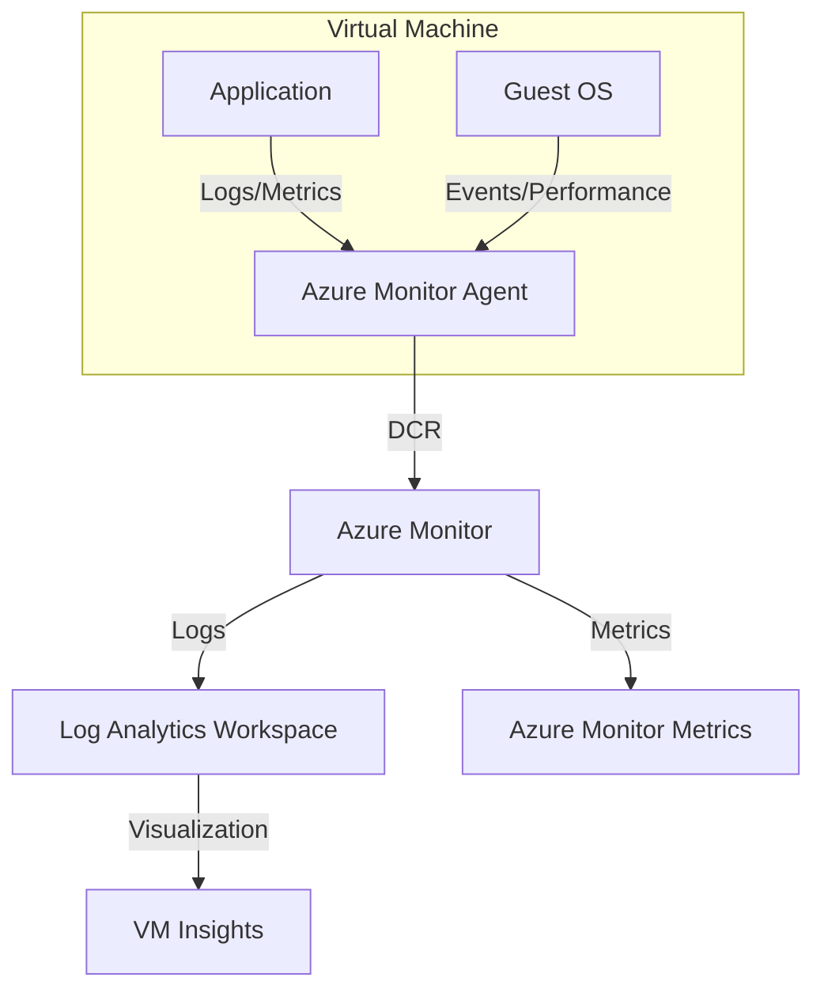

# VM Observability

Monitoring Azure Virtual Machines involves collecting data from the host, the guest operating system (OS), and the workloads running within. This is primarily achieved using the Azure Monitor Agent (AMA) and VM Insights.

## Data Flow Diagram



## Core Components

- **Azure Monitor Agent (AMA)**: The primary agent for collecting guest OS telemetry. It replaces legacy agents like the Log Analytics agent and Diagnostics extension.
- **Data Collection Rules (DCR)**: Define what data to collect from the agent and where to send it. DCRs provide granular control over data ingestion.
- **VM Insights**: A feature that provides a simplified onboarding experience and pre-defined visualizations for performance, health, and dependencies (Map).

## Configuration Examples

### Installing Azure Monitor Agent via CLI

To install the AMA extension on a Linux VM:

```bash
az vm extension set \
    --name "AzureMonitorLinuxAgent" \
    --publisher "Microsoft.Azure.Monitor" \
    --resource-group "my-resource-group" \
    --vm-name "my-linux-vm" \
    --enable-auto-upgrade true
```

### Associating a DCR via CLI

After creating a Data Collection Rule, associate it with a VM:

```bash
az monitor data-collection rule association create \
    --name "my-vm-dcr-association" \
    --resource "/subscriptions/{subscriptionId}/resourceGroups/{resourceGroupName}/providers/Microsoft.Compute/virtualMachines/{vmName}" \
    --rule-id "/subscriptions/{subscriptionId}/resourceGroups/{resourceGroupName}/providers/Microsoft.Insights/dataCollectionRules/{dcrName}"
```

## KQL Query Examples

### Monitor VM Heartbeat

Verify that your virtual machines are actively reporting to the workspace.

```kusto
Heartbeat
| where TimeGenerated > ago(1h)
| summarize LastHeartbeat = max(TimeGenerated) by Computer
| order by LastHeartbeat desc
```

### Analyze CPU Performance Counters

Retrieve CPU utilization trends for all monitored VMs.

```kusto
InsightsMetrics
| where Origin == "vm.azm.ms"
| where Namespace == "Processor" and Name == "UtilizationPercentage"
| summarize AvgCPU = avg(Val) by Computer, bin(TimeGenerated, 15m)
| render timechart
```

### Search System Event Logs (Windows)

Find critical errors in the Windows System event log.

```kusto
Event
| where EventLog == "System" and EventLevelName == "Error"
| summarize count() by Source, EventID
| order by count_ desc
```

## See Also

- [AKS Observability](../aks/observability.md)
- [App Service Platform Logs](../app-service/platform-logs.md)

## Sources

- [Monitor virtual machines with Azure Monitor](https://learn.microsoft.com/en-us/azure/azure-monitor/vm/monitor-virtual-machine)
- [Azure Monitor Agent overview](https://learn.microsoft.com/en-us/azure/azure-monitor/agents/azure-monitor-agent-overview)
- [VM insights overview](https://learn.microsoft.com/en-us/azure/azure-monitor/vm/vminsights-overview)
