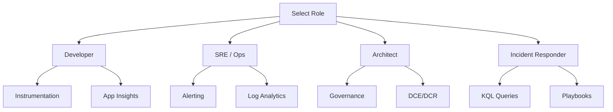

---
content_sources:
  diagrams:
    - id: learning-paths
      type: flowchart
      source: self-generated
      based_on:
        - https://learn.microsoft.com/en-us/azure/azure-monitor/fundamentals/overview
        - https://learn.microsoft.com/en-us/azure/azure-monitor/logs/log-analytics-overview
        - https://learn.microsoft.com/en-us/azure/azure-monitor/alerts/alerts-overview
        - https://learn.microsoft.com/en-us/azure/azure-monitor/app/app-insights-overview
        - https://learn.microsoft.com/en-us/azure/azure-monitor/visualize/workbooks-overview
---

# Learning Paths

This guide is structured to support different operational roles. Select your path based on your primary responsibilities within the Azure environment.

<!-- diagram-id: learning-paths -->

## Developer Path

Focus on application-level visibility and tracing.

*   **Instrumentation**: Start with Application Insights for request tracking and exception logging.
*   **Local Debugging**: Use Profiler and Snapshot Debugger to identify performance bottlenecks.
*   **Traces**: Implement OpenTelemetry standards for portable observability.
*   **Read**: [App Service Monitoring](../service-guides/app-service/index.md), [Functions Monitoring](../service-guides/functions/index.md).

## SRE and Operations Path

Focus on reliability, alerting, and system health.

*   **Platform Foundation**: Understand Log Analytics workspaces and data retention.
*   **Alerting**: Configure metric alerts and scheduled query alerts with Action Groups.
*   **Dashboards**: Build Azure Workbooks for unified views of infrastructure health.
*   **Read**: [Platform Setup](../platform/index.md), [Operations](../operations/index.md).

## Architect Path

Focus on design, governance, and cost management.

*   **Data Ingestion**: Use Data Collection Endpoints (DCE) and Data Collection Rules (DCR).
*   **Governance**: Apply Azure Policy for automated monitoring agent deployment.
*   **Cost Management**: Monitor ingestion volumes and optimize data retention.
*   **Read**: [Best Practices](../best-practices/index.md), [Reference Architecture](../reference/index.md).

## Incident Responder Path

Focus on rapid detection and root cause analysis.

*   **KQL Proficiency**: Master the Kusto Query Language for searching across logs.
*   **Service Health**: Monitor Azure Service Health and Resource Health.
*   **Playbooks**: Use standardized troubleshooting workflows for common failures.
*   **Read**: [Troubleshooting](../troubleshooting/index.md), [KQL Reference](../troubleshooting/kql/index.md).

## See Also

*   [Overview](overview.md)
*   [Repository Map](repository-map.md)

## Sources

*   [Azure Monitor Fundamentals](https://learn.microsoft.com/azure/azure-monitor/best-practices)
*   [Roles and permissions](https://learn.microsoft.com/azure/azure-monitor/roles-permissions-security)
