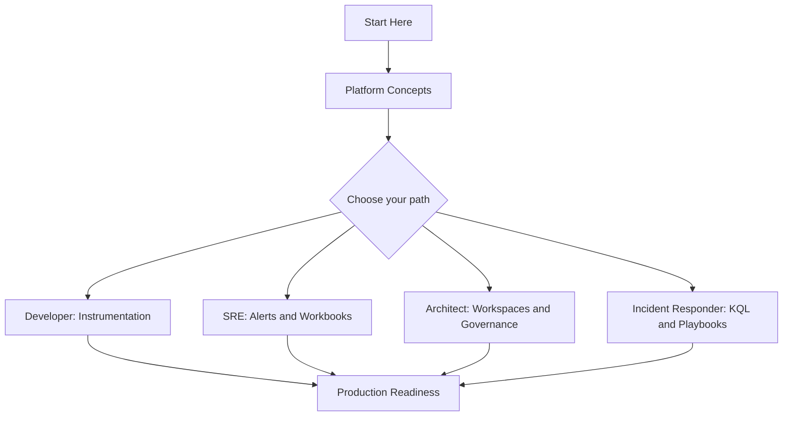
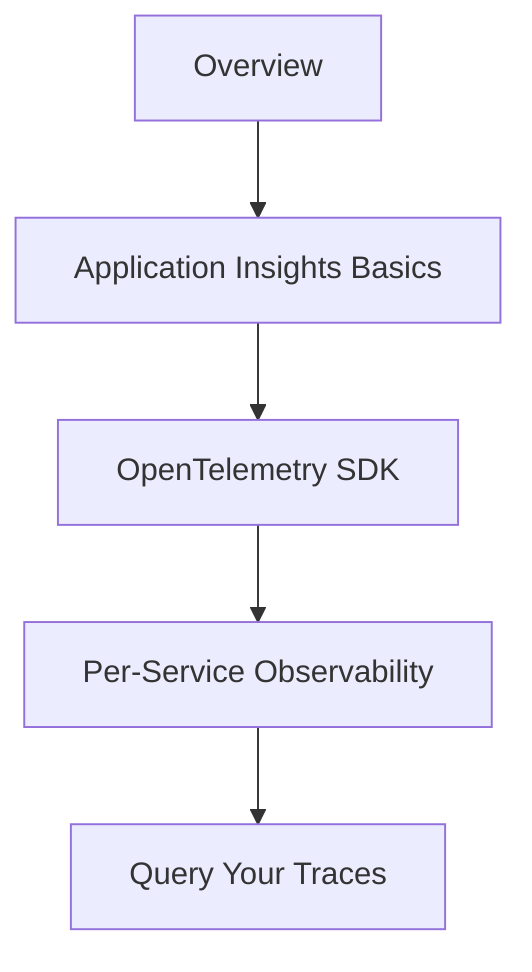
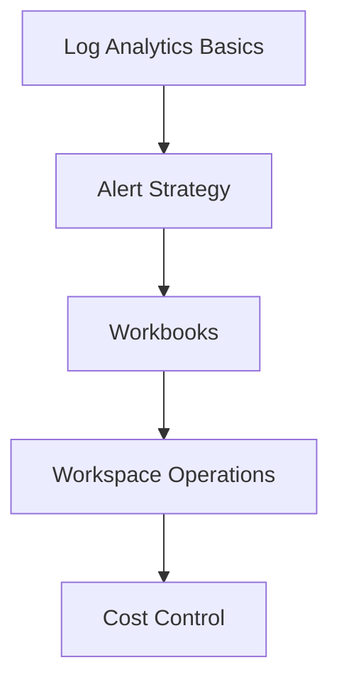
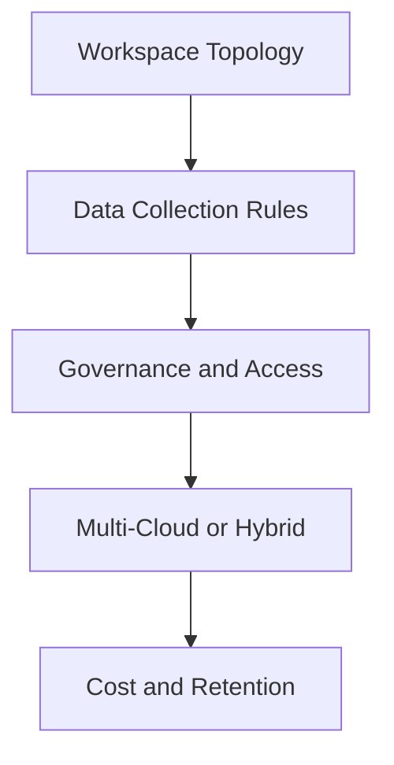
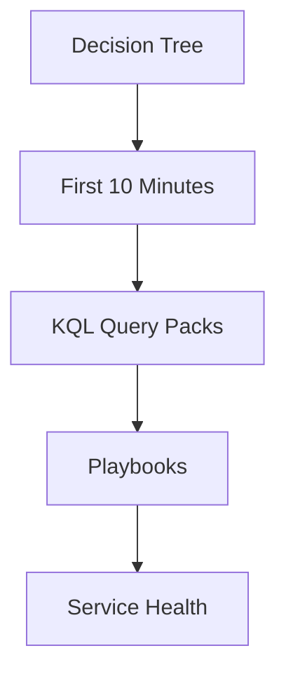

# Learning Paths

Use this page to choose a reading path based on your role and goal. Each path is numbered, so read the pages in order for the best result. Every path ends with a checklist of concrete outcomes you should be able to demonstrate.

!!! tip "Pick one primary path first"
    If you fit multiple roles, pick the one that matches your current goal, complete that path, then read a second path opportunistically. Trying to follow every path in parallel dilutes progress.

## Choose Your Path

| Role | Goal | Time Budget | Start With |
|---|---|---|---|
| **Developer** | Instrument apps and read traces or metrics | 2-3 hours | [Overview](overview.md), [Platform Hub](../platform/index.md) |
| **SRE / Operator** | Design alerts, workbooks, and workspace hygiene | 3-4 hours | [Operations Hub](../operations/index.md), [Best Practices Hub](../best-practices/index.md) |
| **Architect** | Design workspaces, DCR ingestion, governance, cost | 4-6 hours | [Platform Hub](../platform/index.md), [Best Practices Hub](../best-practices/index.md) |
| **Incident Responder** | Diagnose fast with KQL, playbooks, and service health | 2-4 hours + on-call reference | [Troubleshooting Hub](../troubleshooting/index.md) |

## Recommended Sequence

<!-- diagram-id: mon-learning-paths-overview -->

```mermaid
flowchart TD
    A[Start Here] --> B[Platform Concepts]
    B --> C{Choose your path}
    C --> D[Developer: Instrumentation]
    C --> E[SRE: Alerts and Workbooks]
    C --> F[Architect: Workspaces and Governance]
    C --> G[Incident Responder: KQL and Playbooks]
    D --> H[Production Readiness]
    E --> H
    F --> H
    G --> H
```

## Developer Path

Instrument application code, emit useful traces and metrics, and read them from Application Insights or Log Analytics.

**Time**: 2-3 hours

<!-- diagram-id: mon-learning-paths-developer -->

```mermaid
flowchart TD
    A[Overview] --> B[Application Insights Basics]
    B --> C[OpenTelemetry SDK]
    C --> D[Per-Service Observability]
    D --> E[Query Your Traces]
```

Read in order:

1. [Overview](overview.md)
2. [Platform Hub](../platform/index.md) — focus on Application Insights and the data platform
3. Per-service observability: [App Service](../service-guides/app-service/index.md), [Functions](../service-guides/functions/index.md), [Container Apps](../service-guides/container-apps/index.md), [AKS](../service-guides/aks/index.md), [VM](../service-guides/vm/index.md)
4. [Reference Hub](../reference/index.md) — KQL quick reference
5. [Troubleshooting Hub](../troubleshooting/index.md) — missing telemetry playbook

### Outcomes

- You can wire Application Insights into an ASP.NET, Python, Node, or Java app using OpenTelemetry.
- You can emit a custom trace or metric and query it in Log Analytics.
- You can find your service's platform logs and the tables they land in.
- You know when to use App Insights vs Log Analytics for a diagnostic question.

### Microsoft Learn anchors

- [Application Insights overview](https://learn.microsoft.com/en-us/azure/azure-monitor/app/app-insights-overview)
- [OpenTelemetry for Application Insights](https://learn.microsoft.com/en-us/azure/azure-monitor/app/opentelemetry-overview)
- [Data collection basics](https://learn.microsoft.com/en-us/azure/azure-monitor/fundamentals/data-platform)

## SRE / Operator Path

Run Azure Monitor in production: alert design, workbook curation, action-group hygiene, and workspace operations.

**Time**: 3-4 hours

<!-- diagram-id: mon-learning-paths-sre -->

```mermaid
flowchart TD
    A[Log Analytics Basics] --> B[Alert Strategy]
    B --> C[Workbooks]
    C --> D[Workspace Operations]
    D --> E[Cost Control]
```

Read in order:

1. [Platform Hub](../platform/index.md) — Log Analytics workspace, metrics, alerts architecture
2. [Best Practices Hub](../best-practices/index.md) — alert strategy, workspace design, cost, security
3. [Operations Hub](../operations/index.md) — alert rule management, workbooks, workspace management
4. [Troubleshooting Hub](../troubleshooting/index.md) — first 10 minutes and playbooks for common ops symptoms
5. [Reference Hub](../reference/index.md) — CLI cheatsheet and diagnostic tables

### Outcomes

- You can design an alert set that catches top failure modes without page-storming.
- You can build a workbook that unifies infra and app signals for one service.
- You can rotate action groups and validate the alert-to-incident pipeline end-to-end.
- You can identify the top-cost tables in a workspace and apply a retention or filtering change.

### Microsoft Learn anchors

- [Azure Monitor alerts overview](https://learn.microsoft.com/en-us/azure/azure-monitor/alerts/alerts-overview)
- [Log Analytics workspace overview](https://learn.microsoft.com/en-us/azure/azure-monitor/logs/log-analytics-overview)
- [Azure Monitor Workbooks overview](https://learn.microsoft.com/en-us/azure/azure-monitor/visualize/workbooks-overview)

## Architect Path

Design workspace topology, ingestion policy with Data Collection Rules, governance guardrails, and cost model for Azure Monitor across a portfolio.

**Time**: 4-6 hours

<!-- diagram-id: mon-learning-paths-architect -->

```mermaid
flowchart TD
    A[Workspace Topology] --> B[Data Collection Rules]
    B --> C[Governance and Access]
    C --> D[Multi-Cloud or Hybrid]
    D --> E[Cost and Retention]
```

Read in order:

1. [Platform Hub](../platform/index.md) — data platform, DCR, workspace, networking and security
2. [Best Practices Hub](../best-practices/index.md) — workspace design, data retention, tagging, multi-cloud, security and access
3. [Operations Hub](../operations/index.md) — DCR ops, diagnostic settings, export and integration
4. [Reference Hub](../reference/index.md) — platform limits, diagnostic tables
5. [Troubleshooting Hub](../troubleshooting/index.md) — mental model and architecture overview

### Outcomes

- You can pick between a central and distributed workspace model for a portfolio.
- You can design a Data Collection Rule set that filters noise before ingestion.
- You can define an access model with Azure RBAC and table-level permissions.
- You can estimate monthly ingestion cost and set alerts for cost drift.

### Microsoft Learn anchors

- [Design a Log Analytics workspace architecture](https://learn.microsoft.com/en-us/azure/azure-monitor/logs/workspace-design)
- [Data collection rules in Azure Monitor](https://learn.microsoft.com/en-us/azure/azure-monitor/essentials/data-collection-rule-overview)
- [Cost optimization in Azure Monitor](https://learn.microsoft.com/en-us/azure/azure-monitor/logs/cost-logs)

## Incident Responder Path

Diagnose fast during a live incident. Focuses on symptom-to-playbook mapping, KQL fluency, and service health signals.

**Time**: 2-4 hours + on-call reference

<!-- diagram-id: mon-learning-paths-incident-responder -->

```mermaid
flowchart TD
    A[Decision Tree] --> B[First 10 Minutes]
    B --> C[KQL Query Packs]
    C --> D[Playbooks]
    D --> E[Service Health]
```

Read in order:

1. [Troubleshooting Hub](../troubleshooting/index.md)
2. [Decision Tree](../troubleshooting/decision-tree.md) and [Mental Model](../troubleshooting/mental-model.md)
3. First 10 Minutes runbooks: [No Data](../troubleshooting/first-10-minutes/no-data.md), [Alert Not Firing](../troubleshooting/first-10-minutes/alert-not-firing.md), [Query Timeout](../troubleshooting/first-10-minutes/query-timeout.md), [High Cost](../troubleshooting/first-10-minutes/high-cost.md)
4. [KQL Query Packs](../troubleshooting/kql/index.md)
5. [Playbooks Hub](../troubleshooting/playbooks/index.md) — no-data, alert-storm, agent-not-reporting, high-ingestion-cost, slow-query, and more

### Outcomes

- You can run the First 10 Minutes runbook for a monitoring symptom (no data, storm, cost, timeout).
- You can write a KQL query that isolates a failure window and its top offenders.
- You can select the right playbook from a symptom description.
- You can correlate Azure Service Health with a workload alert to rule out platform events.

### Microsoft Learn anchors

- [Azure Monitor Logs query overview](https://learn.microsoft.com/en-us/azure/azure-monitor/logs/log-query-overview)
- [Azure Service Health overview](https://learn.microsoft.com/en-us/azure/service-health/service-health-overview)
- [Troubleshoot alerts](https://learn.microsoft.com/en-us/azure/azure-monitor/alerts/alerts-troubleshoot)

## Track Selection Matrix

| Situation | Start with | Then continue to |
|---|---|---|
| Onboarding a new service to Monitor | Developer Path | SRE Path |
| Designing a portfolio workspace strategy | Architect Path | SRE Path |
| Preparing for launch | SRE Path | Incident Responder Path |
| Active incidents | Incident Responder Path | SRE Path (hardening) |

!!! tip "Live incident? Skip the path."
    If you are actively responding to a page, jump straight to [Troubleshooting Hub](../troubleshooting/index.md), the [Decision Tree](../troubleshooting/decision-tree.md), and the First 10 Minutes runbooks.

## See Also

- [Overview](overview.md)
- [Repository Map](repository-map.md)
- [Platform Hub](../platform/index.md)
- [Service Guides Hub](../service-guides/index.md)
- [Operations Hub](../operations/index.md)
- [Best Practices Hub](../best-practices/index.md)
- [Troubleshooting Hub](../troubleshooting/index.md)

## Sources

- [Azure Monitor overview](https://learn.microsoft.com/en-us/azure/azure-monitor/fundamentals/overview)
- [Application Insights overview](https://learn.microsoft.com/en-us/azure/azure-monitor/app/app-insights-overview)
- [Log Analytics workspace overview](https://learn.microsoft.com/en-us/azure/azure-monitor/logs/log-analytics-overview)
- [Azure Monitor alerts overview](https://learn.microsoft.com/en-us/azure/azure-monitor/alerts/alerts-overview)
- [Data collection rules in Azure Monitor](https://learn.microsoft.com/en-us/azure/azure-monitor/essentials/data-collection-rule-overview)
- [Best practices for Azure Monitor](https://learn.microsoft.com/en-us/azure/azure-monitor/best-practices)
