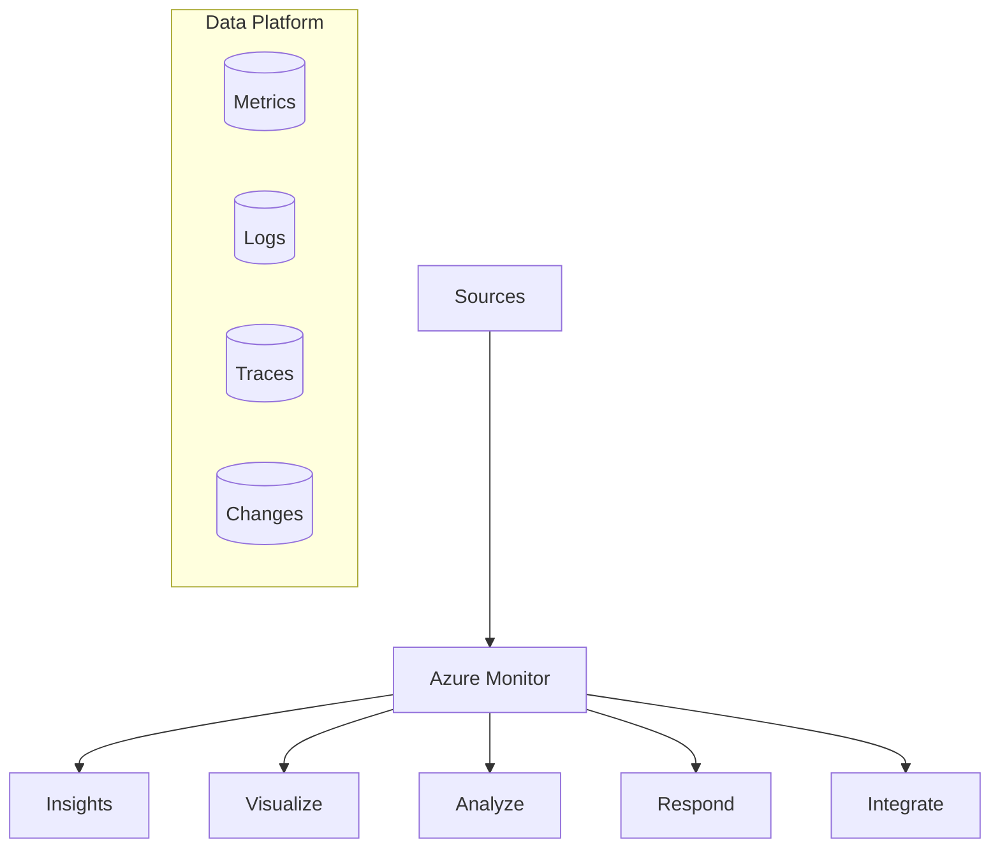

# Overview

Azure Monitor provides a full stack monitoring solution for your applications and infrastructure. This guide provides a structured approach to implementing observability using native Azure tools.

## Core Capabilities

Azure Monitor collects and analyzes telemetry from your cloud and on-premises environments. It helps you understand how your applications perform and proactively identifies issues affecting them and the resources they depend on.

## Guide Scope

This guide covers the implementation and operational aspects of Azure Monitor. It focuses on:

*   **Platform Configuration**: Setting up Log Analytics workspaces, Data Collection Rules, and Managed Identities.
*   **Service Monitoring**: Specific strategies for AKS, App Service, Functions, and Virtual Machines.
*   **Operational Excellence**: Alerting strategies, dashboarding, and cost management.
*   **Advanced Troubleshooting**: Using Kusto Query Language (KQL) and specialized playbooks.

## Target Audience

*   **Platform Engineers**: Responsible for the shared monitoring infrastructure and governance.
*   **Developers**: Implementing application-level instrumentation and tracing.
*   **SRE/Operations**: Managing alerts, responding to incidents, and ensuring system reliability.
*   **Architects**: Designing resilient systems with observability in mind.

## Structure

The guide is organized into logical sections that follow the monitoring lifecycle:

1.  **Start Here**: Introduction, learning paths, and repository structure.
2.  **Platform Setup**: Foundation for monitoring data collection and storage.
3.  **Service Guides**: Tailored monitoring for specific Azure services.
4.  **Operations**: Day-to-day management, alerts, and cost optimization.
5.  **Troubleshooting**: Practical KQL examples and incident response playbooks.

## See Also

*   [Learning Paths](learning-paths.md)
*   [Repository Map](repository-map.md)

## Sources

*   [Azure Monitor Documentation](https://learn.microsoft.com/azure/azure-monitor/overview)
*   [Azure Monitor Data Platform](https://learn.microsoft.com/azure/azure-monitor/data-platform)
