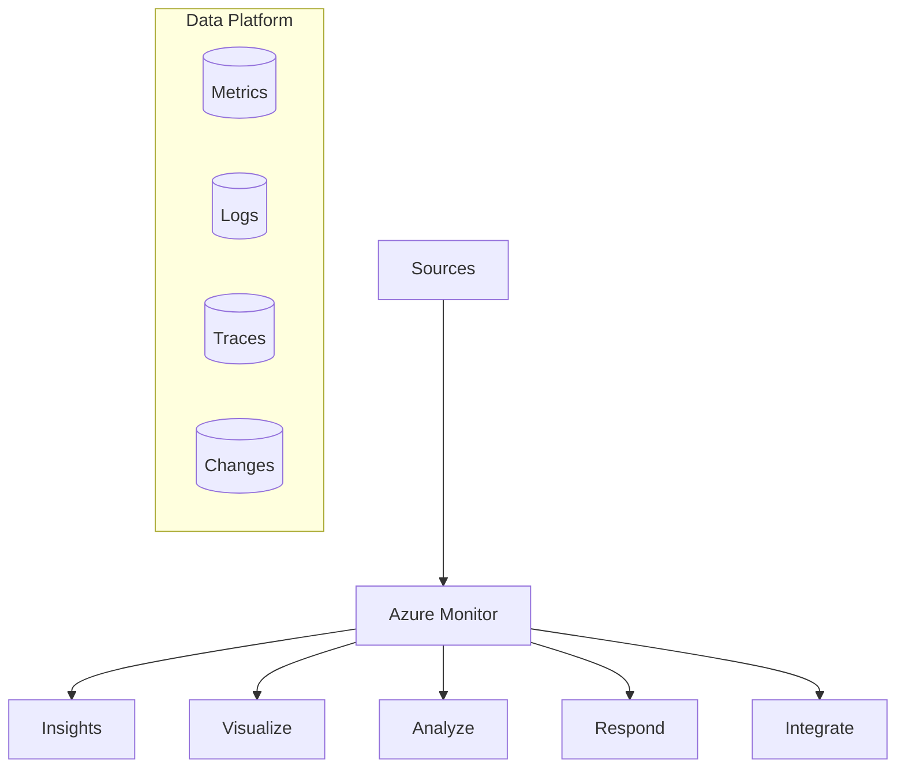

---
content_sources:
  diagrams:
    - id: core-capabilities
      type: flowchart
      source: self-generated
      based_on:
        - https://learn.microsoft.com/en-us/azure/azure-monitor/fundamentals/overview
        - https://learn.microsoft.com/en-us/azure/azure-monitor/fundamentals/data-sources
---

# Overview

Azure Monitor provides a full stack monitoring solution for your applications and infrastructure. This guide provides a structured approach to implementing observability using native Azure tools.

## Core Capabilities

Azure Monitor collects and analyzes telemetry from your cloud and on-premises environments. It helps you understand how your applications perform and proactively identifies issues affecting them and the resources they depend on.

<!-- diagram-id: core-capabilities -->

## Guide Scope

This guide covers the implementation and operational aspects of Azure Monitor. It focuses on:

*   **Platform Configuration**: Setting up Log Analytics workspaces, Data Collection Rules, and Managed Identities.
*   **Service Monitoring**: Specific strategies for AKS, App Service, Functions, and Virtual Machines.
*   **Operational Excellence**: Alerting strategies, dashboarding, and cost management.
*   **Advanced Troubleshooting**: Using Kusto Query Language (KQL) and specialized playbooks.

## Target Audience

*   **Platform Engineers**: Responsible for the shared monitoring infrastructure and governance.
*   **Developers**: Implementing application-level instrumentation and tracing.
*   **SRE/Operations**: Managing alerts, responding to incidents, and ensuring system reliability.
*   **Architects**: Designing resilient systems with observability in mind.

## Structure

The guide is organized into logical sections that follow the monitoring lifecycle:

1.  **Start Here**: Orientation, role-based learning paths, and repository navigation.
2.  **Platform**: Core Azure Monitor architecture, data platform, workspace design foundations, and security concepts.
3.  **Best Practices**: Recommended patterns for retention, alerting, access control, tagging, and cost optimization.
4.  **Service Guides**: Tailored monitoring implementations for App Service, Container Apps, Functions, AKS, and virtual machines.
5.  **Operations**: Repeatable day-2 runbooks for workspaces, diagnostics, alert rules, dashboards, exports, and cost control.
6.  **Troubleshooting**: Decision trees, evidence mapping, KQL query packs, and incident playbooks.
7.  **Reference**: Quick lookup material for CLI commands, KQL syntax, diagnostic tables, and platform limits.

## See Also

*   [Learning Paths](learning-paths.md)
*   [Repository Map](repository-map.md)

## Sources

*   [Azure Monitor Documentation](https://learn.microsoft.com/azure/azure-monitor/overview)
*   [Azure Monitor Data Platform](https://learn.microsoft.com/azure/azure-monitor/data-platform)
