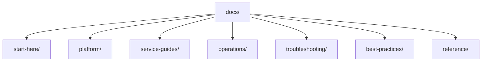

# Repository Map

The Azure Monitoring Practical Guide is organized to mirror the workflow of setting up and operating a production monitoring stack. This section explains the structure and purpose of each directory.

## Directory Structure

*   `docs/start-here/`
    *   `overview.md`: Introduction to the guide and Azure Monitor concepts.
    *   `learning-paths.md`: Tailored reading paths based on roles.
    *   `repository-map.md`: This file, explaining the guide's structure.
*   `docs/platform/`
    *   Guides for foundational components: Log Analytics, Application Insights, and Data Collection Rules.
*   `docs/service-guides/`
    *   Resource-specific monitoring implementations for AKS, App Service, Functions, and VMs.
*   `docs/operations/`
    *   Day-two operations: Alerting, Action Groups, Workbooks, and cost management.
*   `docs/troubleshooting/`
    *   `kql/`: Kusto Query Language examples and patterns.
    *   `playbooks/`: Step-by-step incident response procedures.
*   `docs/best-practices/`
    *   Optimization strategies for performance and efficiency.
*   `docs/reference/`
    *   Quick reference sheets and design patterns.

## Content Navigation

To get the most out of this repository, follow these navigation principles:

*   **Foundation First**: Start with `platform/` before moving to specific service guides.
*   **Searchable Patterns**: Use the `troubleshooting/kql/` directory as a library of reusable search queries.
*   **Actionable Advice**: Look for the `playbooks/` sections when dealing with active incidents.

## See Also

*   [Overview](overview.md)
*   [Learning Paths](learning-paths.md)

## Sources

*   [Azure Monitor Documentation](https://learn.microsoft.com/azure/azure-monitor/)
*   [Azure Architecture Center - Monitoring](https://learn.microsoft.com/azure/architecture/best-practices/monitoring)
