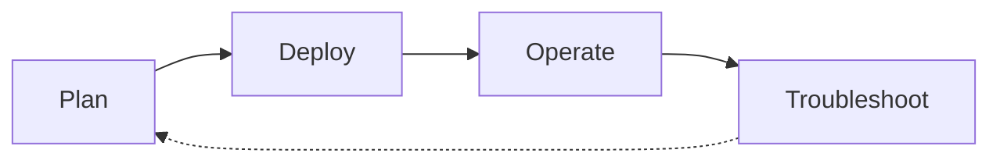

# Scenario Router

Use this page when you have a specific situation and want to jump straight to the page that answers it. This is a breadth-first index across four lifecycle phases — Plan, Deploy, Operate, Troubleshoot — that complements the depth-first [Learning Paths](learning-paths.md) and the symptom-first [Decision Tree](../troubleshooting/decision-tree.md).

!!! tip "Start with Learning Paths if you're new to Azure Monitor"
    This page assumes you already know what you're trying to do. If you're still deciding what to learn first, start with [Learning Paths](learning-paths.md) — it sequences a role-based tour of the guide. Use this Scenario Router when you have a specific question and want to jump to the exact page that answers it.

## How to Use This Router

- Pick the table for the lifecycle phase you're in — Plan, Deploy, Operate, or Troubleshoot.
- Scan the left column for the situation that matches yours; open the destination on the right.
- If two rows fit, prefer the row from the phase you're actually in — the same platform concept often appears in more than one phase.
- If your situation spans two phases (a design choice today that will become an incident later), check [Cross-Phase Scenarios](#cross-phase-scenarios) first.
- Every destination is a real page in this guide, not an external link and not an aspirational page.
- Rows are intentionally short. Follow the link for the depth; this table is a switchboard, not a summary.
- If your situation is missing, [open an issue](https://github.com/yeongseon/azure-monitoring-practical-guide/issues) — the router is meant to grow.

## Lifecycle Overview

<!-- diagram-id: mon-scenario-router-lifecycle -->

## I'm Planning

| Situation | Where to go |
|---|---|
| I'm choosing which learning path to follow | [Learning Paths](learning-paths.md) — role-based reading paths |
| I want to understand how Azure Monitor works end-to-end | [How Azure Monitor Works](../platform/how-azure-monitor-works.md) — sources, pipeline, and destinations |
| I'm deciding between Log Analytics, Application Insights, and Metrics for a signal | [Data Platform](../platform/data-platform.md) — Metrics, Logs, Traces, Changes pillars |
| I'm designing Log Analytics workspace topology for a portfolio | [Workspace Design](../best-practices/workspace-design.md) — central vs distributed models |
| I'm designing ingestion policy with Data Collection Rules | [Data Collection Rules](../platform/data-collection-rules.md) — filter noise before ingestion |
| I'm planning retention, archive, and cost model | [Data Retention](../best-practices/data-retention.md) — analytics tier, basic logs, archive |
| I'm planning access model (RBAC, table-level permissions) | [Security and Access](../best-practices/security-and-access.md) — workspace and table RBAC |
| I'm planning networking posture (Private Link, IP restrictions) | [Networking and Security](../platform/networking-and-security.md) — AMPLS and private access |
| I'm planning multi-cloud or hybrid coverage | [Multi-Cloud Hybrid](../best-practices/multi-cloud-hybrid.md) — non-Azure signal ingestion |

## I'm Deploying

| Situation | Where to go |
|---|---|
| I want the quickest possible first-hands-on | [Lab Guides](../tutorials/lab-guides/index.md) — 5 end-to-end labs (workspace, KQL, alerts, App Insights, workbooks) |
| I'm setting up my first Log Analytics workspace | [Workspace Management](../operations/workspace-management.md) — create, link, and configure |
| I'm setting up Application Insights for a new app | [Application Insights](../platform/application-insights.md) — connection string, sampling, and SDK model |
| I'm configuring Data Collection Rules for ingestion | [Data Collection Rules Ops](../operations/data-collection-rules-ops.md) — create, associate, and update DCRs |
| I need to enable diagnostic settings on Azure resources | [Diagnostic Settings](../operations/diagnostic-settings.md) — route platform logs to a workspace |
| I'm instrumenting a specific Azure service | [Service Guides Hub](../service-guides/index.md) — App Service, Container Apps, Functions, AKS, VMs |
| I'm tagging resources so cost and ownership are visible | [Tagging and Organization](../best-practices/tagging-and-organization.md) — cost-center and workspace tagging |

## I'm Operating in Production

| Situation | Where to go |
|---|---|
| I need day-2 operational procedures | [Operations Hub](../operations/index.md) — production runbooks |
| I want to follow production best practices | [Best Practices Hub](../best-practices/index.md) — hardening and design guidance |
| I'm designing alerts that catch real incidents without page-storming | [Alert Strategy](../best-practices/alert-strategy.md) — signal-to-noise design |
| I'm managing alert rules (create, tune, silence) | [Alert Rule Management](../operations/alert-rule-management.md) — lifecycle for alert rules |
| I'm building or curating workbooks and dashboards | [Workbooks and Dashboards](../operations/workbooks-and-dashboards.md) — visualization ops |
| I need to control monthly ingestion cost | [Cost Control](../operations/cost-control.md) — daily cap, table tier, retention levers |
| I need to update a DCR to filter a noisy table | [Data Collection Rules Ops](../operations/data-collection-rules-ops.md) — filter and transform ingested data |
| I'm exporting data to a SIEM or long-term storage | [Export and Integration](../operations/export-and-integration.md) — Event Hubs, Storage, and Sentinel |
| I'm hardening workspace access and audit | [Security and Access](../best-practices/security-and-access.md) — RBAC, table permissions, audit |

## I'm Troubleshooting

| Situation | Where to go |
|---|---|
| I need to systematically diagnose an issue | [Decision Tree](../troubleshooting/decision-tree.md) — hypothesis-driven triage flow |
| I need to know what evidence to collect | [Evidence Map](../troubleshooting/evidence-map.md) — question → KQL + CLI artifact index |
| I want quick pattern-match cards for common symptoms | [Quick Diagnosis Cards](../troubleshooting/quick-diagnosis-cards.md) — one-page symptom cards |
| An incident just started and I have 10 minutes | [First 10 Minutes](../troubleshooting/first-10-minutes/index.md) — ordered triage checklist |
| No data is landing in my workspace | [No Data in Workspace](../troubleshooting/playbooks/no-data-in-workspace.md) — DCR, agent, and permission gaps |
| Application Insights telemetry is missing or incomplete | [Missing Application Telemetry](../troubleshooting/playbooks/missing-application-telemetry.md) — SDK, sampling, and connection issues |
| An alert rule isn't firing when it should | [Alert Not Firing](../troubleshooting/playbooks/alert-not-firing.md) — evaluation, threshold, and scope checks |
| An alert storm is paging on-call repeatedly | [Alert Storm](../troubleshooting/playbooks/alert-storm.md) — dampening, dedupe, and threshold tuning |
| Monthly ingestion cost jumped unexpectedly | [High Ingestion Cost](../troubleshooting/playbooks/high-ingestion-cost.md) — top tables, DCR audit, and cap review |
| An agent (AMA, Log Analytics agent) isn't reporting | [Agent Not Reporting](../troubleshooting/playbooks/agent-not-reporting.md) — identity, network, and DCR-association issues |

## Cross-Phase Scenarios

Some situations straddle two phases — the design choice you make while planning determines the failure mode you eventually debug. These rows link the two together so you can see the pattern *and* the drill in one place. If you're only in one phase today, still skim this table: it's the cheapest way to preview which decisions will hurt later.

| Situation | Where to go |
|---|---|
| I'm designing DCR policy and want to see later ops implications first | [Data Collection Rules](../platform/data-collection-rules.md) then [Data Collection Rules Ops](../operations/data-collection-rules-ops.md) — design + day-2 filter management |
| I'm designing alert strategy and want to see the failure mode it prevents | [Alert Strategy](../best-practices/alert-strategy.md) then [Alert Storm](../troubleshooting/playbooks/alert-storm.md) — plan + incident |
| I'm planning cost model and want to see the surprise it prevents | [Cost Optimization](../best-practices/cost-optimization.md) then [High Ingestion Cost](../troubleshooting/playbooks/high-ingestion-cost.md) — plan + incident |
| I'm setting up Application Insights and want to preview instrumentation gaps | [Application Insights](../platform/application-insights.md) then [Missing Application Telemetry](../troubleshooting/playbooks/missing-application-telemetry.md) — deploy + drill |

## When This Router Isn't the Right Entry Point

- You're brand new to Azure Monitor → start with [Learning Paths](learning-paths.md) instead.
- You already have a symptom (no data, alert storm, high cost) and don't know which lifecycle phase you're in → jump to [Decision Tree](../troubleshooting/decision-tree.md) or [Quick Diagnosis Cards](../troubleshooting/quick-diagnosis-cards.md).
- You're deciding which Azure signal type to emit (Metrics vs Logs vs Traces) → use [Data Platform](../platform/data-platform.md).

## See Also

- [Learning Paths](learning-paths.md) — depth-first, role-based reading order
- [Overview](overview.md) — what Azure Monitor is and who this guide is for
- [Repository Map](repository-map.md) — full section map
- [Data Platform](../platform/data-platform.md) — Metrics, Logs, Traces, Changes pillars
- [Decision Tree](../troubleshooting/decision-tree.md) — symptom-first troubleshooting router
- [Evidence Map](../troubleshooting/evidence-map.md) — evidence-collection index
