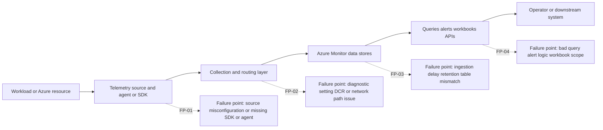
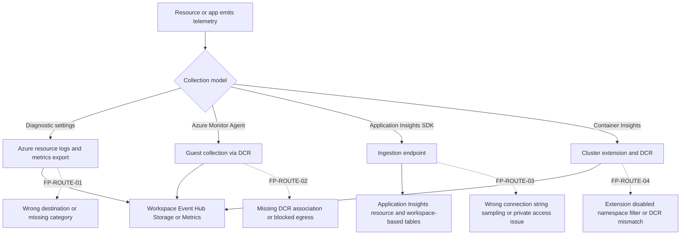
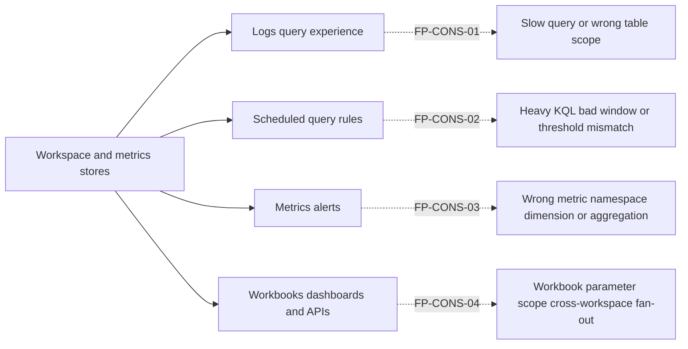

---
content_sources:
  diagrams:
    - id: 1-end-to-end-azure-monitor-flow
      type: flowchart
      source: mslearn-adapted
      based_on:
        - https://learn.microsoft.com/en-us/azure/azure-monitor/troubleshoot
        - https://learn.microsoft.com/en-us/azure/azure-monitor/data-collection/data-collection-overview
        - https://learn.microsoft.com/en-us/azure/azure-monitor/essentials/create-diagnostic-settings
        - https://learn.microsoft.com/en-us/azure/azure-monitor/agents/azure-monitor-agent-overview
        - https://learn.microsoft.com/en-us/azure/azure-monitor/app/app-insights-overview
        - https://learn.microsoft.com/en-us/azure/azure-monitor/logs/log-analytics-workspace-overview
    - id: 3-collection-and-routing-path
      type: flowchart
      source: mslearn-adapted
      based_on:
        - https://learn.microsoft.com/en-us/azure/azure-monitor/troubleshoot
        - https://learn.microsoft.com/en-us/azure/azure-monitor/data-collection/data-collection-overview
        - https://learn.microsoft.com/en-us/azure/azure-monitor/essentials/create-diagnostic-settings
        - https://learn.microsoft.com/en-us/azure/azure-monitor/agents/azure-monitor-agent-overview
        - https://learn.microsoft.com/en-us/azure/azure-monitor/app/app-insights-overview
        - https://learn.microsoft.com/en-us/azure/azure-monitor/logs/log-analytics-workspace-overview
    - id: 5-consumer-architecture-queries-alerts-and-workbooks
      type: flowchart
      source: mslearn-adapted
      based_on:
        - https://learn.microsoft.com/en-us/azure/azure-monitor/troubleshoot
        - https://learn.microsoft.com/en-us/azure/azure-monitor/data-collection/data-collection-overview
        - https://learn.microsoft.com/en-us/azure/azure-monitor/essentials/create-diagnostic-settings
        - https://learn.microsoft.com/en-us/azure/azure-monitor/agents/azure-monitor-agent-overview
        - https://learn.microsoft.com/en-us/azure/azure-monitor/app/app-insights-overview
        - https://learn.microsoft.com/en-us/azure/azure-monitor/logs/log-analytics-workspace-overview
---

# Troubleshooting Architecture Overview

This page answers the most important first question in Azure Monitor incidents: **where can the monitoring path fail?**

Before opening a specific playbook, classify the symptom against the Azure Monitor data path, control path, and consumption path. That routing step prevents common mistakes such as debugging Application Insights SDK configuration when the real issue is diagnostic settings, or blaming Log Analytics query latency when the actual problem is a workbook fanning out across multiple workspaces.

## Why this page exists

Playbooks are detailed and symptom-driven. During active incidents, operators usually need one faster artifact:

1. An end-to-end map of telemetry flow from source to consumer
2. A list of failure points where data can be delayed, dropped, blocked, or misrouted
3. A routing guide for choosing between ingestion, alerting, or query-performance investigation
4. A shared vocabulary for incident notes and escalation

Use this page to map the symptom first, then move to the appropriate playbook.

## 1) End-to-end Azure Monitor flow

<!-- diagram-id: 1-end-to-end-azure-monitor-flow -->


### Interpretation

- **Source problems** usually look like zero or partial telemetry from one workload.
- **Routing problems** usually look like data reaching the wrong workspace, missing categories, or blocked outbound collection.
- **Data-store problems** usually look like ingestion gaps, delay, retention surprises, or table-specific anomalies.
- **Consumer problems** usually look like slow queries, broken workbooks, or alert rules that do not reflect the actual data.

## 2) Telemetry source architecture

Different Azure Monitor signals originate from different collection models.

| Signal type | Typical source | Collection mechanism | First failure question |
|---|---|---|---|
| Platform metrics | Azure resources | Native Azure Monitor metrics pipeline | Is the resource emitting the expected metric dimension? |
| Resource logs | Azure resources | Diagnostic settings | Is the resource sending the right categories to the intended destination? |
| VM or server logs and metrics | Guest OS | Azure Monitor Agent + DCR | Is AMA installed, healthy, and associated with the correct DCR? |
| Application traces and requests | Application code | Application Insights SDK, autoinstrumentation, or OpenTelemetry | Is the app sending telemetry with the correct connection string or endpoint? |
| Container and AKS logs | Cluster or node agents | Container Insights / AMA / extension pipeline | Is the extension enabled and the workspace/DCR mapping correct? |

### Source-side failure points

| Failure point | Typical symptom | First evidence | Primary page |
|---|---|---|---|
| FP-SRC-01 Application SDK missing or broken | Requests missing, traces absent, custom events never arrive | App config and application logs | [Missing Application Telemetry](playbooks/missing-application-telemetry.md) |
| FP-SRC-02 Diagnostic setting disabled or incomplete | Resource logs absent in workspace | Azure Activity Log + diagnostic settings list | [No Data in Workspace](playbooks/no-data-in-workspace.md) |
| FP-SRC-03 AMA unhealthy or not assigned | VM heartbeat stops, guest data disappears | `Heartbeat`, DCR association, extension state | [Agent Not Reporting](playbooks/agent-not-reporting.md) |
| FP-SRC-04 AKS monitoring addon or extension misconfigured | `ContainerLogV2` and insights tables stale or empty | AKS addon state, DCR, extension logs | [AKS Container Insights Issues](playbooks/aks-container-insights-issues.md) |

## 3) Collection and routing path

<!-- diagram-id: 3-collection-and-routing-path -->


### What to check first on the routing layer

```bash
az monitor diagnostic-settings list \
    --resource "$RESOURCE_ID"

az monitor data-collection rule association list \
    --resource "$RESOURCE_ID"

az monitor app-insights component show \
    --resource-group "$RG" \
    --app "$APP_INSIGHTS_NAME"
```

### Routing-layer interpretation

- If a resource emits metrics but no logs, the problem is often diagnostic settings rather than resource health.
- If `Heartbeat` is stale for one VM cohort, DCR association or agent health is more likely than workspace outage.
- If Application Insights requests arrive but custom traces do not, sampling, SDK configuration, or module coverage is more likely than ingestion failure.
- If AKS node metrics appear but container logs do not, inspect namespace filters and Container Insights configuration before debugging query logic.

## 4) Data-store architecture

Azure Monitor is not a single store. Troubleshooting quality improves when you know which store is supposed to hold the evidence.

| Store | Purpose | Typical symptoms when wrong store is queried |
|---|---|---|
| Metrics store | Near-real-time numeric platform and custom metrics | Alert seems wrong because operator searched logs instead of metrics dimensions |
| Log Analytics workspace | Central log and analytics store for resource logs, agent data, and workspace-based AI data | Data appears missing because operator queried the wrong workspace or table |
| Application Insights tables | Application telemetry schema over workspace-based or classic storage | Requests exist but user looks only at resource logs or vice versa |
| Activity Log | Control-plane change history | Operators miss the config change that caused the incident |

### Data-store failure points

| Failure point | Typical symptom | First question |
|---|---|---|
| FP-DATA-01 Wrong workspace | Query returns nothing even though data exists elsewhere | Are we querying the intended workspace ID and table family? |
| FP-DATA-02 Ingestion delay or temporary lag | Data appears later than expected | Is there fresh control data in simple tables such as `Heartbeat` or `Usage`? |
| FP-DATA-03 Retention or plan misunderstanding | Historical data seems missing | Was the data retained in this table plan for the requested period? |
| FP-DATA-04 Table mismatch | Query hits the wrong schema or old table name | Is the signal expected in `requests`, `AppRequests`, `AzureDiagnostics`, or another table? |

## 5) Consumer architecture: queries, alerts, and workbooks

<!-- diagram-id: 5-consumer-architecture-queries-alerts-and-workbooks -->


### Consumer-side failure patterns

| Failure point | Typical symptom | Primary page |
|---|---|---|
| FP-CONS-01 Slow KQL or timeouts | Logs and workbooks are slow or fail to load | [Slow Query Performance](playbooks/slow-query-performance.md) |
| FP-CONS-02 Alert rule never fires | Data exists but query or threshold logic does not align | [Alert Not Firing](playbooks/alert-not-firing.md) |
| FP-CONS-03 Alert storm | Thresholds or dimensions produce excessive noise | [Alert Storm](playbooks/alert-storm.md) |
| FP-CONS-04 Workbook overhead | Portal visual is slow but direct query is healthy | [Slow Query Performance](playbooks/slow-query-performance.md) |

## 6) Failure domains by symptom

| Observed symptom | Highest-probability domain | Why |
|---|---|---|
| No data in a workspace | Source or routing | Telemetry usually failed before or during collection |
| One app has no requests in Application Insights | Source | SDK, connection string, or app restart issue is likely |
| VM logs missing but workspace healthy | Agent and DCR | Collection path is per-VM and easy to isolate |
| Queries time out only on one table | Consumer plus table design | Data exists, but query shape or table volume is unhealthy |
| Alerts do not reflect visible data | Consumer logic | Alert cadence, dimensions, and query scope often diverge from ad hoc analysis |
| Cost spikes suddenly | Routing and data volume | Diagnostic setting changes or noisy apps often drive ingestion growth |

## 7) Minimal evidence set for first routing

Use one fast check per layer before going deeper.

```bash
az monitor log-analytics workspace show \
    --resource-group "$RG" \
    --workspace-name "$WORKSPACE_NAME" \
    --query "{id:id,name:name,retentionInDays:retentionInDays}"

az monitor scheduled-query show \
    --resource-group "$RG" \
    --name "$ALERT_RULE_NAME" \
    --output json
```

```kusto
Heartbeat
| where TimeGenerated > ago(15m)
| summarize LastHeartbeat = max(TimeGenerated) by Computer
| take 5
```

```kusto
Usage
| where TimeGenerated > ago(24h)
| summarize TotalGB = round(sum(Quantity) / 1024.0, 2) by DataType
| order by TotalGB desc
| take 10
```

### How to use this evidence set

1. Confirm you are in the correct workspace.
2. Prove the workspace answers a narrow control query.
3. Check whether one table or signal family dominates recent ingestion.
4. If the symptom is alert-specific, inspect the rule before changing data collection.

## 8) Fast routing examples

- **Example A: VM metrics stop, but workspace queries are healthy**
    - Start in the source/routing layer.
    - Open: [Agent Not Reporting](playbooks/agent-not-reporting.md).

- **Example B: Application requests exist, but workbook takes minutes to load**
    - Start in the consumer layer.
    - Open: [Slow Query Performance](playbooks/slow-query-performance.md).

- **Example C: New cost spike after a platform rollout**
    - Start in routing and data-volume analysis.
    - Open: [High Ingestion Cost](playbooks/high-ingestion-cost.md).

- **Example D: Azure resource logs disappeared after a change window**
    - Start with control-plane evidence and diagnostic settings.
    - Open: [No Data in Workspace](playbooks/no-data-in-workspace.md).

- **Example E: App traces disappeared but requests still arrive**
    - Start at the application telemetry source.
    - Open: [Missing Application Telemetry](playbooks/missing-application-telemetry.md).

## 9) Escalation boundaries

Only escalate as a likely Azure-side platform incident when all of these are true:

1. Narrow control queries are also unhealthy.
2. Multiple unrelated signal types or workloads are affected.
3. Configuration and routing evidence do not explain the symptom.
4. Azure Service Health or broader tenant impact signals support the timeline.

If those conditions are not met, stay in the relevant playbook and continue with evidence-driven disproof.

!!! tip "Use architecture labels in incident notes"
    Add the current failure domain to the incident timeline.

    Examples:

    - `Initial routing: Source/Routing`
    - `Initial routing: Consumer/Query`
    - `Reclassified after evidence: Data-store mismatch`

## See Also

- [Troubleshooting](index.md)
- [Decision Tree](decision-tree.md)
- [Evidence Map](evidence-map.md)
- [Troubleshooting Mental Model](mental-model.md)
- [Playbooks Index](playbooks/index.md)
- [KQL Query Packs](kql/index.md)

## Sources

- [Troubleshoot Azure Monitor](https://learn.microsoft.com/en-us/azure/azure-monitor/troubleshoot)
- [Azure Monitor data collection overview](https://learn.microsoft.com/en-us/azure/azure-monitor/data-collection/data-collection-overview)
- [Create diagnostic settings in Azure Monitor](https://learn.microsoft.com/en-us/azure/azure-monitor/essentials/create-diagnostic-settings)
- [Azure Monitor Agent overview](https://learn.microsoft.com/en-us/azure/azure-monitor/agents/azure-monitor-agent-overview)
- [Application Insights overview](https://learn.microsoft.com/en-us/azure/azure-monitor/app/app-insights-overview)
- [Log Analytics workspace overview](https://learn.microsoft.com/en-us/azure/azure-monitor/logs/log-analytics-workspace-overview)
