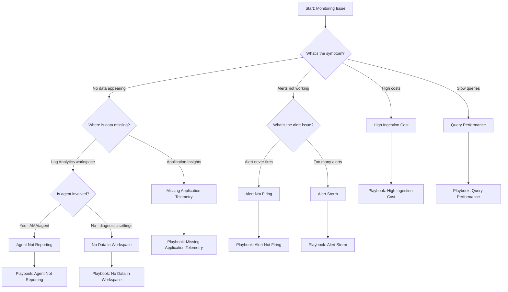

# Decision Tree

Symptom-based routing to troubleshooting playbooks.

## Quick Symptom Lookup

| Symptom | First Check | Playbook |
|---------|-------------|----------|
| No data in Log Analytics | Diagnostic settings enabled? | [No Data in Workspace](playbooks/no-data-in-workspace.md) |
| Application Insights empty | Connection string configured? | [Missing Application Telemetry](playbooks/missing-application-telemetry.md) |
| Alert rule never fires | Signal has data? | [Alert Not Firing](playbooks/alert-not-firing.md) |
| Getting too many alerts | Thresholds appropriate? | [Alert Storm](playbooks/alert-storm.md) |
| Unexpected cost increase | Which table growing? | [High Ingestion Cost](playbooks/high-ingestion-cost.md) |
| Queries timing out | Time range too wide? | [Query Performance](playbooks/query-performance.md) |
| VM metrics missing | AMA installed and healthy? | [Agent Not Reporting](playbooks/agent-not-reporting.md) |

## First 5 Minutes Checklist

Before diving into playbooks, check these common issues:

### Data Issues

1. **Resource exists and is running** — Is the resource deployed and operational?
2. **Diagnostic settings configured** — Are logs/metrics being sent anywhere?
3. **Correct workspace target** — Is data going to the workspace you're querying?
4. **Time range appropriate** — Are you querying the right time window?
5. **Ingestion delay** — Wait 5-10 minutes for recent data to appear

### Alert Issues

1. **Alert rule enabled** — Is the rule active, not disabled?
2. **Scope correct** — Does the rule target the right resources?
3. **Signal has data** — Is the metric/log table populated?
4. **Condition makes sense** — Is threshold achievable with current data?
5. **Action group configured** — Are notifications set up correctly?

### Cost Issues

1. **Check Usage table** — Which tables are growing?
2. **Review recent changes** — New resources or diagnostic settings?
3. **Daily cap status** — Has cap been hit or adjusted?
4. **Commitment tier** — Is usage aligned with tier?

## See Also

- [Evidence Map](evidence-map.md)
- [Playbooks Index](playbooks/index.md)
- [KQL Query Packs](kql/index.md)

## Sources

- [Troubleshoot Azure Monitor](https://learn.microsoft.com/azure/azure-monitor/troubleshoot)
- [Troubleshoot Log Analytics agent](https://learn.microsoft.com/azure/azure-monitor/agents/agent-troubleshoot-overview)
