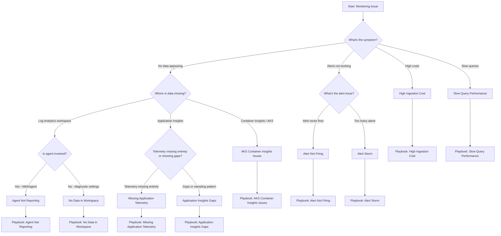

---
content_sources:
  diagrams:
    - id: decision-tree
      type: flowchart
      source: self-generated
      based_on:
        - https://learn.microsoft.com/en-us/azure/azure-monitor/troubleshoot
        - https://learn.microsoft.com/en-us/azure/azure-monitor/logs/troubleshoot
        - https://learn.microsoft.com/en-us/azure/azure-monitor/alerts/alerts-troubleshoot
---

# Decision Tree

Symptom-based routing to troubleshooting playbooks.

<!-- diagram-id: decision-tree -->

## Quick Symptom Lookup

| Symptom | First Check | Playbook |
|---------|-------------|----------|
| No data in Log Analytics | Diagnostic settings enabled? | [No Data in Workspace](playbooks/no-data-in-workspace.md) |
| Application Insights empty | Connection string configured? | [Missing Application Telemetry](playbooks/missing-application-telemetry.md) |
| Alert rule never fires | Signal has data? | [Alert Not Firing](playbooks/alert-not-firing.md) |
| Getting too many alerts | Thresholds appropriate? | [Alert Storm](playbooks/alert-storm.md) |
| Unexpected cost increase | Which table growing? | [High Ingestion Cost](playbooks/high-ingestion-cost.md) |
| Queries timing out | Time range too wide? | [Slow Query Performance](playbooks/slow-query-performance.md) |
| VM metrics missing | AMA installed and healthy? | [Agent Not Reporting](playbooks/agent-not-reporting.md) |
| AKS cluster nodes or pods missing in Container Insights | Is AKS monitoring enabled and are `ama-logs` pods healthy? | [AKS Container Insights Issues](playbooks/aks-container-insights-issues.md) |
| Application Insights has intermittent gaps or lower-than-expected volume | Is sampling active or did one telemetry type stop first? | [Application Insights Gaps](playbooks/application-insights-gaps.md) |

## Routing Notes for "No Data Appearing"

Use the decision points under **No data appearing** to avoid opening the wrong playbook first:

1. **Log Analytics workspace** means the workspace looks empty or stale across platform logs, guest logs, or one monitored resource category.
2. **Application Insights** means the app is instrumented, but request, dependency, trace, or exception data is missing from App* tables.
3. **Container Insights / AKS** means the AKS resource exists, but cluster inventory, pod logs, or Container Insights charts are empty or partial.

### Application Insights split guidance

- Open [Missing Application Telemetry](playbooks/missing-application-telemetry.md) when all or nearly all telemetry is absent after deployment, startup, or configuration drift.
- Open [Application Insights Gaps](playbooks/application-insights-gaps.md) when data still arrives but is intermittent, reduced by sampling, or missing for only certain telemetry types.

### AKS routing guidance

- Open [AKS Container Insights Issues](playbooks/aks-container-insights-issues.md) when nodes, namespaces, or pod logs are missing from Container Insights even though the AKS cluster itself is healthy.
- Stay with [No Data in Workspace](playbooks/no-data-in-workspace.md) when the issue is broader than AKS and affects unrelated diagnostic pipelines into the same workspace.

## Symptom-to-Playbook Boundaries

| If you observe... | Prefer this playbook | Why |
|---|---|---|
| `Heartbeat` is stale for VMs or Arc machines | [Agent Not Reporting](playbooks/agent-not-reporting.md) | Focuses on AMA health, DCR association, identity, and endpoint access. |
| `KubeNodeInventory` or `ContainerLogV2` is stale for AKS only | [AKS Container Insights Issues](playbooks/aks-container-insights-issues.md) | AKS monitoring can fail even when other workspace tables remain healthy. |
| App telemetry vanished after connection-string drift | [Missing Application Telemetry](playbooks/missing-application-telemetry.md) | Optimized for complete or near-complete instrumentation loss. |
| App telemetry volume dropped but `itemCount` suggests estimation | [Application Insights Gaps](playbooks/application-insights-gaps.md) | Sampling and partial ingestion explain apparent gaps better than total outage assumptions. |
| Alert notifications are excessive rather than absent | [Alert Storm](playbooks/alert-storm.md) | This is a signal design or suppression problem, not an ingestion problem. |
| Querying itself is slow while data still exists | [Slow Query Performance](playbooks/slow-query-performance.md) | Separates performance issues from missing-data issues. |

## When to Switch Playbooks

Re-route quickly if the first playbook disproves its main hypothesis:

- Start in [No Data in Workspace](playbooks/no-data-in-workspace.md), then switch to [AKS Container Insights Issues](playbooks/aks-container-insights-issues.md) if only `Kube*`, `ContainerLogV2`, or Container Insights views are stale.
- Start in [Missing Application Telemetry](playbooks/missing-application-telemetry.md), then switch to [Application Insights Gaps](playbooks/application-insights-gaps.md) if traffic still exists and `ItemCount` or per-table comparisons point to sampling or partial collection.
- Start in [Alert Not Firing](playbooks/alert-not-firing.md), then switch to [Slow Query Performance](playbooks/slow-query-performance.md) if the alert query itself is timing out or scanning too much data.

These handoffs prevent treating every incident as a full ingestion outage when the real problem is isolated to AKS, Application Insights sampling, or query design.

## First 5 Minutes Checklist

Before diving into playbooks, check these common issues:

### Data Issues

1. **Resource exists and is running** — Is the resource deployed and operational?
2. **Diagnostic settings configured** — Are logs/metrics being sent anywhere?
3. **Correct workspace target** — Is data going to the workspace you're querying?
4. **Time range appropriate** — Are you querying the right time window?
5. **Ingestion delay** — Wait 5-10 minutes for recent data to appear

### Alert Issues

1. **Alert rule enabled** — Is the rule active, not disabled?
2. **Scope correct** — Does the rule target the right resources?
3. **Signal has data** — Is the metric/log table populated?
4. **Condition makes sense** — Is threshold achievable with current data?
5. **Action group configured** — Are notifications set up correctly?

### Cost Issues

1. **Check Usage table** — Which tables are growing?
2. **Review recent changes** — New resources or diagnostic settings?
3. **Daily cap status** — Has cap been hit or adjusted?
4. **Commitment tier** — Is usage aligned with tier?

## See Also

- [Evidence Map](evidence-map.md)
- [Playbooks Index](playbooks/index.md)
- [KQL Query Packs](kql/index.md)

## Sources

- [Troubleshoot Azure Monitor](https://learn.microsoft.com/azure/azure-monitor/troubleshoot)
- [Troubleshoot Log Analytics agent](https://learn.microsoft.com/azure/azure-monitor/agents/agent-troubleshoot-overview)
