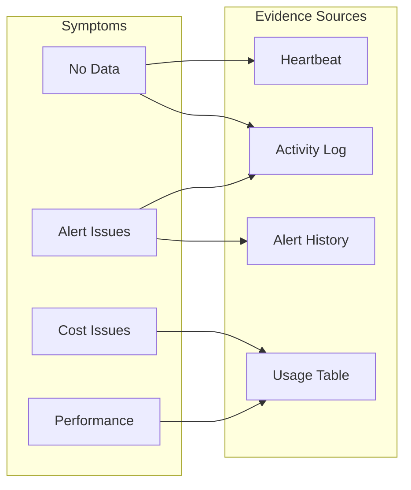

---
content_sources:
  diagrams:
    - id: evidence-map
      type: flowchart
      source: self-generated
      based_on:
        - https://learn.microsoft.com/en-us/azure/azure-monitor/troubleshoot
        - https://learn.microsoft.com/en-us/azure/azure-monitor/logs/troubleshoot
        - https://learn.microsoft.com/en-us/azure/azure-monitor/app/app-insights-overview
---

# Evidence Map

Data sources to check for each symptom category.

<!-- diagram-id: evidence-map -->


## Evidence by Symptom

### No Data in Workspace

| Evidence Source | What to Check | KQL Query |
|-----------------|---------------|-----------|
| AzureActivity | Diagnostic setting changes | `AzureActivity \| where OperationNameValue contains "diagnosticSettings"` |
| Heartbeat | Agent connectivity | `Heartbeat \| where TimeGenerated > ago(1h) \| summarize by Computer` |
| Usage | Table ingestion rates | `Usage \| where TimeGenerated > ago(1d) \| summarize sum(Quantity) by DataType` |
| _LogOperation | Ingestion errors | `_LogOperation \| where Level == "Error"` |

### Missing Application Telemetry

| Evidence Source | What to Check | KQL Query |
|-----------------|---------------|-----------|
| requests | Request data present | `requests \| where timestamp > ago(1h) \| count` |
| dependencies | Dependency tracking | `dependencies \| where timestamp > ago(1h) \| count` |
| traces | Custom logging | `traces \| where timestamp > ago(1h) \| summarize count() by severityLevel` |
| AppServicePlatformLogs | App Service startup | `AppServicePlatformLogs \| where TimeGenerated > ago(1h)` |

### Alert Not Firing

| Evidence Source | What to Check | KQL Query |
|-----------------|---------------|-----------|
| AzureActivity | Alert rule changes | `AzureActivity \| where OperationNameValue contains "alertRules"` |
| Signal data | Data exists for condition | Check the metric/log table in alert condition |
| Alert history | Past alert instances | Azure Portal → Alerts → History |

### Alert Storm

| Evidence Source | What to Check | KQL Query |
|-----------------|---------------|-----------|
| AzureActivity | Alert firing rate | `AzureActivity \| where OperationNameValue == "Microsoft.Insights/alertRules/activated/action"` |
| Metrics | Metric volatility | Check metric values over time for threshold violations |
| Alert processing rules | Suppression configured | Azure Portal → Alerts → Alert processing rules |

### High Ingestion Cost

| Evidence Source | What to Check | KQL Query |
|-----------------|---------------|-----------|
| Usage | Data volume by table | `Usage \| where TimeGenerated > ago(1d) \| summarize GB=sum(Quantity)/1000 by DataType \| order by GB desc` |
| Usage | Data volume trend | `Usage \| where TimeGenerated > ago(7d) \| summarize GB=sum(Quantity)/1000 by bin(TimeGenerated, 1d)` |
| _LogOperation | Ingestion anomalies | `_LogOperation \| where Category == "Ingestion"` |

### Query Performance

| Evidence Source | What to Check | Notes |
|-----------------|---------------|-------|
| Query text | Time scope present | Ensure `where TimeGenerated > ago(...)` |
| Query text | Table specified | Avoid `search *` patterns |
| Usage | Table size | Large tables need narrower queries |
| Workspace | Concurrent queries | Check for query throttling |

### Agent Not Reporting

| Evidence Source | What to Check | KQL Query |
|-----------------|---------------|-----------|
| Heartbeat | Last heartbeat time | `Heartbeat \| summarize LastHeartbeat=max(TimeGenerated) by Computer` |
| AzureActivity | DCR changes | `AzureActivity \| where OperationNameValue contains "dataCollectionRules"` |
| _LogOperation | Collection errors | `_LogOperation \| where Category == "Collection" and Level == "Error"` |

## Azure Portal Evidence Locations

| Evidence Type | Portal Location |
|---------------|-----------------|
| Diagnostic settings | Resource → Diagnostic settings |
| Alert rules | Monitor → Alerts → Alert rules |
| Alert history | Monitor → Alerts → (filter by time) |
| Action groups | Monitor → Alerts → Action groups |
| DCR assignments | Monitor → Data Collection Rules → (select DCR) → Resources |
| Agent health | VM → Extensions + Applications |
| Workspace usage | Log Analytics workspace → Usage and estimated costs |
| Ingestion anomalies | Log Analytics workspace → Insights |

## CLI Evidence Collection

```bash

# Check diagnostic settings for a resource
az monitor diagnostic-settings list \
    --resource $RESOURCE_ID

# List alert rules in subscription
az monitor metrics alert list \
    --resource-group $RG

# Check DCR associations
az monitor data-collection rule association list \
    --resource $RESOURCE_ID

# View agent extensions on VM
az vm extension list \
    --resource-group $RG \
    --vm-name $VM_NAME
```

## See Also

- [Decision Tree](decision-tree.md)
- [KQL Query Packs](kql/index.md)
- [Reference: CLI Cheatsheet](../reference/cli-cheatsheet.md)

## Sources

- [Troubleshoot Azure Monitor](https://learn.microsoft.com/azure/azure-monitor/troubleshoot)
- [Troubleshoot Log Analytics](https://learn.microsoft.com/azure/azure-monitor/logs/troubleshoot)
