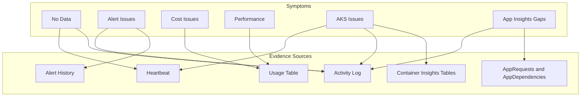

---
content_sources:
  diagrams:
    - id: evidence-map
      type: flowchart
      source: self-generated
      justification: "Synthesized from Microsoft Learn troubleshooting articles for Azure Monitor and Log Analytics"
      based_on:
        - https://learn.microsoft.com/en-us/azure/azure-monitor/troubleshoot
        - https://learn.microsoft.com/en-us/azure/azure-monitor/logs/troubleshoot
        - https://learn.microsoft.com/en-us/azure/azure-monitor/app/app-insights-overview
---

# Evidence Map

Data sources to check for each symptom category.

<!-- diagram-id: evidence-map -->


## Evidence by Symptom

### No Data in Workspace

| Evidence Source | What to Check | KQL Query |
|-----------------|---------------|-----------|
| AzureActivity | Diagnostic setting changes | `AzureActivity \| where OperationNameValue contains "diagnosticSettings"` |
| Heartbeat | Agent connectivity | `Heartbeat \| where TimeGenerated > ago(1h) \| summarize by Computer` |
| Usage | Table ingestion rates | `Usage \| where TimeGenerated > ago(1d) \| summarize sum(Quantity) by DataType` |
| _LogOperation | Ingestion errors | `_LogOperation \| where Level == "Error"` |

### Missing Application Telemetry

| Evidence Source | What to Check | KQL Query |
|-----------------|---------------|-----------|
| requests | Request data present | `requests \| where timestamp > ago(1h) \| count` |
| dependencies | Dependency tracking | `dependencies \| where timestamp > ago(1h) \| count` |
| traces | Custom logging | `traces \| where timestamp > ago(1h) \| summarize count() by severityLevel` |
| AppServicePlatformLogs | App Service startup | `AppServicePlatformLogs \| where TimeGenerated > ago(1h)` |

### Alert Not Firing

| Evidence Source | What to Check | KQL Query |
|-----------------|---------------|-----------|
| AzureActivity | Alert rule changes | `AzureActivity \| where OperationNameValue contains "alertRules"` |
| Signal data | Data exists for condition | Check the metric/log table in alert condition |
| Alert history | Past alert instances | Azure Portal → Alerts → History |

### Alert Storm

| Evidence Source | What to Check | KQL Query |
|-----------------|---------------|-----------|
| AzureActivity | Alert firing rate | `AzureActivity \| where OperationNameValue == "Microsoft.Insights/alertRules/activated/action"` |
| Metrics | Metric volatility | Check metric values over time for threshold violations |
| Alert processing rules | Suppression configured | Azure Portal → Alerts → Alert processing rules |

### High Ingestion Cost

| Evidence Source | What to Check | KQL Query |
|-----------------|---------------|-----------|
| Usage | Data volume by table | `Usage \| where TimeGenerated > ago(1d) \| summarize GB=sum(Quantity)/1000 by DataType \| order by GB desc` |
| Usage | Data volume trend | `Usage \| where TimeGenerated > ago(7d) \| summarize GB=sum(Quantity)/1000 by bin(TimeGenerated, 1d)` |
| _LogOperation | Ingestion anomalies | `_LogOperation \| where Category == "Ingestion"` |

### Query Performance

| Evidence Source | What to Check | Notes |
|-----------------|---------------|-------|
| Query text | Time scope present | Ensure `where TimeGenerated > ago(...)` |
| Query text | Table specified | Avoid `search *` patterns |
| Usage | Table size | Large tables need narrower queries |
| Workspace | Concurrent queries | Check for query throttling |

### Agent Not Reporting

| Evidence Source | What to Check | KQL Query |
|-----------------|---------------|-----------|
| Heartbeat | Last heartbeat time | `Heartbeat \| summarize LastHeartbeat=max(TimeGenerated) by Computer` |
| AzureActivity | DCR changes | `AzureActivity \| where OperationNameValue contains "dataCollectionRules"` |
| _LogOperation | Collection errors | `_LogOperation \| where Category == "Collection" and Level == "Error"` |

### AKS Container Insights Issues

| Evidence Source | What to Check | KQL Query |
|-----------------|---------------|-----------|
| KubeNodeInventory | Cluster and node freshness | `KubeNodeInventory \| where TimeGenerated > ago(30m) \| summarize LastSeen=max(TimeGenerated), Nodes=dcount(Computer) by ClusterName` |
| KubePodInventory | Namespace or pod inventory gaps | `KubePodInventory \| where TimeGenerated > ago(30m) \| summarize Pods=dcount(PodUid), LastSeen=max(TimeGenerated) by ClusterName, Namespace` |
| ContainerLogV2 | Pod log arrival by namespace | `ContainerLogV2 \| where TimeGenerated > ago(30m) \| summarize LogLines=count(), LastSeen=max(TimeGenerated) by ClusterName, PodNamespace` |
| InsightsMetrics | Metrics path still active | `InsightsMetrics \| where TimeGenerated > ago(30m) \| where Origin == "container.azm.ms" \| summarize Samples=count(), LastSeen=max(TimeGenerated) by Namespace` |

### Application Insights Gaps

| Evidence Source | What to Check | KQL Query |
|-----------------|---------------|-----------|
| AppRequests | Request timeline and `ItemCount` sampling signal | `AppRequests \| where TimeGenerated > ago(1h) \| summarize Recorded=count(), Estimated=sum(ItemCount), LastSeen=max(TimeGenerated)` |
| AppDependencies | One telemetry type missing while requests still arrive | `AppDependencies \| where TimeGenerated > ago(1h) \| summarize Count=count(), LastSeen=max(TimeGenerated)` |
| AppTraces | Partial logging gaps by severity or role | `AppTraces \| where TimeGenerated > ago(1h) \| summarize Count=count(), LastSeen=max(TimeGenerated) by AppRoleName, SeverityLevel` |
| AzureActivity | Deployment or configuration changes near the gap | `AzureActivity \| where TimeGenerated > ago(24h) \| where ResourceProviderValue has_any ("MICROSOFT.WEB", "MICROSOFT.INSIGHTS")` |

## Failure-Domain Matrix

| Failure domain | Relevant tables | Typical symptoms | First KQL check |
|---|---|---|---|
| Source | `AppRequests`, `AppDependencies`, `AppTraces`, `Heartbeat`, `Perf`, `ContainerLogV2` | One app, VM, or AKS cluster stopped producing expected telemetry while the workspace still receives other data | `union isfuzzy=true (AppRequests | summarize LastSeen=max(TimeGenerated) by TableName="AppRequests"), (Heartbeat | summarize LastSeen=max(TimeGenerated) by TableName="Heartbeat"), (ContainerLogV2 | summarize LastSeen=max(TimeGenerated) by TableName="ContainerLogV2")` |
| Routing | `AzureActivity`, `_LogOperation`, `Heartbeat`, `KubeNodeInventory` | Diagnostic settings, DCR association, or monitoring extension changed and data stopped shortly after | `AzureActivity | where TimeGenerated > ago(24h) | where OperationNameValue has_any ("diagnosticSettings", "dataCollectionRules", "managedClusters") | project TimeGenerated, OperationNameValue, ResourceGroup, ActivityStatusValue` |
| Data Store | `Usage`, `_Usage`, `_LogOperation`, `Operation` | Sudden ingestion drop, table growth anomaly, latency, or workspace-side throttling suspicion | `Usage | where TimeGenerated > ago(2d) | summarize GB=sum(Quantity)/1000 by DataType, bin(TimeGenerated, 1h) | order by TimeGenerated desc` |
| Consumer | `AppRequests`, `AppDependencies`, `Usage`, `AzureMetrics` | Data exists, but a workbook, alert, or query looks empty, late, or too slow | `AppRequests | where TimeGenerated > ago(1h) | summarize Count=sum(ItemCount), LastSeen=max(TimeGenerated) by bin(TimeGenerated, 5m)` |

Use the matrix to decide whether you are debugging production telemetry generation, the Azure Monitor routing path, workspace ingestion/storage behavior, or only the downstream query and alert consumer.

## Azure Portal Evidence Locations

| Evidence Type | Portal Location |
|---------------|-----------------|
| Diagnostic settings | Resource → Diagnostic settings |
| Alert rules | Monitor → Alerts → Alert rules |
| Alert history | Monitor → Alerts → (filter by time) |
| Action groups | Monitor → Alerts → Action groups |
| DCR assignments | Monitor → Data Collection Rules → (select DCR) → Resources |
| Agent health | VM → Extensions + Applications |
| Workspace usage | Log Analytics workspace → Usage and estimated costs |
| Ingestion anomalies | Log Analytics workspace → Insights |

## CLI Evidence Collection

```bash

# Check diagnostic settings for a resource
az monitor diagnostic-settings list \
    --resource $RESOURCE_ID

# List alert rules in subscription
az monitor metrics alert list \
    --resource-group $RG

# Check DCR associations
az monitor data-collection rule association list \
    --resource $RESOURCE_ID

# View agent extensions on VM
az vm extension list \
    --resource-group $RG \
    --vm-name $VM_NAME
```

## Change-History Evidence

Use `AzureActivity` to test whether the incident began immediately after a monitoring configuration, deployment, identity, or networking change. Microsoft Learn troubleshooting guidance repeatedly emphasizes correlating the first missing-data window with recent control-plane writes before assuming a platform outage.
### Query 1: Recent monitoring-related writes
```kusto
AzureActivity
| where TimeGenerated > ago(24h)
| where ActivityStatusValue == "Succeeded"
| where OperationNameValue has_any (
    "diagnosticSettings/write",
    "dataCollectionRules/write",
    "scheduledQueryRules/write",
    "metricAlerts/write",
    "components/write",
    "managedClusters/write")
| project TimeGenerated, ResourceGroup, ResourceProviderValue, OperationNameValue, Caller, ResourceId
| order by TimeGenerated desc
```
### Query 2: Correlate change window with Application Insights gap timing
```kusto
let GapStart = ago(6h);
let AppTimeline =
    AppRequests
    | where TimeGenerated > GapStart
    | summarize RequestCount = sum(ItemCount) by TimeBucket = bin(TimeGenerated, 15m), AppRoleName;
let MonitorChanges =
    AzureActivity
    | where TimeGenerated > GapStart
    | where OperationNameValue has_any ("components/write", "sites/config/write", "webapps/write")
    | summarize Changes = count(), Operations = make_set(OperationNameValue) by TimeBucket = bin(TimeGenerated, 15m), ResourceGroup;
AppTimeline
| join kind=leftouter MonitorChanges on TimeBucket
| order by TimeBucket asc
```
### Query 3: Correlate DCR or AKS changes with missing Container Insights data
```kusto
let ClusterSignals =
    KubeNodeInventory
    | where TimeGenerated > ago(12h)
    | summarize LastSeen=max(TimeGenerated), Nodes=dcount(Computer) by ClusterName;
AzureActivity
| where TimeGenerated > ago(12h)
| where OperationNameValue has_any ("dataCollectionRules/write", "managedClusters/write", "extensions/write")
| extend ClusterName = extract(@"managedClusters/([^/]+)", 1, ResourceId)
| project TimeGenerated, ResourceGroup, ClusterName, OperationNameValue, ResourceId, Caller
| join kind=leftouter ClusterSignals on ClusterName
| order by TimeGenerated desc
```
### When change history is especially useful

- A rule stopped firing right after someone edited the scope or condition.
- Container Insights became partial after AKS extension, DCR, or networking changes.
- Application Insights gaps began after deployment, app-setting, or component updates.

## See Also

- [Decision Tree](decision-tree.md)
- [KQL Query Packs](kql/index.md)
- [Reference: CLI Cheatsheet](../reference/cli-cheatsheet.md)

## Sources

- [Troubleshoot Azure Monitor](https://learn.microsoft.com/azure/azure-monitor/troubleshoot)
- [Troubleshoot Log Analytics](https://learn.microsoft.com/azure/azure-monitor/logs/troubleshoot)
