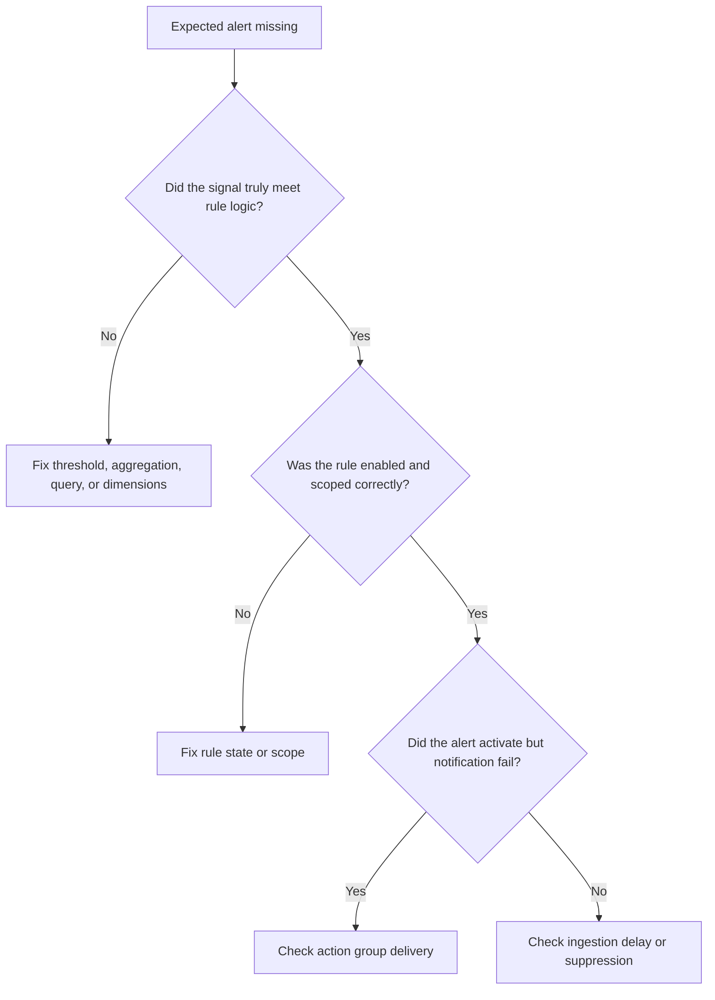

# First 10 Minutes: Alert Not Firing

## Quick Context

Use this checklist when a metric or log condition appears real but Azure Monitor did not create the expected alert, or created it without delivering a notification. In the first 10 minutes, determine whether the miss is in signal evaluation, rule configuration, suppression, or action group delivery.



## Step 1: Identify alert type first

- Metric alert: validate metric aggregation, dimensions, frequency, and window.
- Scheduled query alert: validate the exact KQL, time window, and ingestion delay.
- Good signal: you know which evaluation engine applies.
- Bad signal: the team is replaying the wrong logic in Logs or Metrics Explorer.

## Step 2: Check rule state, scope, and evaluation settings

Metric alert:

```bash
az monitor metrics alert show \
    --resource-group "$RG" \
    --name "$ALERT_RULE_NAME" \
    --output json
```

Scheduled query alert:

```bash
az monitor scheduled-query show \
    --resource-group "$RG" \
    --name "$ALERT_RULE_NAME" \
    --output json
```

- Good signal: rule is enabled, scope is correct, and window/frequency match the expected symptom.
- Bad signal: rule is disabled, scoped to the wrong resource, or uses a window that misses the event.

## Step 3: Replay the signal using the same evaluation shape

```kusto
Perf
| where TimeGenerated > ago(2h)
| where ObjectName == "Processor" and CounterName == "% Processor Time"
| summarize AvgCPU=avg(CounterValue) by bin(TimeGenerated, 5m), Computer
| order by TimeGenerated asc
```

- Good signal: replay confirms the threshold breach exactly as the rule evaluates it.
- Bad signal: the chart looked bad, but the evaluated signal never crossed the real threshold.

## Step 4: Check for ingestion delay if the alert is log-based

```kusto
Perf
| where TimeGenerated > ago(6h)
| extend DelayMinutes = datetime_diff('minute', ingestion_time(), TimeGenerated)
| summarize AvgDelay=avg(DelayMinutes), P95Delay=percentile(DelayMinutes, 95), MaxDelay=max(DelayMinutes)
```

- Good signal: low delay relative to the alert rule window.
- Bad signal: delay approaches or exceeds the evaluation window, causing late or missed alerts.

## Step 5: Check action groups connected to the rule

```bash
az monitor action-group list \
    --resource-group "$RG" \
    --output table
```

- Good signal: the expected action group is attached and active.
- Bad signal: wrong action group, missing receiver, or outdated endpoint.

## Step 6: Check for alert processing rules or suppression

```bash
az monitor alert-processing-rule list \
    --resource-group "$RG" \
    --output json
```

- Good signal: no rule suppresses the affected scope or time window.
- Bad signal: maintenance or routing rules suppress notifications.

## Step 7: Check control-plane activity for recent alert-rule changes

```kusto
AzureActivity
| where TimeGenerated > ago(7d)
| where OperationNameValue has_any ("Microsoft.Insights/metricAlerts", "Microsoft.Insights/scheduledQueryRules", "Microsoft.Insights/actionGroups")
| project TimeGenerated, OperationNameValue, ActivityStatusValue, ResourceId, Caller
| order by TimeGenerated desc
```

- Good signal: no risky change aligned with the first missed alert.
- Bad signal: a recent write changed rule settings, scope, or receivers.

## Decision Points

- **Signal mismatch**: the operator's chart or manual query does not match real rule logic.
- **Rule configuration issue**: disabled state, wrong scope, or incorrect cadence explains the miss.
- **Suppression issue**: alert processing rules prevented notification.
- **Delivery issue**: the alert existed, but action group delivery failed.

## Next Steps

- [Alert Not Firing](../playbooks/alert-not-firing.md)
- [Alert Firing History](../kql/alerts/alert-firing-history.md)
- [Action Group Failures](../kql/alerts/action-group-failures.md)

## See Also

- [First 10 Minutes](index.md)
- [Decision Tree](../decision-tree.md)
- [Alert Not Firing Playbook](../playbooks/alert-not-firing.md)

## Sources

- [Troubleshoot Azure Monitor alerts](https://learn.microsoft.com/en-us/azure/azure-monitor/alerts/alerts-troubleshoot)
- [Azure Monitor action groups](https://learn.microsoft.com/en-us/azure/azure-monitor/alerts/action-groups)
- [Create or edit a log search alert rule](https://learn.microsoft.com/en-us/azure/azure-monitor/alerts/alerts-create-log-alert-rule)
