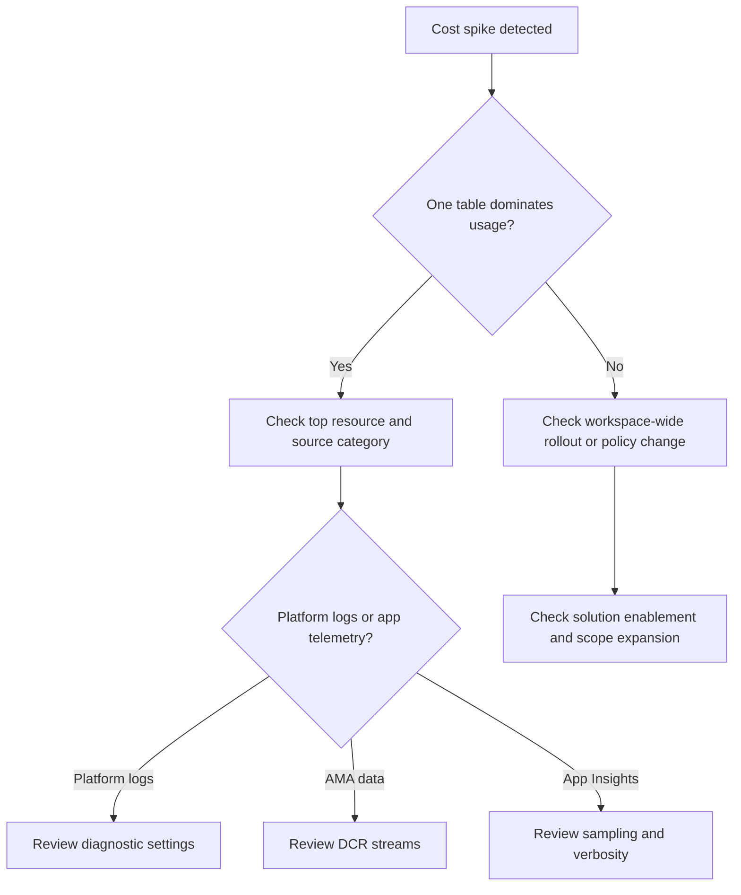

# First 10 Minutes: High Cost

## Quick Context

Use this checklist when Log Analytics ingestion cost or daily billable GB increases unexpectedly. In the first 10 minutes, determine whether the spike comes from one noisy table, one noisy resource, a new DCR or solution rollout, or application telemetry volume that grew after a deployment or incident.



## Step 1: Check top billable tables first

```kusto
Usage
| where TimeGenerated > ago(24h)
| where IsBillable == true
| summarize TotalGB=round(sum(Quantity)/1024.0, 2) by DataType
| order by TotalGB desc
| take 10
```

- Good signal: one or two tables clearly explain the increase.
- Bad signal: many tables rose together, suggesting rollout or workspace-scope change.

## Step 2: Check which resources are driving the spike

```kusto
_Usage
| where TimeGenerated > ago(24h)
| summarize BillableGB=round(sum(Quantity)/1024.0, 2) by _ResourceId, DataType
| order by BillableGB desc
| take 20
```

- Good signal: a small number of resources dominate the new volume.
- Bad signal: broad distributed growth suggests policy, solution, or environment-wide change.

## Step 3: Check workspace pricing and capping context

```bash
az monitor log-analytics workspace show \
    --resource-group "$RG" \
    --workspace-name "$WORKSPACE_NAME" \
    --query "{sku:sku.name,retentionInDays:retentionInDays,dailyQuotaGb:workspaceCapping.dailyQuotaGb}"
```

- Good signal: pricing settings are unchanged and only ingestion shape changed.
- Bad signal: no cap and rising ingestion mean cost will continue until the source is reduced.

## Step 4: Check whether a DCR rollout expanded collection

```bash
az monitor data-collection rule list \
    --resource-group "$RG" \
    --output table
```

- Good signal: no recent DCR additions or stream expansion.
- Bad signal: a new DCR or changed stream selection aligns with the cost spike.

## Step 5: If platform logs are implicated, inspect diagnostic settings

```bash
az monitor diagnostic-settings list \
    --resource "$RESOURCE_ID" \
    --output json
```

- Good signal: only required categories are enabled.
- Bad signal: verbose or duplicated categories are sent to the workspace.

## Step 6: If Application Insights tables grew, check telemetry design

```bash
az monitor app-insights component show \
    --app "$APP_INSIGHTS_NAME" \
    --resource-group "$RG" \
    --query "{workspaceResourceId:workspaceResourceId,applicationType:applicationType,samplingPercentage:samplingPercentage}"
```

```kusto
union requests, dependencies, traces, exceptions
| where timestamp > ago(24h)
| summarize Items=sum(itemCount) by itemType, cloud_RoleName
| order by Items desc
```

- Good signal: request growth explains telemetry growth proportionally.
- Bad signal: traces, dependencies, or exceptions exploded due to verbosity or retry storms.

## Step 7: Check recent change timing against the usage jump

```kusto
Usage
| where TimeGenerated > ago(14d)
| where IsBillable == true
| summarize TotalGB=round(sum(Quantity)/1024.0, 2) by bin(TimeGenerated, 1d), DataType
| order by TimeGenerated asc
```

- Good signal: a clean step change lines up with a rollout or configuration update.
- Bad signal: repeated daily spikes point to recurring workload or logging behavior.

## Decision Points

- **Noisy table / resource**: top-table and top-resource queries isolate the main contributor.
- **DCR or diagnostic setting expansion**: recent monitoring scope change explains the spike.
- **Application telemetry inflation**: verbose tracing, exceptions, or retries are driving cost.
- **Commercial setting awareness**: cap and plan do not cause the spike, but they affect impact.

## Next Steps

- [High Ingestion Cost](../playbooks/high-ingestion-cost.md)
- [Ingestion Volume Queries](../kql/log-analytics/ingestion-volume.md)
- [Cost Control Operations](../../operations/cost-control.md)

## See Also

- [First 10 Minutes](index.md)
- [High Ingestion Cost Playbook](../playbooks/high-ingestion-cost.md)
- [Cost Optimization Best Practices](../../best-practices/cost-optimization.md)

## Sources

- [Analyze usage in a Log Analytics workspace](https://learn.microsoft.com/en-us/azure/azure-monitor/logs/analyze-usage)
- [Manage usage and costs with Azure Monitor Logs](https://learn.microsoft.com/en-us/azure/azure-monitor/logs/cost-logs)
- [Data collection rules in Azure Monitor](https://learn.microsoft.com/en-us/azure/azure-monitor/data-collection/data-collection-rule-overview)
