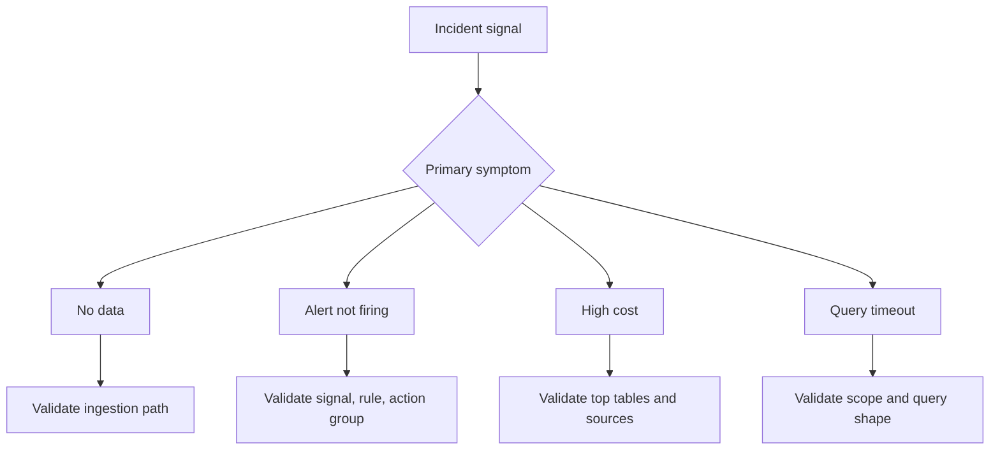

# First 10 Minutes

Fast triage checklists for the first 10 minutes of an Azure Monitor incident.

Use these pages before opening a full playbook when you need to quickly classify whether the problem is data ingestion, alert delivery, cost growth, or query performance.

## Checklists

| Checklist | When to Use |
|---|---|
| [No Data](no-data.md) | Logs or metrics are missing, stale, or never arrived in the workspace |
| [Alert Not Firing](alert-not-firing.md) | Threshold was crossed but no alert or notification appeared |
| [High Cost](high-cost.md) | Workspace ingestion cost or daily GB suddenly increased |
| [Query Timeout](query-timeout.md) | Logs, workbooks, or scheduled queries are slow or timing out |

## Suggested First Pass

1. Pick the checklist that matches the user-visible symptom.
2. Confirm whether the issue is broad or isolated to one resource, table, or rule.
3. Collect one KQL signal and one control-plane signal before changing configuration.
4. Escalate to the linked playbook when the first-response path narrows to one or two hypotheses.

## See Also

- [Quick Diagnosis Cards](../quick-diagnosis-cards.md)
- [Troubleshooting Overview](../index.md)
- [Decision Tree](../decision-tree.md)
- [Playbooks](../playbooks/index.md)

## Sources

- [Troubleshoot Azure Monitor](https://learn.microsoft.com/en-us/azure/azure-monitor/troubleshoot)
- [Troubleshoot Log Analytics in Azure Monitor](https://learn.microsoft.com/en-us/azure/azure-monitor/logs/troubleshoot)
