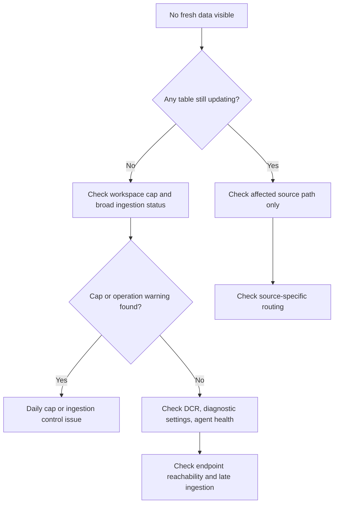

# First 10 Minutes: No Data

## Quick Context

Use this checklist when a Log Analytics workspace, workbook, or alert query shows empty or stale results. In the first 10 minutes, determine whether the break is caused by workspace capping, missing diagnostic settings, missing DCR association, unhealthy agents, or ingestion delay that only looks like data loss.



## Step 1: Check whether the problem is broad or table-specific

- KQL:

```kusto
union isfuzzy=true
    (Heartbeat | summarize LastSeen=max(TimeGenerated) by TableName="Heartbeat"),
    (AzureActivity | summarize LastSeen=max(TimeGenerated) by TableName="AzureActivity"),
    (AzureDiagnostics | summarize LastSeen=max(TimeGenerated) by TableName="AzureDiagnostics"),
    (Perf | summarize LastSeen=max(TimeGenerated) by TableName="Perf")
| extend MinutesSinceLastSeen = datetime_diff('minute', now(), LastSeen) * -1
| order by MinutesSinceLastSeen desc
```

- Good signal: one or two tables are stale while others are current.
- Bad signal: every major table is stale, pointing to cap, ingestion controls, or broad source failure.

## Step 2: Check workspace cap and control-plane state

```bash
az monitor log-analytics workspace show \
    --resource-group "$RG" \
    --workspace-name "$WORKSPACE_NAME" \
    --query "{provisioningState:provisioningState,dailyQuotaGb:workspaceCapping.dailyQuotaGb,quotaNextResetTime:workspaceCapping.quotaNextResetTime}"
```

- Good signal: `provisioningState` is `Succeeded` and cap is not unexpectedly low.
- Bad signal: cap was reached recently or the workspace state is abnormal.

## Step 3: Check operation events for ingestion warnings

```kusto
Operation
| where TimeGenerated > ago(24h)
| where OperationCategory in ("Data Collection Status", "Ingestion", "Workspace")
| project TimeGenerated, OperationCategory, OperationName, OperationStatus, OperationDetail
| order by TimeGenerated desc
```

- Good signal: no cap or ingestion warnings near incident start.
- Bad signal: `Daily cap reached` or collection-status warnings align with the symptom window.

## Step 4: Validate diagnostic settings on an affected Azure resource

```bash
az monitor diagnostic-settings list \
    --resource "$RESOURCE_ID" \
    --output json
```

- Good signal: expected categories still point to the correct workspace.
- Bad signal: diagnostic settings were removed, changed, or target the wrong destination.

## Step 5: Validate DCR association for AMA-backed resources

```bash
az monitor data-collection rule association list \
    --resource "$RESOURCE_ID" \
    --output json
```

- Good signal: expected DCR association exists for the affected resource.
- Bad signal: no association or the wrong DCR is attached.

## Step 6: Check agent heartbeat for affected machines

```kusto
Heartbeat
| where TimeGenerated > ago(24h)
| summarize LastHeartbeat=max(TimeGenerated) by Computer, _ResourceId
| order by LastHeartbeat asc
| take 20
```

- Good signal: healthy machines continue sending heartbeat.
- Bad signal: many machines stopped together, suggesting shared DCR, network, or policy issues.

## Step 7: Measure late ingestion before declaring data loss

```kusto
union isfuzzy=true Heartbeat, Perf, AzureActivity
| where TimeGenerated > ago(6h)
| extend DelayMinutes = datetime_diff('minute', ingestion_time(), TimeGenerated)
| summarize AvgDelay=avg(DelayMinutes), P95Delay=percentile(DelayMinutes, 95), MaxDelay=max(DelayMinutes) by Type
| order by P95Delay desc
```

- Good signal: low delay values and missing data limited to one source.
- Bad signal: high delay means the pipeline is degraded, not fully stopped.

## Decision Points

- **Daily cap or ingestion control**: operation events and workspace settings explain the gap.
- **Diagnostic settings or DCR issue**: only certain resources or tables are missing.
- **Agent or endpoint issue**: heartbeat is stale and resources share the same reporting path.
- **Late ingestion**: data arrives eventually but too slowly for normal dashboards and alerts.

## Next Steps

- [No Data in Workspace](../playbooks/no-data-in-workspace.md)
- [Agent Not Reporting](../playbooks/agent-not-reporting.md)
- [Ingestion Volume Queries](../kql/log-analytics/ingestion-volume.md)

## See Also

- [First 10 Minutes](index.md)
- [Evidence Map](../evidence-map.md)
- [No Data in Workspace](../playbooks/no-data-in-workspace.md)

## Sources

- [Troubleshoot Azure Monitor Agent issues](https://learn.microsoft.com/en-us/azure/azure-monitor/agents/azure-monitor-agent-troubleshoot)
- [Create and edit diagnostic settings in Azure Monitor](https://learn.microsoft.com/en-us/azure/azure-monitor/platform/diagnostic-settings)
- [Troubleshoot Log Analytics in Azure Monitor](https://learn.microsoft.com/en-us/azure/azure-monitor/logs/troubleshoot)
