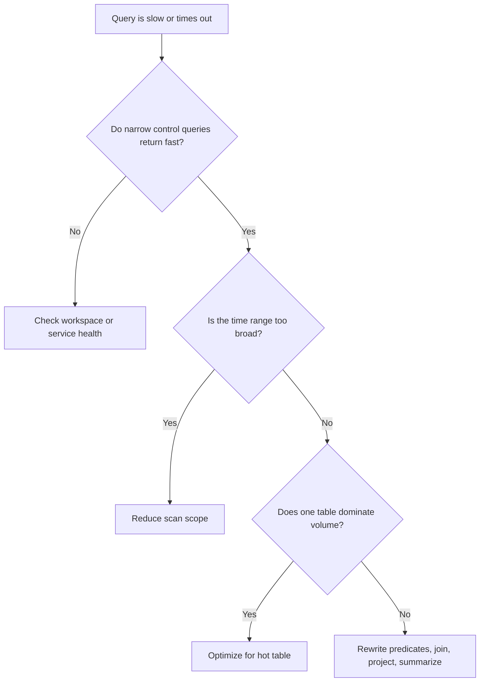

---
content_sources:
  diagrams:
    - id: quick-context
      type: flowchart
      source: mslearn-adapted
      based_on:
        - https://learn.microsoft.com/en-us/azure/azure-monitor/logs/query-optimization
        - https://learn.microsoft.com/en-us/azure/azure-monitor/logs/troubleshoot
        - https://learn.microsoft.com/en-us/azure/azure-monitor/logs/scope
---

# First 10 Minutes: Query Timeout

## Quick Context

Use this checklist when Log Analytics queries, workbook visuals, or scheduled query rules are slow enough to time out or become operationally unreliable. In the first 10 minutes, determine whether the problem is broad workspace health, oversized time range, inefficient query shape, or one hot table with heavy volume.

<!-- diagram-id: quick-context -->


## Step 1: Run a narrow control query

```bash
az monitor log-analytics query \
    --workspace "$WORKSPACE_ID" \
    --analytics-query "Heartbeat | where TimeGenerated > ago(15m) | summarize LastHeartbeat=max(TimeGenerated) by Computer | take 5" \
    --timespan "PT15M"
```

- Good signal: control query is fast, so the workspace is generally healthy.
- Bad signal: even simple narrow queries are slow, raising service-health or access-path suspicion.

## Step 2: Check top table volume for the incident window

```kusto
Usage
| where TimeGenerated > ago(24h)
| summarize TotalGB=round(sum(Quantity)/1024.0, 2) by DataType
| order by TotalGB desc
| take 10
```

- Good signal: you know which tables deserve early filtering.
- Bad signal: the query is scanning very large tables with no selective predicates.

## Step 3: Inspect the original query for early time and resource filters

- Check for `where TimeGenerated > ago(...)` near the top.
- Check for early `where _ResourceId`, `Computer`, `Category`, or `ResourceProvider` filters.
- Check for early `project` before `join`, `parse`, or wide `summarize`.
- Bad signal: `search *`, broad `contains`, and late filtering appear before expensive operators.

## Step 4: Compare expensive vs selective operator shape

```kusto
AppServiceHTTPLogs
| where TimeGenerated > ago(1h)
| where CsUriStem has "/api/orders"
| project TimeGenerated, CsUriStem, ScStatus, TimeTaken
| summarize Requests=count(), P95=percentile(TimeTaken, 95) by bin(TimeGenerated, 5m)
| order by TimeGenerated asc
```

- Good signal: a smaller window and selective operator preserve the analytical answer.
- Bad signal: the original query depends on broad string scans or unnecessary columns.

## Step 5: If a workbook or alert is involved, check hidden scope expansion

```bash
az monitor scheduled-query show \
    --resource-group "$RG" \
    --name "$ALERT_RULE_NAME" \
    --output json
```

- Good signal: one workspace and one clear cadence match the intended design.
- Bad signal: cross-workspace scope, large evaluation windows, or heavy workbooks expand the query beyond what operators expect.

## Step 6: Check table settings if one hot table dominates

```bash
az monitor log-analytics workspace table show \
    --resource-group "$RG" \
    --workspace-name "$WORKSPACE_NAME" \
    --name "$TABLE_NAME" \
    --output json
```

- Good signal: table settings look normal and optimization should focus on KQL shape.
- Bad signal: a high-volume table with wide schema or dynamic fields is the real bottleneck.

## Step 7: Check for current Azure Monitor service-health events

```bash
az servicehealth events list \
    --query "[?contains(title, 'Azure Monitor') || contains(title, 'Log Analytics')].{title:title,status:status}"
```

- Good signal: no active event and narrow queries are healthy.
- Bad signal: active Azure Monitor or Log Analytics event aligns with broad slowness.

## Decision Points

- **Workspace/service issue**: even control queries are slow and service health shows active issues.
- **Data volume issue**: top tables and broad windows dominate scan cost.
- **Query-shape issue**: weak predicates, late projection, or expensive joins explain the timeout.
- **Workbook/alert design issue**: hidden federation or wide cadence causes unexpected overhead.

## Next Steps

- [Slow Query Performance](../playbooks/slow-query-performance.md)
- [Ingestion Volume Queries](../kql/log-analytics/ingestion-volume.md)
- [Cross-Workspace Queries](../kql/log-analytics/cross-workspace.md)

## See Also

- [First 10 Minutes](index.md)
- [Slow Query Performance Playbook](../playbooks/slow-query-performance.md)
- [KQL Quick Reference](../../reference/kql-quick-reference.md)

## Sources

- [Optimize log queries in Azure Monitor Logs](https://learn.microsoft.com/en-us/azure/azure-monitor/logs/query-optimization)
- [Troubleshoot Log Analytics in Azure Monitor](https://learn.microsoft.com/en-us/azure/azure-monitor/logs/troubleshoot)
- [Query scope in Azure Monitor Log Analytics](https://learn.microsoft.com/en-us/azure/azure-monitor/logs/scope)
